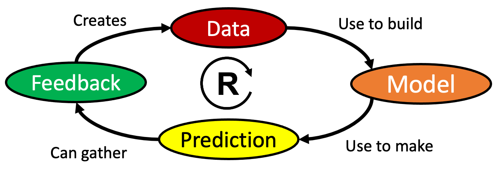

# The AI Flywheel
 
A positive feedback cycle where good predictions cause more use of a service which provide more feedback data to create better predictive models.

## Key Steps

This creates a single reinforcing loop where:

1. **Data** - used to trains the machine learning Model
2. The **Model** - used to generate predictions or recommendations
3. Predictions - are used to get user **Feedback** (thumbs up, thumbs down)
4. **Feedback Logs** - becomes new Data to improve the model with reinforcement learning (RL)

Key Features

- **Single Primary Reinforcement Loop:** The entire diagram focuses on one reinforcing feedback loop
- **Clear Sequential Flow:**  Each node clearly feeds into the next in a circular pattern
- **Practical Examples:**  Each node includes concrete examples students can relate to
- **Delay Recognition:**  Shows that feedback processing takes time (1-4 weeks)
- **Educational Focus:**  Discussion questions help students understand the flywheel concept

This simplified version makes it easy to understand the core AI Flywheel concept while maintaining the rigorous structure of the JSON schema. It's perfect for introducing students to how AI systems create self-reinforcing improvement cycles through continuous feedback.
The AI Flywheel has four key steps:

1. More data creates more precise machine learning models
2. Machine learning models make predictions about the future
3. Every time we make a prediction, we can get feedback on how good that prediction was
4. Feedback is a new data source for our predictive models

## Key Insights

There are two key insights:

1. Building your first machine learning model is hard.
2. Getting feedback from your predictions is also hard.

Once you get enough feedback, your predictions get better and more users will use your tools.

## Feedback is the Key

If your models don't produce recommendations that get feedback your model will not evolve over time.

Creating a predictive model is never a one-and-done task.  It is a process of continuous improvement.

In the real-world things are changing all the time.  The key to building intelligent systems is to continually learn from new data and new variations in existing data.

Note that once a prediction is in the range of 30% correct, 
users are more likely to try the recommendation and give you more feedback.

## Impacts on Business Strategy

The AI Flywheel is a central tool that allows large companies with large amounts of data to 
use this data to make free predictions to get even more data.  
This makes it difficult for new-entrants to challenge incumbents players.
