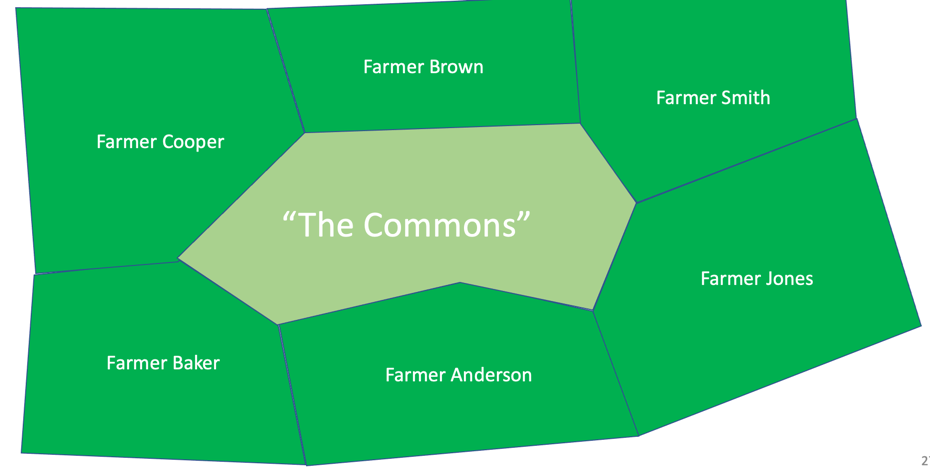
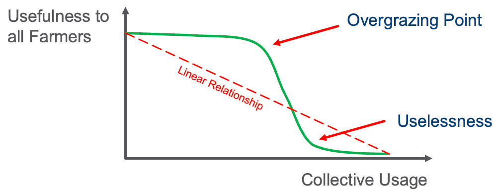
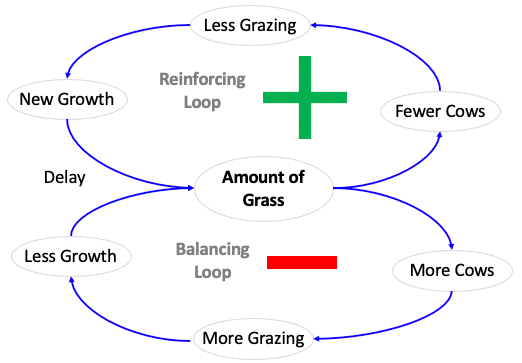
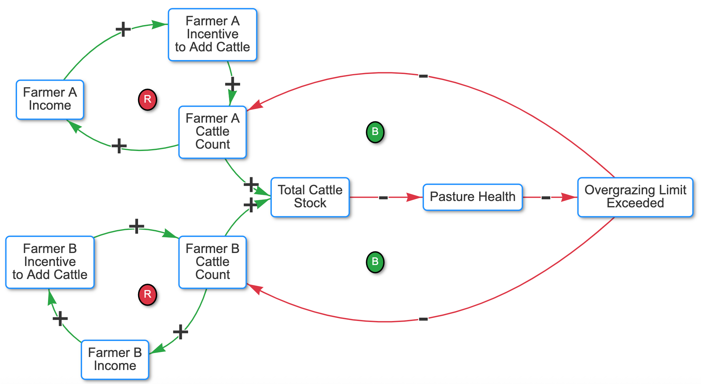

# Tragedy of the Commons

Here are some resources for teaching the concepts in the classic tragedy of the commons.

Land Diagram:

Non-linear behaviors:

## Tragedy of the Commons Causal Loop Diagrams

[Interactive Tragedy of the Commons Using the CLD viewer](../../sims/cld-viewer/main.html?file=tragedy-of-the-commons-cld)

## Solutions Tragedy of the Commons

1. Educating about sustainability and how to monitor
2. Enforcing laws limiting use of a resource
Privatizing the resource so that each participant must pay for the the direct impact of his/her actions

## References

* [Wikipedia on Tragedy of the Commons](https://en.wikipedia.org/wiki/Tragedy_of_the_commons)