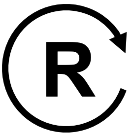
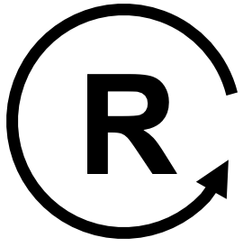
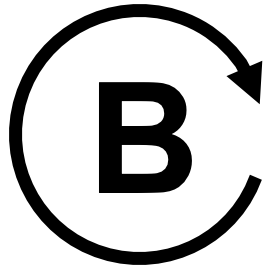
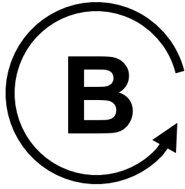

# Causal Loop Diagram Notation and Loop Identification

## Summary

This chapter teaches the formal notation of causal loop diagrams (CLDs): nodes, edges, causal links, and link polarity. It presents the negative-link counting rule for identifying whether a loop is reinforcing or balancing, and how to mark loops on a diagram. Students completing this chapter will be able to read and label a causal loop diagram correctly.

## Concepts Covered

This chapter covers the following 16 concepts from the learning graph:

| Concept | Concept Impact Score |
|---------|-----------------------|
| Causal Loop Diagram | 60505 |
| Node | 25569 |
| Edge (CLD) | 25568 |
| Causal Link | 25567 |
| Positive Causal Link | 12783 |
| Negative Causal Link | 12783 |
| Loop Polarity | 6391 |
| Same-Direction Link | 6391 |
| Opposite-Direction Link | 6391 |
| Negative-Link Counting Rule | 6390 |
| Loop Identification | 6389 |
| Loop Marker | 3402 |
| Reinforcing Loop | 1313 |
| Balancing Loop | 1673 |
| Reinforcing Loop Label | 5 |
| Balancing Loop Label | 410 |

## Prerequisites

This chapter builds on concepts from:

- [1. Foundations of Systems Thinking](../01-foundations-of-systems-thinking/index.md)
- [2. Mental Models and Systems Analysis Tools](../02-mental-models-and-systems-analysis-tools/index.md)

---

## Introduction

Chapter 2 gave you general-purpose tools for studying a system: mental models, systems maps, rich pictures. A systems map can show almost anything moving between parts — money, people, goods, information — which makes it flexible but also a little loose. This chapter narrows the focus to one specific kind of map, built entirely out of cause-and-effect arrows and nothing else. That narrowing is deliberate: restricting a diagram to a single relationship — causality — is exactly what makes it possible to write down a precise notation and a simple counting rule that lets you look at any drawn loop and correctly predict, every time, which of exactly two behaviors it produces.

!!! mascot-welcome "From Loose Maps to Precise Notation"
    { class="mascot-admonition-img" }
    Welcome back, fellow systems thinker! You've sketched rich pictures and systems maps — now it's time for a notation precise enough that two people who've never met can look at the same loop and agree, every time, on exactly what it does. Let's zoom out and see the whole system!

## What Is a Causal Loop Diagram?

A **causal loop diagram** (CLD) is a diagram that represents a system as a set of variables connected by arrows showing cause-and-effect relationships, drawn so that at least one chain of arrows loops back around to its own starting point. That closing-the-loop property is what separates a CLD from an ordinary flowchart: a flowchart typically runs from a start to an end, while a CLD is built specifically to show a story that feeds back into itself.

Consider a plain-language feedback story you've probably heard before: "The more money sitting in a savings account, the more interest it earns each month — and the more interest it earns, the more money ends up back in the account." Told out loud, that story is a single sentence. Drawn as a causal loop diagram, it becomes two labeled boxes and two arrows: one arrow from "Bank Balance" to "Interest Earned," and a second arrow from "Interest Earned" back to "Bank Balance," closing the loop. Nothing in the diagram is new information — it's the exact same story — but the diagram makes the *shape* of the story visible in a way the sentence alone does not.

!!! mascot-thinking "A Line Becomes a Circle"
    { class="mascot-admonition-img" }
    Notice the shift: Chapter 1's cause-and-effect chains ran in a straight line, from a first cause to a final symptom. A causal loop diagram bends that line back on itself. Once effect can become cause again, "what happens next?" stops being a question with one final answer.

Not every diagram of causes and effects qualifies as a CLD, and it's worth being precise about why. Chapter 1's printer-jam chain — sunny window causes a warm room, a warm room causes damp paper, damp paper causes jams — is a perfectly good cause-and-effect diagram, but it is not a causal loop diagram, because the arrows never circle back to "sunny window." It stays a straight line from a root cause to a symptom. The bank-balance story above earns the name "causal loop diagram" specifically because tracing its arrows eventually brings you right back to the node you started at. When you're deciding whether something you've drawn counts as a CLD, that's the one test that matters: pick any node, follow the arrows forward, and see whether you can walk your way back to it.

The MicroSim below shows exactly this savings-account loop. Hover over either box to see its description, and notice how the two arrows are labeled — that labeling is the subject of the next several sections.

#### Diagram: Bank Balance Causal Loop Diagram

<iframe src="../../sims/cld-viewer/main.html?file=bank-balance-cld.json" width="100%" height="500px" scrolling="no"></iframe>

[Run the CLD Viewer fullscreen](../../sims/cld-viewer/main.html?file=bank-balance-cld.json){ .md-button }

Bank Balance Causal Loop Diagram (reused MicroSim)

Type: graph-model
**sim-id:** cld-viewer 
**Library:** vis-network 
**Status:** Reused 
**Source:** ../../sims/cld-viewer/main.html?file=bank-balance-cld.json 
**Source Repo:** local — docs/sims/cld-viewer (examples/bank-balance-cld.json)

Reused from this book's own CLD Viewer tool, loaded with its two-node "Interest-Earning Bank Account" example. Hovering over the "Bank Balance" or "Interest Earned" node shows a tooltip with that variable's description; hovering over either arrow shows the causal claim it represents. Learning objective: given a simple feedback story in prose, the learner will identify the two variables and two causal arrows that form its causal loop diagram (Bloom: Understanding).

## Nodes: The Variables in a Loop

A **node** is a labeled box in a causal loop diagram representing a single variable — a quantity that can meaningfully increase or decrease over time. In the diagram above, "Bank Balance" and "Interest Earned" are both nodes: each names a quantity, and each can plainly go up or go down.

Node labels have a specific job, so they follow a specific pattern: a good node name is a noun or noun phrase naming something measurable, never a verb describing a one-time action. "Bank Balance" is a valid node because it names a quantity; "Deposit money" is not, because it names an action rather than something that rises and falls. This distinction matters more than it looks: a diagram built out of actions instead of quantities has nothing for an arrow to meaningfully increase or decrease, and the whole notation this chapter teaches depends on every node being a quantity. The same test works outside of finance: in a customer-service system, "Customer Satisfaction" is a valid node because it can rise or fall, while "Send a satisfaction survey" is an action that belongs *between* nodes, not inside one — it's the sort of thing an edge's description explains, not something that itself goes up or down.

Diagram-building tools often go one step further and sort nodes into a few reusable types, and the examples in this chapter already use three of them. A **stock** node holds an accumulated quantity that persists over time, like "Bank Balance" or "Population" — the kind of thing you could, in principle, freeze and measure at a single instant. A plain **variable** node is a quantity that is recalculated each period rather than accumulated, like "Interest Earned," which resets and is earned fresh each cycle. A **condition** node represents an externally set target or state, like a thermostat's "Desired Temperature Setpoint," which a person sets rather than the system computing on its own. None of this changes the counting rule you'll learn later in this chapter — it applies to every node the same way — but recognizing a node's type helps you read an unfamiliar diagram faster, since stocks are usually where a system's real "memory" lives.

!!! mascot-tip "The One Test for a Good Node Name"
    { class="mascot-admonition-img" }
    Unsure whether something belongs in a box? Ask: "Can this quantity go up or go down?" If yes, it's a node. If the answer is no — if it's a one-time event or an action instead — rename it as the quantity that event changes, and put that in the box instead.

## Edges and Causal Links

An **edge (CLD)** — an edge, in the specific sense this book uses inside a causal loop diagram — is the arrow drawn between two nodes, pointing from a cause to the effect it produces. A **causal link** is the underlying claim that edge represents: that a change in the variable at the arrow's tail actually causes a change in the variable at the arrow's head, not merely that the two happen to move together.

The distinction is worth keeping straight even though the two terms are often used interchangeably once it's understood. Drawing an edge is easy — it's a single line on a page. Defending the causal link behind it is where the real analytical work happens, and it's exactly the same work Chapter 1 asked of you when it warned against mistaking correlation for causation. In the bank-balance diagram, the edge from "Bank Balance" to "Interest Earned" is not just decoration; it stands in for the causal link "a higher balance causes more interest to be earned," a claim you could actually check against the account's stated interest rate. Before drawing any edge in a diagram of your own, it's worth pausing to ask whether you could defend the causal link it represents to a skeptic — an edge that fails that test usually signals a correlation being mistaken for causation, or two variables that are both driven by some third factor you haven't drawn yet. Chapter 1's ice-cream-and-drowning example makes the failure mode concrete: an edge drawn straight from "Ice Cream Sales" to "Drowning Deaths" would be a real edge on a real diagram, but it would misrepresent a spurious correlation as a causal link, since both are actually driven by a third node — hot weather — that the diagram would need to include instead.

Because the bare claim "A causes B" is often too thin on its own, most CLD tools let you attach a short label to the edge summarizing the mechanism in a few words — "generates," "triggers," "reduces" — so a reader can get a rough sense of *how* the causal link works without needing to click into a full description. The bank-balance diagram's two edges are labeled "generates" and "increases" for exactly this reason: a one-word hint, sitting right on the arrow, that turns a bare line into a small piece of the causal story.

## Positive and Negative Causal Links

A **positive causal link** is a causal link in which the two variables move in the same direction: when the cause increases, the effect increases above what it otherwise would have been, and when the cause decreases, the effect decreases. A **negative causal link** is a causal link in which the two variables move in opposite directions: when the cause increases, the effect decreases, and when the cause decreases, the effect increases. On a diagram, this is marked with a small "+" or "−" near the arrowhead.

Before you look at an example with both, one warning is worth stating plainly: positive and negative describe *direction of change*, not "good" and "bad." A negative link is not a flaw in the diagram — it can just as easily represent something desirable, like a safety mechanism that reduces risk as spending on it increases. A classroom example makes the same point from the opposite side: "Study Time" causing "Test Anxiety" to fall is a negative link, and a welcome one, while "Test Anxiety" causing "Test Score" to fall is also negative, and unwelcome. Same symbol, same rule for reading it, opposite feelings about the outcome — the diagram itself stays neutral.

Both edges in the bank-balance diagram are positive: more balance causes more interest, and more interest causes more balance. The diagram below, showing population dynamics, contains one of each. Two edges connect "Population" to "Births" — both positive, since a larger population enables more births, and more births directly increase the population. But the edge from "Deaths" to "Population" is negative: more deaths *decrease* the population, not increase it.

Before we look at the diagram, one more term deserves a plain-language definition first: **loop polarity**, which is the overall tendency of a complete loop — whether the loop as a whole amplifies an initial change or opposes it — determined by combining the polarities of every link around the loop, not by looking at any single link alone. This is a genuinely different property from a single link's polarity: an individual edge is positive or negative on its own, but a *loop's* polarity only comes into view once you've traced every edge in the loop and combined their effects, which is exactly why the next few sections build up a formal counting procedure rather than asking you to eyeball it. The population diagram below contains two separate loops with two different polarities, and spotting the difference by eye is exactly the skill the rest of this chapter builds toward.

#### Diagram: Population Growth Causal Loop Diagram

<iframe src="../../sims/cld-viewer/main.html?file=population-cld.json" width="100%" height="500px" scrolling="no"></iframe>

[Run the CLD Viewer fullscreen](../../sims/cld-viewer/main.html?file=population-cld.json){ .md-button }

Population Growth Causal Loop Diagram (reused MicroSim)

Type: graph-model
**sim-id:** cld-viewer 
**Library:** vis-network 
**Status:** Reused 
**Source:** ../../sims/cld-viewer/main.html?file=population-cld.json 
**Source Repo:** local — docs/sims/cld-viewer (examples/population-cld.json)

Reused from this book's own CLD Viewer tool, loaded with its three-node "Population Growth Dynamics" example, which contains both a reinforcing loop (Population-Births) and a balancing loop (Population-Deaths) sharing the "Population" node. Hovering over any node or edge shows a tooltip with its description and polarity; hovering over either small colored "R" or "B" circle at each loop's center shows that loop's full description. Learning objective: given a diagram with two loops sharing a node, the learner will identify which edges are positive and which are negative (Bloom: Understanding).

The following table reinforces the distinction you've just read about between the two link types:

| Link type | Symbol | If the cause increases | If the cause decreases |
|---|---|---|---|
| Positive causal link | + | Effect increases | Effect decreases |
| Negative causal link | − | Effect decreases | Effect increases |

!!! mascot-tip "One Question Settles Every Polarity Call"
    { class="mascot-admonition-img" }
    Stuck deciding + or −? Hold everything else in the diagram fixed and ask: "If I nudged the cause up a little, would the effect go up or down?" Up means positive. Down means negative. That single question resolves almost every polarity call you'll ever face.

## Same-Direction and Opposite-Direction Links

A **same-direction link** is another name for a positive causal link, chosen because it describes directly what matters for the rule coming up next: the two variables move in the same direction. An **opposite-direction link** is another name for a negative causal link, chosen for the identical reason: the two variables move in opposite directions.

These aren't new ideas — they're the exact same positive and negative links you just learned, relabeled. Some CLD tools and instructors mark edges with a small "s" or "o" instead of "+" or "−" for precisely this reason: it sidesteps the "positive equals good" misreading warned about above, since "same direction" and "opposite direction" carry no value judgment at all. This book uses both notations interchangeably, and you should expect to see either one in diagrams drawn by other people.

To see the two notations describe identical facts, relabel the bank-balance and thermostat loops from earlier using "s" and "o" instead of "+" and "−." The bank-balance loop's two edges — "Bank Balance" causing "Interest Earned" to rise, and "Interest Earned" causing "Bank Balance" to rise — are both same-direction links: s, s. The thermostat loop's five edges become s, o, s, s, s, with the single opposite-direction link sitting exactly where the negative causal link sat before. Nothing about the diagrams changed; only the letters written next to the arrows did.

!!! mascot-thinking "Two Names, One Underlying Fact"
    { class="mascot-admonition-img" }
    Here's why this relabeling earns its own name rather than being a footnote: "opposite-direction" doesn't just describe a link — it's the exact thing you're about to start *counting*. Renaming negative to "opposite-direction" turns an abstract polarity rule into a concrete counting task.

## The Negative-Link Counting Rule

The **negative-link counting rule** states that a loop's polarity can be determined by counting the number of negative — that is, opposite-direction — links it contains as you travel once all the way around it: if that count is even, including zero, the loop is reinforcing; if the count is odd, the loop is balancing. This is the single most useful fact in this chapter, because it means you never have to simulate a loop's behavior over time to know what kind of loop it is — you only have to count.

For readers who enjoy a compact restatement: if \( n \) is the number of negative links encountered going once around a loop, the loop is reinforcing when \( (-1)^n = +1 \) and balancing when \( (-1)^n = -1 \). In plain language, that's just a mathematician's way of saying "even flips you back to where you started; odd flips you to the opposite side" — the same rule stated in words above.

Walk through it on the thermostat loop below, which has five edges rather than two, making the counting itself meaningful instead of obvious at a glance:

1. Desired Temperature → Temperature Gap: positive (a higher setpoint raises the gap).
2. Room Temperature → Temperature Gap: **negative** (a warmer room shrinks the gap).
3. Temperature Gap → Thermostat Signal: positive (a bigger gap triggers a stronger signal).
4. Thermostat Signal → Heater Output: positive (a stronger signal drives more heat).
5. Heater Output → Room Temperature: positive (more heat raises the room's temperature, closing the loop).

Only one of these five links is negative. One is an odd number, so the negative-link counting rule predicts this loop is balancing — which matches its real-world job of holding the room at a steady setpoint rather than letting the temperature run away in one direction.

#### Diagram: Thermostat Causal Loop Diagram

<iframe src="../../sims/cld-viewer/main.html?file=thermostat-cld.json" width="100%" height="500px" scrolling="no"></iframe>

[Run the CLD Viewer fullscreen](../../sims/cld-viewer/main.html?file=thermostat-cld.json){ .md-button }

Thermostat Causal Loop Diagram (reused MicroSim)

Type: graph-model
**sim-id:** cld-viewer 
**Library:** vis-network 
**Status:** Reused 
**Source:** ../../sims/cld-viewer/main.html?file=thermostat-cld.json 
**Source Repo:** local — docs/sims/cld-viewer (examples/thermostat-cld.json)

Reused from this book's own CLD Viewer tool, loaded with its five-node "Thermostat Temperature Control System" example — a single balancing loop with exactly one negative link among its five edges. Hovering over any edge shows a tooltip naming its polarity and the reasoning behind it. Learning objective: given a five-link loop, the learner will apply the negative-link counting rule to correctly classify the loop as balancing (Bloom: Applying).

The MicroSim below lets you practice the counting rule directly: click each edge around a loop, in order, and watch a running tally of same-direction versus opposite-direction links build up until the correct loop marker appears automatically.

#### Diagram: Loop Polarity Counter

<iframe src="../../sims/loop-polarity-counter/main.html" width="100%" height="520px" scrolling="no"></iframe>

[Run the Loop Polarity Counter MicroSim fullscreen](../../sims/loop-polarity-counter/main.html){ .md-button }

Loop Polarity Counter

Type: microsim
**sim-id:** loop-polarity-counter 
**Library:** p5.js 
**Template:** https://github.com/dmccreary/infographics/tree/main/docs/sims/cld-builder 
**Status:** Specified

Purpose: Let learners apply the negative-link counting rule step by step on a four-node causal loop by clicking each edge in sequence around the loop and watching a running tally of same-direction (S) and opposite-direction (O) links, culminating in the automatically revealed loop marker.

Bloom Taxonomy Level: Apply
Bloom Taxonomy Verb: Classify

Learning Objective: Given a causal loop diagram, the learner will classify the loop as reinforcing or balancing by counting its opposite-direction links (Bloom: Applying).

Canvas: 700x480 default, responsive — recompute node positions around a circle of radius proportional to `canvas.width` inside a `windowResized()` handler so the loop stays centered and legible at any container width.

Visual elements:
- Four nodes arranged in a circle (default scenario: "Advertising Spend," "New Customers," "Word of Mouth," "Revenue"), connected by four curved directed edges forming one closed loop, each edge labeled with a "+"/S or "−"/O badge once revealed.
- A running tally panel beside the canvas reading "Opposite-direction links found: N" that increments only when the learner clicks an unrevealed edge whose polarity is negative.
- A large loop-marker circle at the loop's center, initially blank/gray, that fills in with a red "R" or green "B" (matching this chapter's color convention) only after all four edges have been clicked/revealed.

Controls:
- Clicking an unrevealed edge reveals its polarity badge (S or O) with a short one-sentence justification appearing in an info panel below the canvas (e.g., "More advertising spend causes more new customers — same direction").
- A "New Scenario" button, built with `createButton()`, that swaps in one of three preloaded four-edge loops (a mix of reinforcing and balancing examples) with freshly randomized node positions.
- A "Reset This Loop" button that re-hides all edge badges and empties the tally without changing the current scenario.

Interactivity requirement: every edge is clickable and reveals a labeled badge plus an explanatory info-panel sentence; the loop-marker circle updates live based on the tally, satisfying the interactivity bar with immediate, teaching feedback on every click.

Color scheme: same-direction (S) badges in the book's positive-link green, opposite-direction (O) badges in the negative-link red, and the final loop marker filled in the matching reinforcing-red or balancing-green used throughout this chapter's other diagrams for visual consistency.

Implementation: p5.js sketch with an array of edge objects (endpoints, true polarity, revealed state) drawn as curved Bezier arrows, `mousePressed()` hit-testing against each edge's curve midpoint, and a small state machine tracking revealed count and running negative-link tally to trigger the final marker reveal.

!!! mascot-warning "Count the Right Thing"
    { class="mascot-admonition-img" }
    A common slip is counting *all* the links in a loop instead of only the negative ones — or stopping halfway around instead of completing the full circuit. The rule only works if you count exactly the opposite-direction links, and only after tracing the loop all the way back to your starting node.

## Loop Identification

**Loop identification** is the practice of locating every closed loop within a causal loop diagram — tracing arrows starting and ending at the same node — and then applying the negative-link counting rule to classify each one separately, since a single diagram commonly contains more than one loop sharing nodes. The population diagram you saw earlier is a compact example: it contains two loops that both touch the "Population" node, yet each one is traced and counted on its own.

The birth loop runs Population → Births → Population, with two positive links and zero negative links — an even count, so it's reinforcing. The death loop runs Population → Deaths → Population, with one positive link and one negative link — an odd count, so it's balancing. Sharing a node doesn't merge the two loops into one; it just means that node participates in two separate feedback stories at once, each with its own independently determined polarity. Real diagrams later in this book, describing archetypes like the tragedy of the commons, will contain three or four overlapping loops at once — loop identification is the discipline of tracing and classifying them one at a time rather than trying to reason about the whole tangle simultaneously.

It's worth practicing the "does this even form a loop" test from earlier in a slightly harder case. Suppose someone proposed adding a new edge directly from "Births" to "Deaths," reasoning that a baby boom eventually means more deaths decades later. Does that create a third loop? Trace it: Births → Deaths → Population → Births. Yes — it closes, so it is a loop, and a genuinely new one, distinct from the two you already found even though it reuses two of the same nodes. Loop identification means checking every such candidate path, not just the two most obvious ones.

!!! mascot-encourage "Untangling Loops Takes Practice"
    { class="mascot-admonition-img" }
    If tracing overlapping loops by eye feels slow at first, that's completely normal — experienced analysts do this one loop at a time too, often tracing each path with a finger or a pen. There's no shortcut around doing it loop by loop the first several times; the speed comes later, with repetition.

## Loop Marker: Recording What You Found

A **loop marker** is a small symbol placed at the center of an identified loop directly on the diagram, recording the loop's polarity so that a reader never has to re-run the counting rule themselves just to understand what the diagram is claiming. In the population and thermostat diagrams above, this marker appears as a small colored circle at each loop's center, labeled "R" or "B" — clicking it reveals the same loop description you'd get from working through the counting rule by hand.

The marker's placement is deliberate, not decorative: it sits at the loop's visual center specifically so it stays roughly equidistant from every node the loop passes through, which keeps it unambiguous even when a diagram has several loops drawn close together — a marker floating near one specific node instead of the loop's center could easily be misread as belonging to a neighboring loop.

The convention pairs a capital letter with a small circular-arrow icon whose curve visually echoes the loop's own drawn direction, so the marker doesn't just label the loop — it points along it:

{ class="mascot-admonition-img" }

That marker — a capital "R" inside a clockwise circular arrow — is what you'd place at the center of any loop the counting rule classifies as reinforcing, matching the red "R" circles you clicked on in the population diagram above. Older systems-dynamics texts sometimes used a small balance-scale icon in place of a circled "B" for a balancing loop, leaning on the everyday image of a scale settling back to level — the circled-letter convention used throughout this book has simply become the more common choice in modern diagramming software.

## Reinforcing Loop

A **reinforcing loop** (marked R) is a loop whose net effect, traced all the way around, pushes an initial change further in the same direction it started: an increase leads, through the chain of links, back to a further increase, and a decrease leads back to a further decrease. This is also called a positive feedback loop, and its everyday names — a *vicious cycle* when the direction is unwanted, a *virtuous circle* when it's welcome — describe the same underlying structure with opposite value judgments attached.

The bank-balance loop from earlier in this chapter is a clean example: more balance produces more interest, and more interest produces more balance, each pass around the loop compounding on the last. Left alone, a reinforcing loop has no built-in stopping point — it will keep amplifying in whichever direction it's already moving until something outside the loop intervenes, a limitation a later chapter on limits to growth returns to directly.

The same structure drives a viral video: more views cause the platform's recommendation algorithm to show the video to more people, and being shown to more people causes more views — an entirely different domain producing the identical loop shape as compounding interest. That resemblance is exactly why systems thinkers bother learning loop notation in the first place: once you can recognize a reinforcing loop's shape, you start seeing the same underlying structure behind a bank balance, a viral video, and — run in reverse, as a downward spiral — a team that skips code review to hit a deadline, ships more defects as a result, and then has even less spare time to bring code review back once the extra defects start demanding emergency fixes.

## Balancing Loop

A **balancing loop** (marked B) is a loop whose net effect counteracts an initial change, pushing the system back toward a goal or equilibrium rather than amplifying the original direction of change. This is also called a negative feedback loop, and unlike a reinforcing loop, it is inherently goal-seeking: it has a target built into its structure, even if that target is never written down anywhere on the diagram itself.

The thermostat loop is the clearest possible example: however far the room's temperature drifts from the setpoint, the loop pushes back toward it, not away from it. Balancing loops aren't always smooth, though — Chapter 1 mentioned that the heater-to-room link carries a real-world delay, and a balancing loop with enough delay in it can overshoot its goal and oscillate back and forth around the target before settling, rather than approaching it in a straight line.

A hiring pipeline shows the same goal-seeking shape outside of physical systems: a company sets a staffing target, an open-positions gap causes recruiters to make more offers, and each hire made shrinks that gap back toward zero. Notice that in both examples the "goal" — a temperature setpoint, a staffing target — is a condition node feeding into the loop rather than a stock circulating inside it, which is a useful pattern to watch for: a balancing loop's driving goal is often set from outside the loop itself, even though the loop's job is to chase it.

The table below reinforces the contrast between the two loop types you've now seen defined and worked through:

| | Reinforcing loop (R) | Balancing loop (B) |
|---|---|---|
| Negative links around the loop | Even (including zero) | Odd |
| Typical behavior | Amplifies change, no built-in limit | Counteracts change, seeks a goal |
| Everyday name | Vicious cycle / virtuous circle | Negative feedback |
| Worked example above | Bank balance compounding | Thermostat holding a setpoint |

The MicroSim below places a reinforcing loop and a balancing loop side by side, animating both their causal loop diagrams and their resulting behavior-over-time graphs together, so the two signatures — runaway growth versus goal-seeking convergence — are visible in direct contrast.

#### Diagram: Reinforcing vs. Balancing Loop Simulator

<iframe src="https://dmccreary.github.io/infographics/sims/reinforcing-vs-balancing/main.html" width="100%" height="500px" scrolling="no"></iframe>

[Run the Reinforcing vs. Balancing Loop Simulator fullscreen](https://dmccreary.github.io/infographics/sims/reinforcing-vs-balancing/main.html){ .md-button }

Reinforcing vs. Balancing Loop Simulator (reused MicroSim)

Type: microsim
**sim-id:** reinforcing-vs-balancing 
**Library:** p5.js 
**Status:** Reused 
**Source:** https://dmccreary.github.io/infographics/sims/reinforcing-vs-balancing/ 
**Source Repo:** https://github.com/dmccreary/infographics/tree/main/docs/sims/reinforcing-vs-balancing

Reused from the MicroSim catalog (WHAT match score 0.81). Side-by-side causal loop diagrams paired with animated time-series graphs, contrasting a reinforcing loop's unconstrained growth curve with a balancing loop's goal-seeking convergence curve. Learning objective: given animated behavior-over-time graphs, the learner will compare the characteristic signature of a reinforcing loop against that of a balancing loop (Bloom: Analyzing).

## Reinforcing Loop Label

The **reinforcing loop label** is the specific "R" symbol convention marking a loop the counting rule classifies as reinforcing — a capital letter R, typically drawn inside a small circular-arrow icon whose curve direction matches the loop's own drawn direction on the page. This chapter has used exactly this label throughout: the red "R" circles you saw and clicked on in the population diagram are reinforcing loop labels in action.

Because a loop can be drawn curving either clockwise or counterclockwise without changing anything about its actual polarity, the label comes in two visually mirrored versions:

{ class="mascot-admonition-img" } { class="mascot-admonition-img" }

Both icons mean precisely the same thing — reinforcing loop — and the choice between them is purely cosmetic, made to match whichever way the diagram's own arrows happen to curve.

## Balancing Loop Label

The **balancing loop label** is the "B" counterpart to the reinforcing loop label: a capital letter B, drawn inside the same style of circular-arrow icon, marking a loop the counting rule classifies as balancing. Like its reinforcing counterpart, it comes in clockwise and counterclockwise versions, chosen to match the diagram's drawn direction rather than to signal any difference in meaning:

{ class="mascot-admonition-img" } { class="mascot-admonition-img" }

Consider the thermostat loop worked through earlier in this chapter. Suppose one diagram artist draws its five arrows sweeping clockwise around the loop, while a colleague redraws the identical loop with the arrows sweeping counterclockwise instead — perhaps just to fit a different page layout. Nothing about the underlying causal links or the negative-link count has changed, so both artists correctly label their loop "balancing." The only difference is which of the two balancing-loop icons above matches their drawing: the first artist reaches for the clockwise B, the second for the counterclockwise B. A reader flipping between the two diagrams should recognize both loops as the exact same balancing structure, just mirrored on the page.

## Key Takeaways

You can now read the formal notation of a causal loop diagram and correctly classify any loop it contains:

- A **causal loop diagram** represents a system as **nodes** (quantities that vary) connected by **edges**, each representing a **causal link** — a defensible claim that one variable's change causes another's.
- Every causal link is either a **positive causal link** (also called a **same-direction link**), where cause and effect move together, or a **negative causal link** (also called an **opposite-direction link**), where they move apart.
- **Loop polarity** — whether a loop as a whole is reinforcing or balancing — is found using the **negative-link counting rule**: an even number of negative links around the loop means reinforcing; an odd number means balancing.
- **Loop identification** is the skill of tracing and classifying each closed loop in a diagram separately, even when several loops share the same node.
- A **loop marker** — the **reinforcing loop label** (R) or **balancing loop label** (B), each available in clockwise and counterclockwise versions — records a loop's polarity directly on the diagram.
- A **reinforcing loop** amplifies change with no built-in stopping point; a **balancing loop** pushes a system back toward a goal, sometimes overshooting it when delays are involved.

!!! mascot-celebration "You Can Now Read Any Loop"
    { class="mascot-admonition-img" }
    Whoo-hoo! You just went from sketching loose systems maps to reading precise causal loop notation — naming nodes, signing edges as positive or negative, and applying the negative-link counting rule to correctly label any loop as reinforcing or balancing. That's the exact skill every archetype in the chapters ahead will ask you to use.
