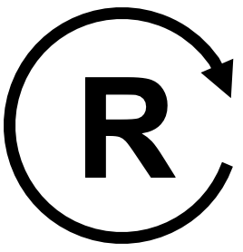
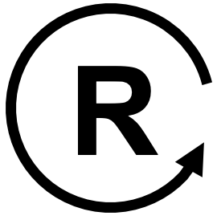
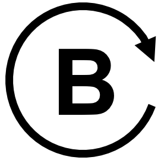
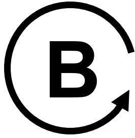

# Causal Loop Diagram Layout Rules Visualization

The following rules are used when drawing causal loop diagrams (CLDs) using
the vis.js JavaScript library.

## Node Layout Rules

1. Use the box shape when rendering nodes
2. The margin of the box is 10
3. The default font is Arial and the font size is 20
4. The border width is 2
5. Use a drop shadow
6. For unselected nodes, use a white background and a dodgerblue border
7. For selected (highlighted) nodes, use a lightsky blue background and darkblue border

Sample `nodes` definition within the `options` element:

```js
nodes: {
    shape: 'box',
    margin: 10,
    font: {
        size: 20,
        face: 'Arial'
    },
    borderWidth: 2,
    shadow: true,
    color: {
        background: 'white',
        border: 'dodgerblue',
        highlight: {
            background: 'lightskyblue',
            border: 'darkblue'
        }
    }
}
```

## Edge Layout Rules

1. Edges have an arrow on the `to` side of each arc enabled with a scale factor of 1.2
2. The color of the edges are gray with a highlight of blue
3. The default width of each edge is 2
4. By default we use a smooth edge type with type of `curvedCW` and a roundness of 0.4
5. The font for the '+' and '-" is 48

Sample `edges` definition within the `options` element:

```js
edges: {
    arrows: {
        to: { enabled: true, scaleFactor: 1.2 }
    },
    color: {
        color: 'gray', highlight: 'blue', hover: 'lightblue'
    },
    width: 2,
    smooth: {
        type: 'curvedCW',
        // changed from 0.3 to 0.4 to make curves more pronounced for two node loops
        roundness: 0.4
    },
    font: {
        size: 40,
        vadjust: -40
        strokeWidth: 3,
        strokeColor: 'white'
    }
}
```

edges: {
        arrows: { to: { enabled: true, scaleFactor: 1.2 } },
        smooth:  { enabled: true, type: 'curvedCW', roundness: 0.4 },
        color: { color: 'gray', highlight: 'blue', hover: 'lightblue' },
        width: 2,
        font: { size: 24, }
      },

## Loop Icon

1. A loop icon is placed in the center of all loops
2. There are two types of loops: Balancing and Reinforcing
3. There is a circular arrow around the loop icon that is either clockwise (default) or counter clockwise
Use one of the following loop icons:

1. Reinforcing Loop Clockwise 
2. Reinforcing Loop Counter Clockwise 
1. Balancing Loop Clockwise 
2. Balancing Loop Counter Clockwise 

## Hover Text
