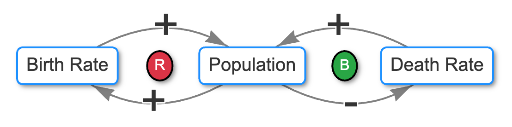

# Test of Curve Direction



Although simple CLDs can use a single default direction for
the edges, for some complex CLDs we need to be able
to control the direction of the edges.  Vis.js
allows us to do this using the edge curve parameter:

Here are two edges.  The default edge is `curvedCW` for clockwise.
In the second edge is `curvedCCW` for counter clockwise.

```js
edges [
    {
        "id": "births_to_population",
        "source": "births",
        "target": "population",
        "polarity": "positive",
        "curve": {
            "type": "curvedCW"
        },
        "description": "Clockwise curved edge from births to population"
    }
    {
        "id": "deaths_to_population",
        "source": "deaths",
        "target": "population",
        "polarity": "negative",
        "curve": {
            "type": "curvedCCW"
        },
        "description": "Counterclockwise curved edge from deaths to population"
    }
]
```