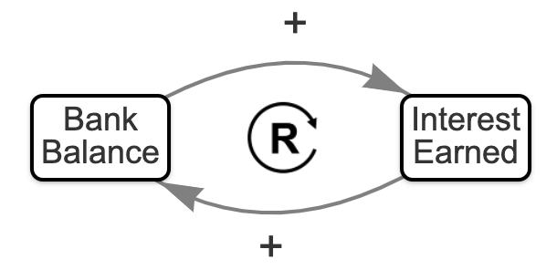

---
hide:
    - toc
---
# Test of Image for Loop Annotations



[Run the Main with the center image](./main.html)

[Run the main in iframe mode](./main-iframe.html)

<iframe src="main-iframe.html" height="420px" scrolling="no"></iframe>


```js
const centerImageDataURI = "reinforcing-loop-cw.png";
```