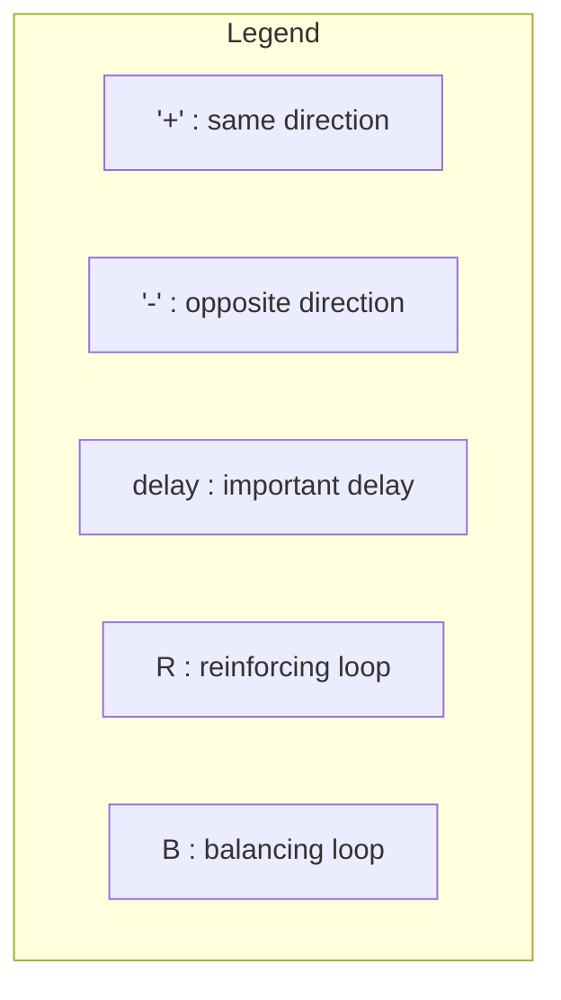
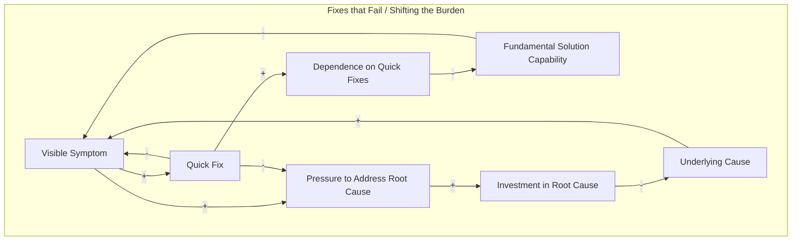
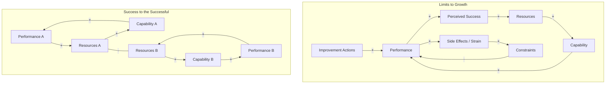
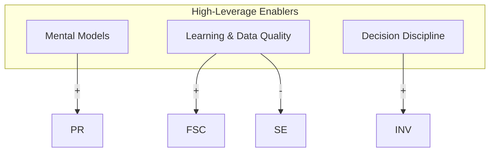

# Mermaid Test

## Legend

```mermaid
flowchart TB
  %% Legend
  subgraph Legend[Legend]
    A['+' : same direction]
    B['-' : opposite direction]
    C[delay : important delay]
    D[R : reinforcing loop]
    E[B : balancing loop]
  end
```

## Shifting the Burden

```mermaid
flowchart TB
  %% ===== Fixes that Fail / Shifting the Burden (B1/R1) =====
  subgraph B1[Fixes that Fail / Shifting the Burden]
    S[Visible Symptom] -->|+| QF[Quick Fix]
    QF -->|-| S

    QF -->|+| DEP[Dependence on Quick Fixes]
    DEP -->|-| FSC[Fundamental Solution Capability]

    PR[Pressure to Address Root Cause] -->|+| INV[Investment in Root Cause]
    INV -->|-| UC[Underlying Cause]
    UC -->|+| S

    S -->|+| PR
    QF -->|-| PR
    FSC -->|-| S
  end
```

```mermaid
flowchart TB
  %% ===== Limits to Growth (R2/B2) =====
  subgraph LB[Limits to Growth]
    ACT[Improvement Actions] -->|+| PERF[Performance]
    PERF -->|+| SUCC[Perceived Success]
    SUCC -->|+| RES[Resources]
    RES -->|+| CAP[Capability]
    CAP -->|+| PERF

    PERF -->|+| SE[Side Effects / Strain]
    SE -->|+| CON[Constraints]
    CON -->|-| PERF
  end

  %% ===== Success to the Successful (R3/R4) =====
  subgraph STS[Success to the Successful]
    PERF_A[Performance A] -->|+| RES_A[Resources A] -->|+| CAP_A[Capability A] -->|+| PERF_A
    PERF_B[Performance B] -->|+| RES_B[Resources B] -->|+| CAP_B[Capability B] -->|+| PERF_B

    RES_A ---|-| RES_B
  end
```

```mermaid
flowchart TB
  %% High-Leverage Enablers
  subgraph LEV[High-Leverage Enablers]
    MM[Mental Models]
    LD[Learning & Data Quality]
    DEL[Decision Discipline]
  end

  MM -->|+| PR
  LD -->|+| FSC
  DEL -->|+| INV
  LD -->|-| SE

```