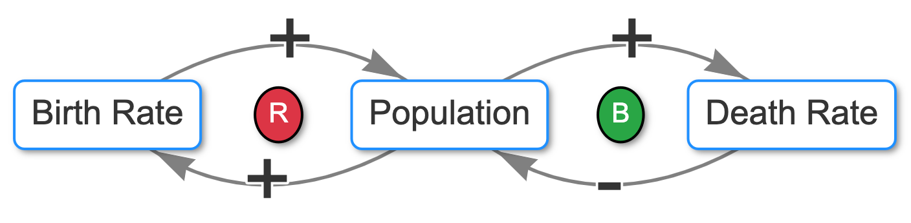

# Population Causal Loop Diagram

- The diagram shows the classic population dynamics with two competing feedback loops

[Run the Population CLD Viewer](../../sims/cld-viewer/main.html?file=population-cld.json)

**Structure:**

- This is a horizontal wide landscape layout with all nodes at y=100
- **Population** is a store placed at the center (300, 100)
- **Birth Rate** is position to the left (100, 100)
- **Death Rate** is position to the right (500, 100)
- A **Reinforcing loop** is in the center of the left birth loop at (200, 100)
- A **Balancing loop** is in the center of the right death loop at (400, 100)

**Two Clockwise Loops:**

1.  **Reinforcing Loop (R)**: Population → Birth Rate → Population
    -   More population enables more births, which increases population further
    -   This creates exponential growth potential
2.  **Balancing Loop (B)**: Population → Death Rate → Population
    -   More population means more potential deaths, which reduces population
    -   This provides a natural balancing effect

**Key Relationships:**

-   Population enables both births (more potential parents) and deaths (larger pool subject to mortality)
-   Births add to population (+), deaths subtract from population (-)
-   The interaction between these loops determines overall population growth patterns

The diagram includes comprehensive educational content, scenarios (like baby booms vs. population decline), and leverage points for understanding how to influence population dynamics. This represents a fundamental systems thinking model that's used in demographics, ecology, and sustainability studies.
