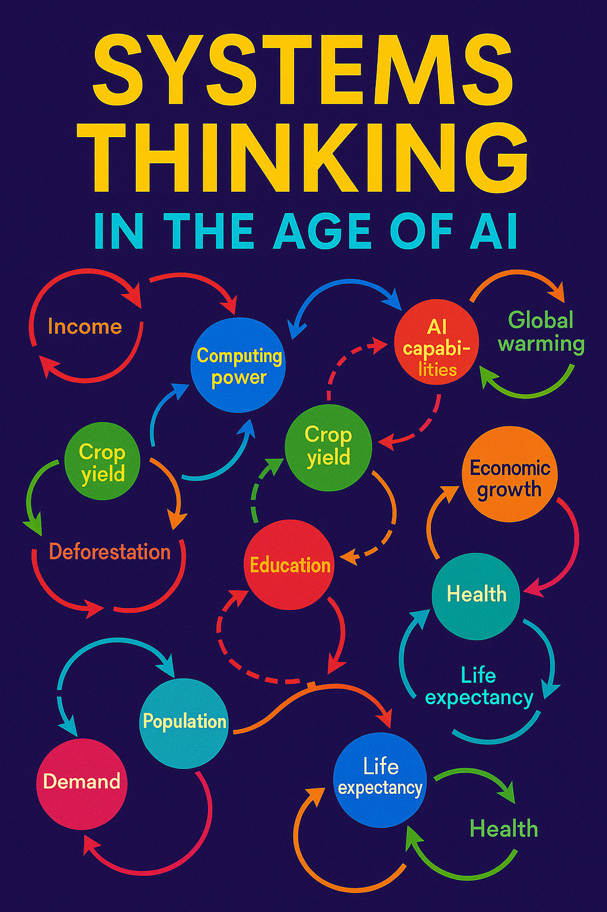

---
hide:
  - title   # Hide the page title
  - toc     # Hide the table of contents
# Systems Thinking in the age of AI
---

Welcome to our website for fans of systems thinking!  The goal of this website
is to provide high quality AI-generated systems thinking resources for a broad 
audience of users.

## Updated for AI Tools

Our 2025 release now features a curated set of generative AI prompts,
a large set of archetypes from many industries and fun
graphic novel stories appealing to younger students.

Whenever you are confronted with difficult problems we
have great tutorials and concrete examples of systems thinking to help you
achieve your goals.

Please let me know if you have any questions or
feedback on this website.

Dan McCreary [Dan on LinkedIn: https://www.linkedin.com/in/danmccreary/](https://www.linkedin.com/in/danmccreary/)

