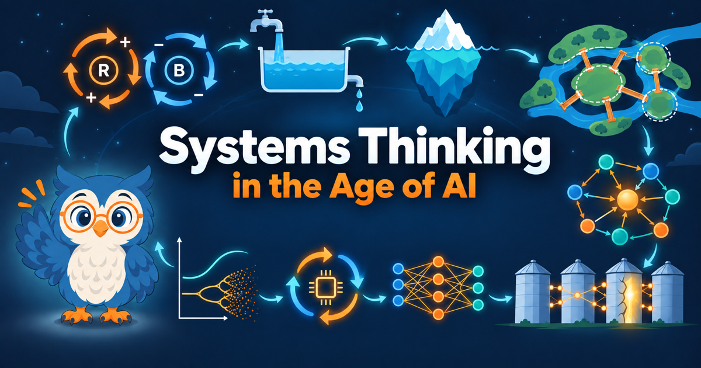

Welcome to our website for fans of systems thinking!  The goal of this website
is to provide high quality AI-generated systems thinking resources for a broad 
audience of users.

## Updates 2026 Version

Our new 2026 release of this textbook now features a fully redesigned learning graph with 528 concepts.
We have also updated our curated set of generative AI prompts, that work with a more
robust skill that generated higher quality causal loop digrams
a large set of archetypes from many industries and fun
graphic novel stories appealing to younger students.

Whenever you are confronted with difficult problems we
have great tutorials and concrete examples of systems thinking to help you
achieve your goals.

## Explore the Book

- [**Chapters**](chapters/index.md) — the full list of chapters, from the foundations of systems thinking through enterprise knowledge graphs and AI systems dynamics
- [**Archetypes**](archetypes/index.md) — recurring systems patterns like Tragedy of the Commons, Fixes That Fail, and Limits to Growth, illustrated with real-world stories
- [**MicroSims**](sims/index.md) — interactive simulations you can run in your browser to explore feedback loops, growth patterns, and system dynamics hands-on
- [**Glossary**](glossary.md) — clear definitions of the key terms used throughout the book

Please let me know if you have any questions or
feedback on this website.

Dan McCreary [Dan on LinkedIn: https://www.linkedin.com/in/danmccreary/](https://www.linkedin.com/in/danmccreary/)

