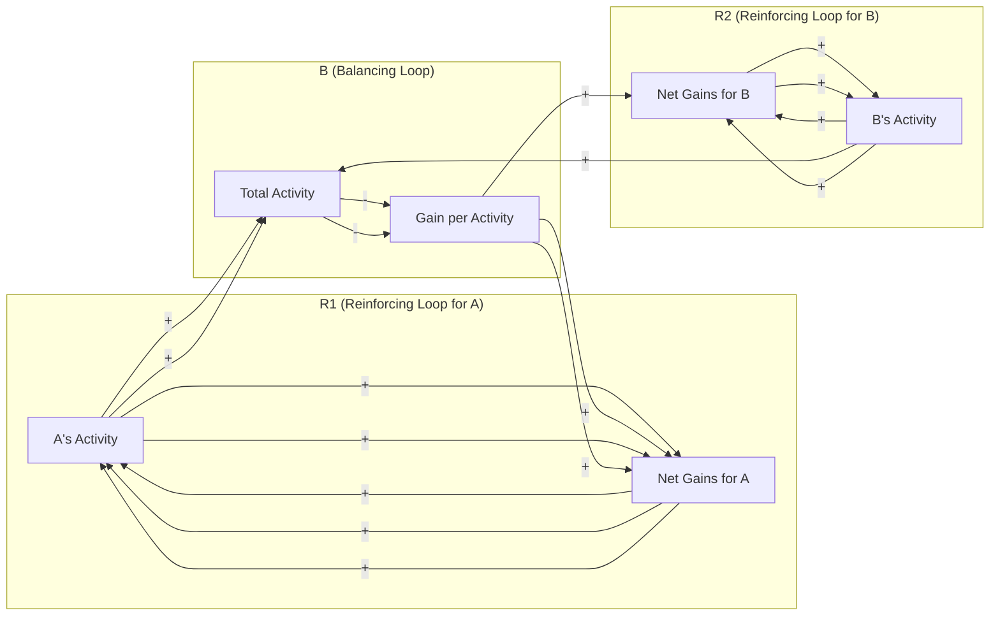

# Tragedy of the Commons in Mermaid

```mermaid
graph LR
            A["A's Activity"] -->|+| AR["Net Gains for A"]
            AR -->|+| A
            B["B's Activity"] -->|+| BR["Net Gains for B"]
            BR -->|+| B
            A -->|+| T["Total Activity"]
            B -->|+| T
            T -->|-| G["Gain per Activity"]
            G -->|+| AR
            G -->|+| BR
subgraph "R1 (Reinforcing Loop for A)"
A -- + --> AR -- + --> A
end
subgraph "R2 (Reinforcing Loop for B)"
B -- + --> BR -- + --> B
end
subgraph "B (Balancing Loop)"
A -- + --> T -- - --> G -- + --> AR -- + --> A
end
```