# List of MicroSims for Systems Thinking in the Age of AI

Interactive Micro Simulations (MicroSims) that let you explore feedback loops, stocks and flows, emergence, and knowledge graphs hands-on. Click any card to open the MicroSim.

-   **[Bathtub Stock and Flow Simulator](./bathtub/index.md)**

    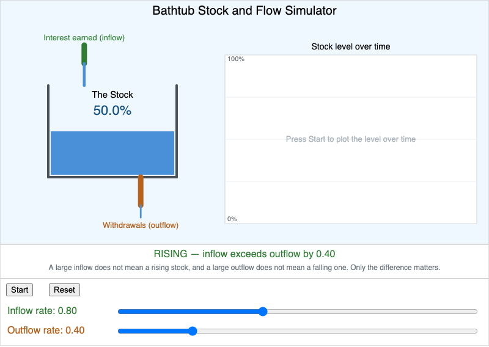

    Set inflow and outflow rates independently and predict whether the stock rises, falls, or holds steady.

-   **[Breadth-First Search Step-by-Step](./bfs/index.md)**

    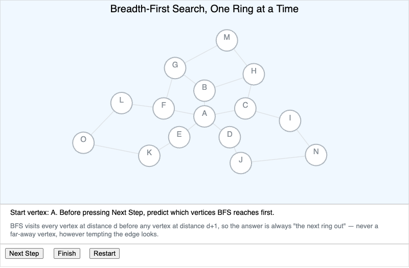

    Advance breadth-first search one ring at a time and predict which vertices it must visit next.

-   **[Capability Maturity Model for Systems Thinking](./cmm-for-systems-thinking/index.md)**

    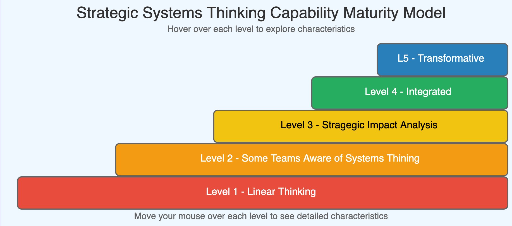

    An interactive infographic microsim that shows the five-level of a capability-maturity model for enterprise systems thinking.

-   **[Causal Loop Diagram Viewer](./cld-viewer/index.md)**

    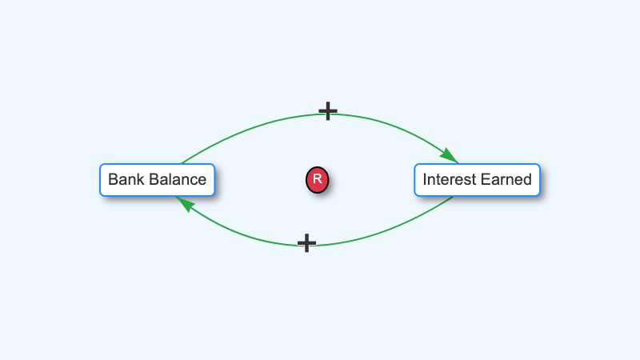

    A reusable viewer that renders causal loop diagrams from JSON files, with optional menus for loading example CLDs such as the bank balance loop.

-   **[Cause-and-Effect Chain](./cause-effect-chain/index.md)**

    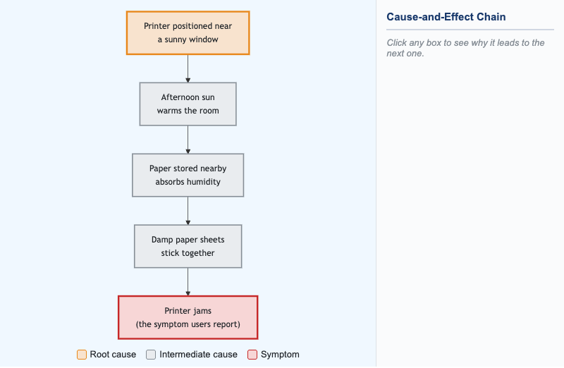

    Trace a printer that jams every afternoon back through four intermediate causes to its root cause.

-   **[CLD Editor](./cld-editor/index.md)**

    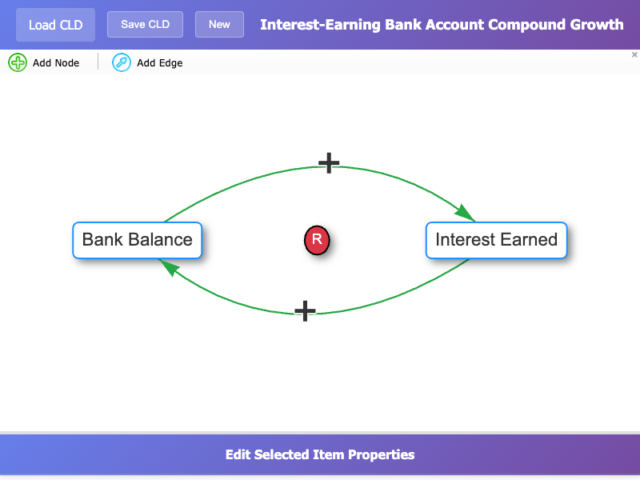

    An interactive editor for building causal loop diagrams: add and edit variables, polarized links, delays, and reinforcing or balancing loops, then save the diagram as JSON.

-   **[Conceptual, Logical, and Physical Data Models](./data-model-layers-workflow/index.md)**

    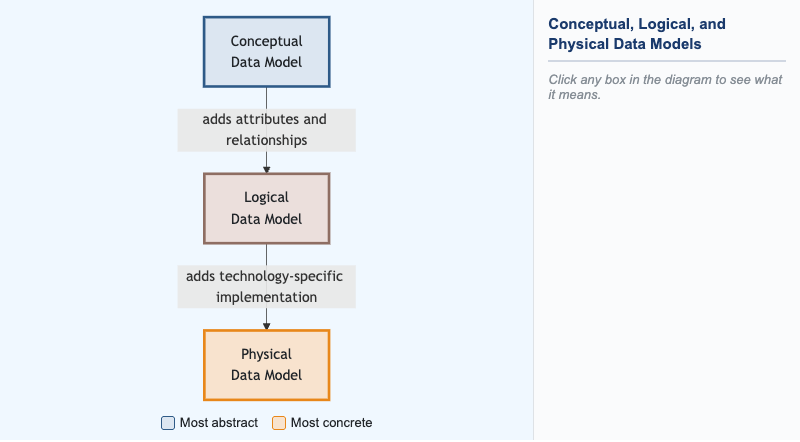

    Trace one retailer relationship through conceptual, logical and physical models and see what each layer adds.

-   **[Data Ingestion Pipeline -- From Lake to Warehouse to Mart](./data-warehouse-pipeline/index.md)**

    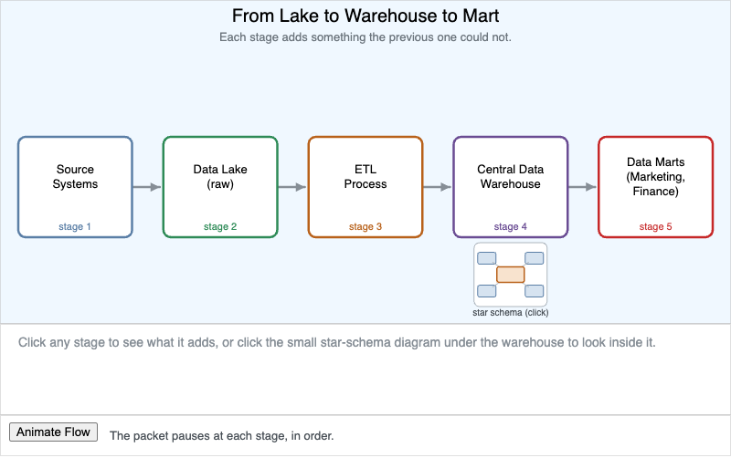

    Sequence a data lake, ETL, warehouse and marts, and look inside the warehouse's star schema.

-   **[Data Lineage and Stewardship Along a Pipeline](./lineage-stewardship-explorer/index.md)**

    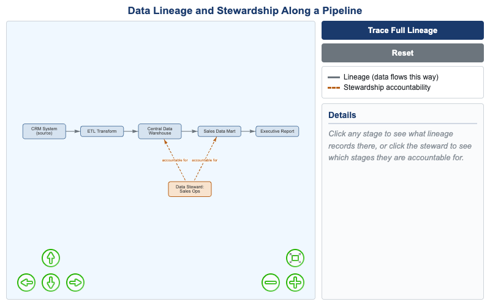

    Trace a field from CRM to executive report and see which two stages a named data steward is accountable for.

-   **[Emergence From Local Rules](./emergence-local-rules/index.md)**

    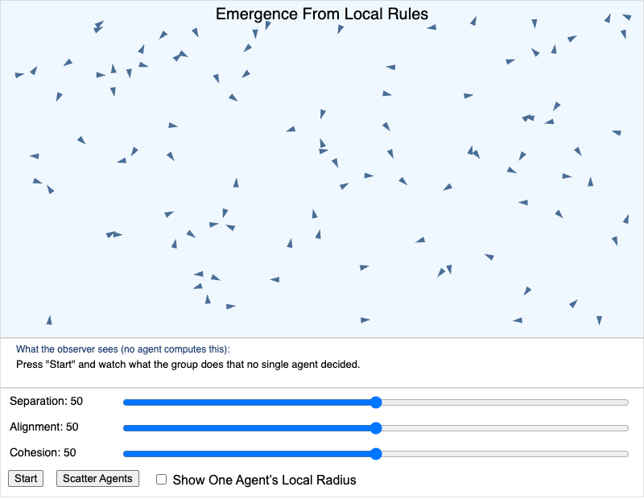

    Weight three local steering rules and predict the flock-level pattern that no individual agent computes.

-   **[Emergence Simulator (Flocking)](./emergence-simulator/index.md)**

    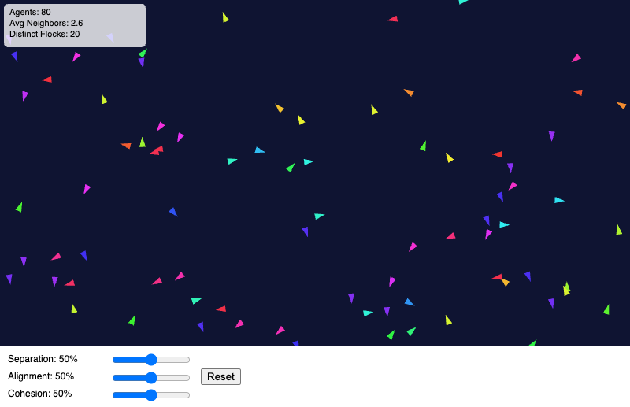

    Watch coordinated flock-level movement appear from agents that each follow only local rules, with no central controller.

-   **[Entity-Attribute-Relationship Explorer](./entity-attribute-relationship-explorer/index.md)**

    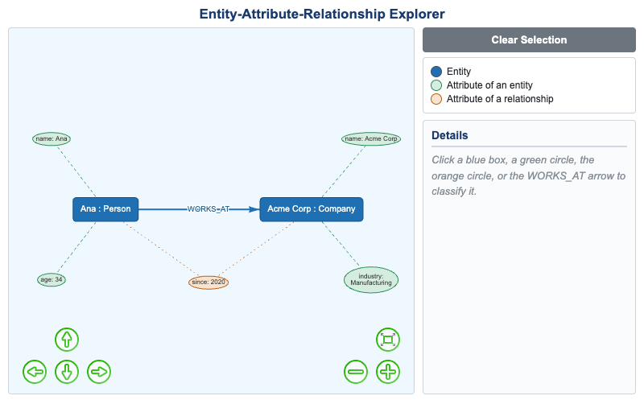

    Classify every piece of a small knowledge representation as an entity, an attribute, or a relationship - including the attribute that belongs to the edge.

-   **[Filter Bubble Formation Simulator](./filter-bubble-formation-simulator/index.md)**

    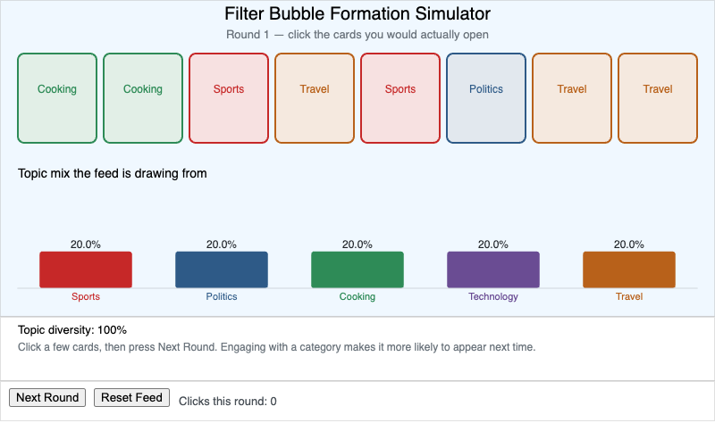

    Click the content you would actually open and watch topic diversity collapse over a handful of rounds.

-   **[Fishbone Diagram — Cart Abandonment](./fishbone-cart-abandonment/index.md)**

    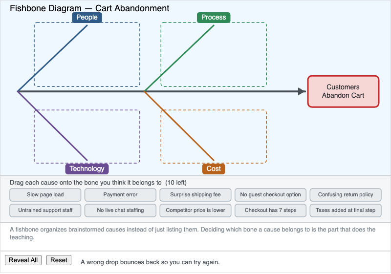

    Drag ten candidate causes of cart abandonment onto the People, Process, Technology or Cost bone they belong to.

-   **[From Intervention Point to Implementation](./intervention-to-implementation-workflow/index.md)**

    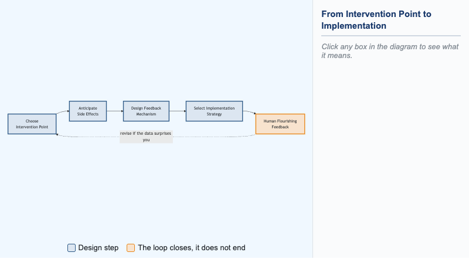

    Sequence five design steps from choosing an intervention point to closing the feedback loop, with a hospital-scheduling example at each step.

-   **[Graph Algorithms Explorer](./graph-algorithms-explorer/index.md)**

    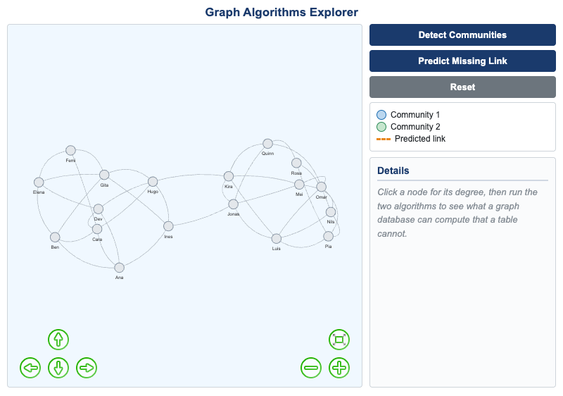

    Run community detection and link prediction on an 18-node network and interpret both results.

-   **[Growth Rate Comparison](./growth-rates/index.md)**

    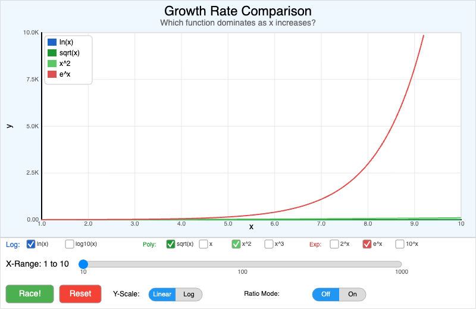

    Zoom the x-axis out and watch logarithmic, linear and exponential curves that looked similar separate dramatically.

-   **[How Embodied Knowledge Moves, Fades, and Leaks](./knowledge-behavior-map/index.md)**

    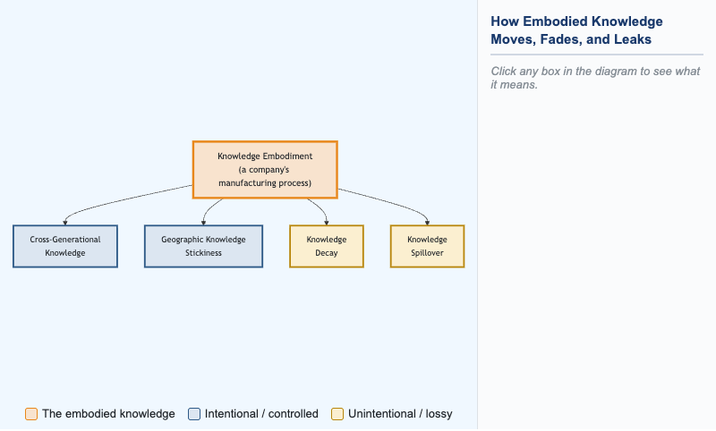

    Classify four ways knowledge moves, fades or leaks, and separate intentional transfer from unintentional spillover.

-   **[Infographic Workflow for Creating a Causal Loop Diagram](./cld-creation-workflow/index.md)**

    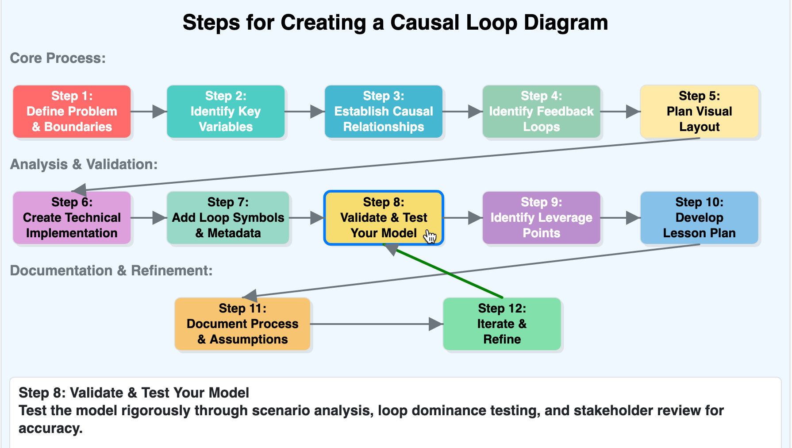

    An interactive infographic-style workflow for the 12 steps in creating a causal loop diagram

-   **[Inside a Neural Network Layer](./neural-network-layer-explorer/index.md)**

    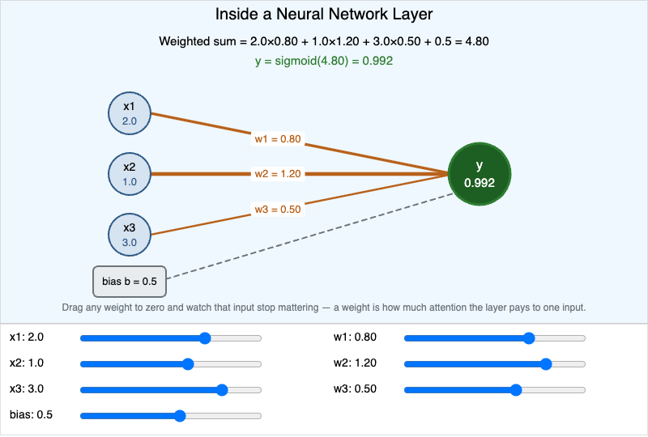

    Move seven sliders and watch a neural network layer's weighted sum and sigmoid activation recompute live.

-   **[Intelligent Agent Causal Loop Diagrams](./agent-cld/index.md)**

    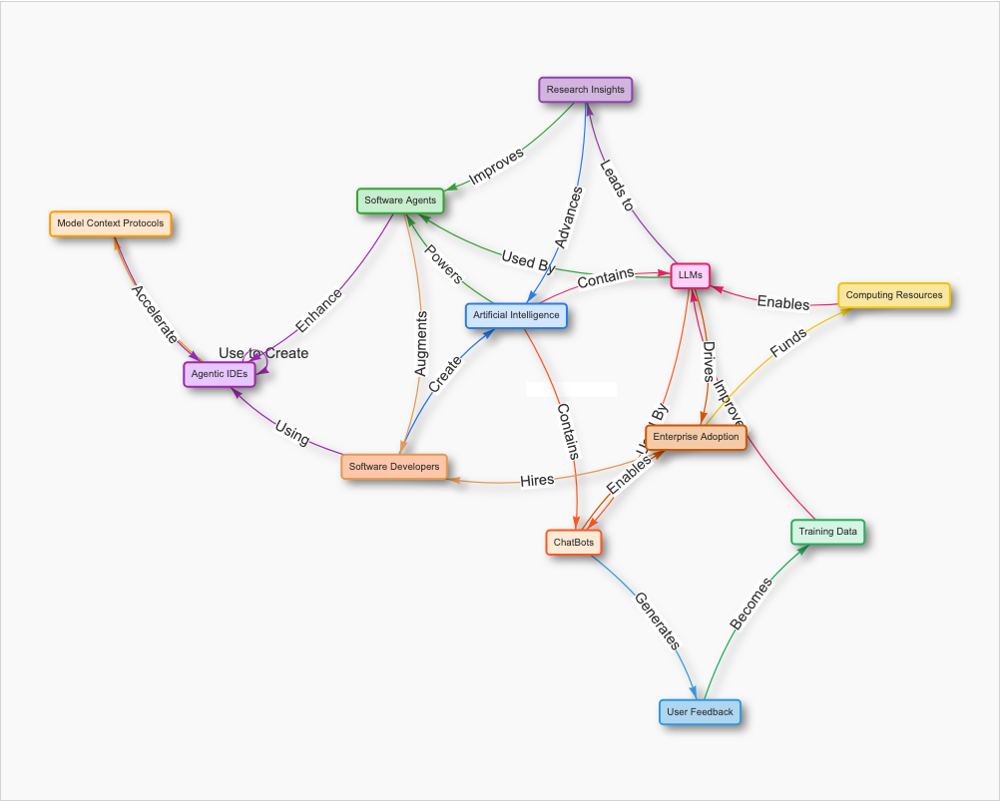

    Several versions of a vis.js causal loop diagram showing how AI, software developers, software agents, agentic IDEs, and MCP reinforce each other to accelerate AI capabilities.

-   **[Interconnection Network Explorer](./interconnection-network-explorer/index.md)**

    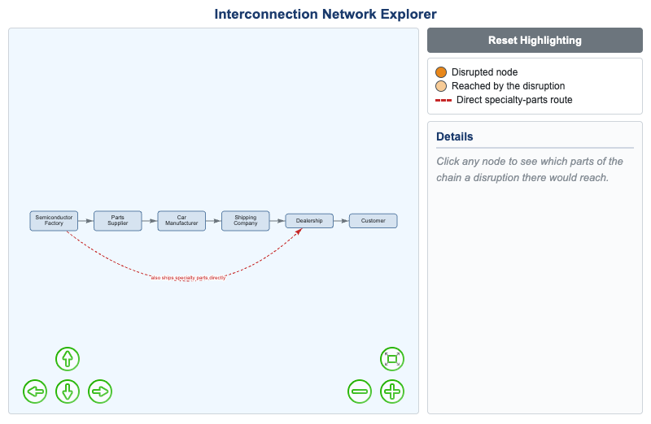

    Click any node in a six-stage supply chain to trace which parts a disruption there would reach, directly and indirectly.

-   **[Learning Curve vs. Experience Curve](./learning-experience-curve-chart/index.md)**

    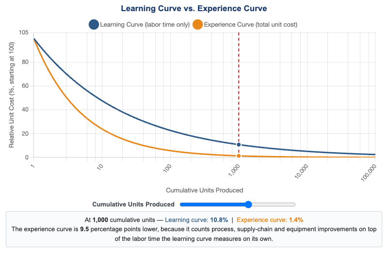

    Compare the learning curve against the experience curve on a log-scaled production axis and see why one falls faster.

-   **[Learning Graph Viewer](./graph-viewer/index.md)**

    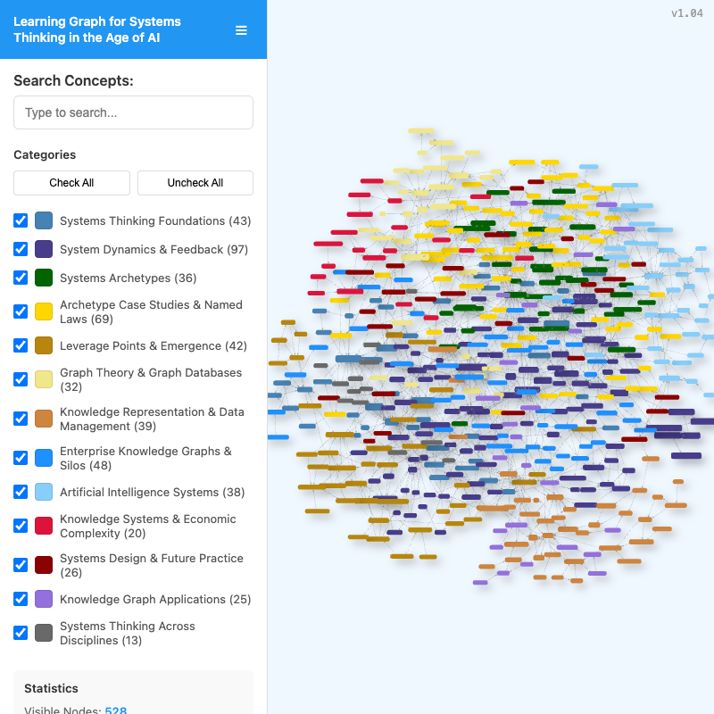

    Explore this book's learning graph of concepts and prerequisites with search, category filters, zoom, and live node and edge counts.

-   **[Leverage Points Iceberg](./leverage-iceberg/index.md)**

    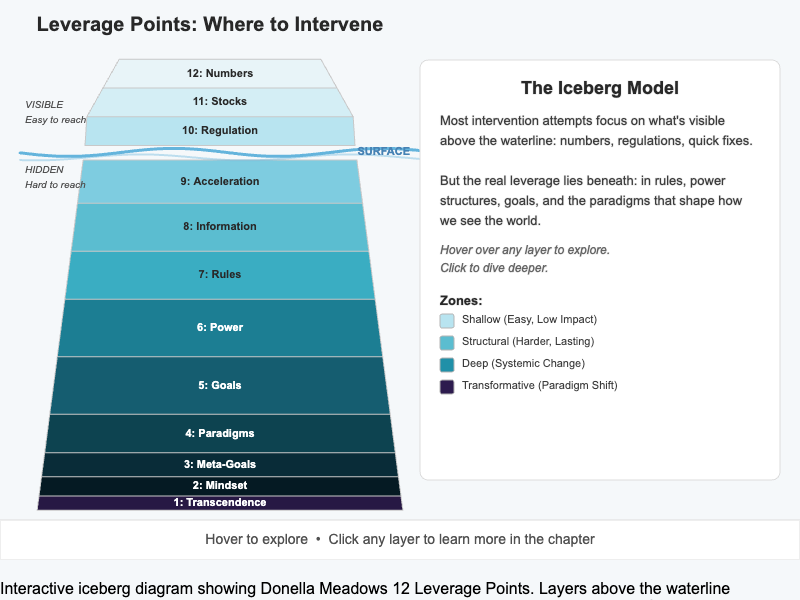

    An interactive visualization of Donella Meadows' 12 Leverage Points using the iceberg metaphor, showing that deep interventions are hidden but transformative.

-   **[Logistic Growth S-Curve Explorer](./logistic-growth-explorer/index.md)**

    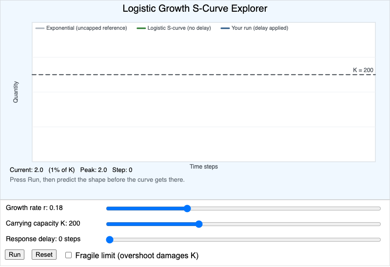

    Add response delay to logistic growth and watch a smooth S-curve turn into overshoot, then into collapse.

-   **[Logistic Map Bifurcation Explorer](./logistic-map-bifurcation-explorer/index.md)**

    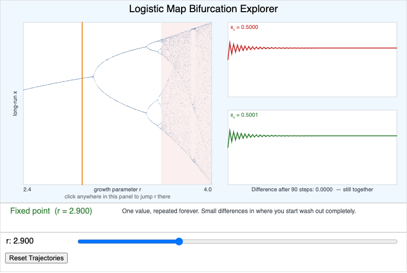

    Drag one parameter through the logistic map's route to chaos and watch two near-identical trajectories separate.

-   **[Loop Polarity Counter](./loop-polarity-counter/index.md)**

    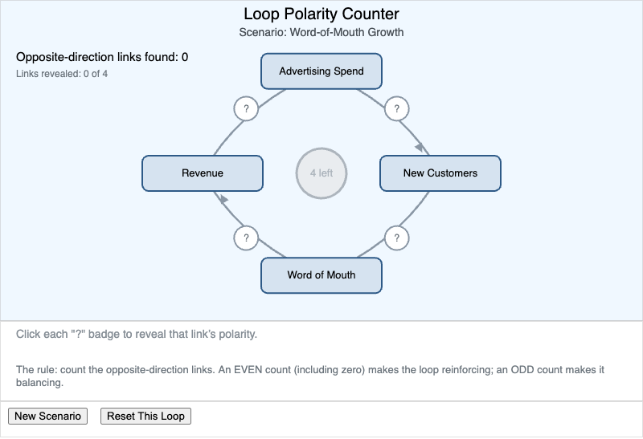

    Click each link of a four-node causal loop to reveal its polarity, then let the running tally decide whether the loop is reinforcing or balancing.

-   **[Mapping Two Schemas to a Canonical Schema](./canonical-schema-mapping/index.md)**

    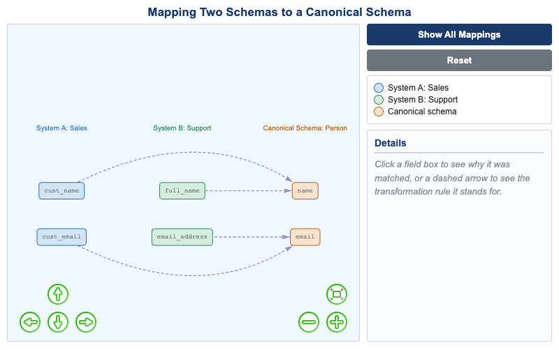

    Match differently-named fields from two source systems to a canonical schema and read each transformation rule.

-   **[Metadata Registry vs. Catalog](./registry-vs-catalog/index.md)**

    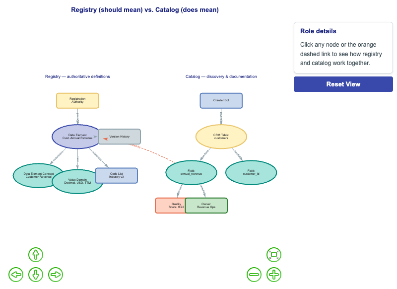

    Compare a governed metadata registry against a discovery catalog, and follow the dashed link that keeps a found field traceable to its definition.

-   **[MicroSim Growth Network Effect](./microsim-growth/index.md)**

    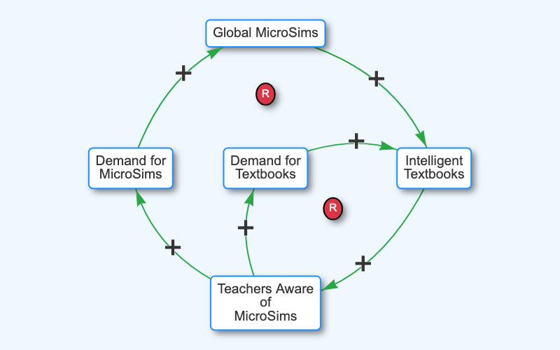

    A reinforcing feedback system showing how MicroSims, Intelligent Textbooks, and Teacher Awareness create a virtuous cycle of growth through network effects.

-   **[Moore's Law Timeline](./moores-law/index.md)**

    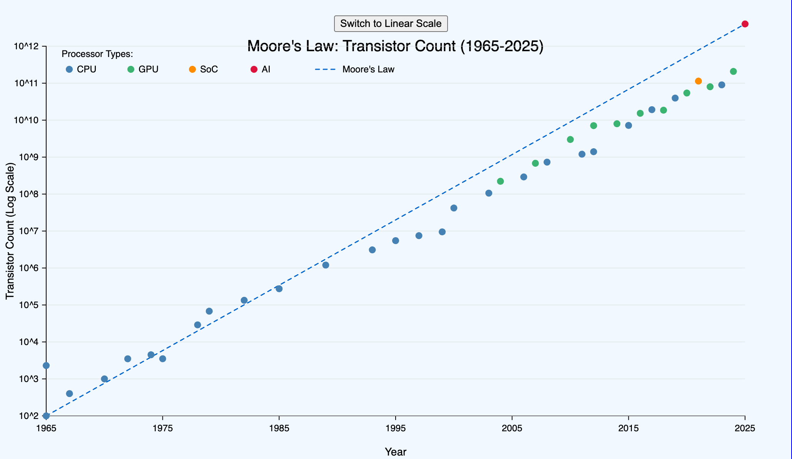

    An infographic with hovers showing the progress of Moore's Law in both linear and log scales.

-   **[Multi-Hop Query Performance, RDBMS vs Graph Database](./multi-hop-performance/index.md)**

    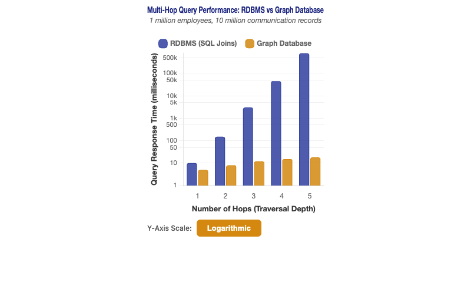

    Compare RDBMS join time against graph traversal time from one to five hops, on a log or a linear axis.

-   **[Node Simulator Test](./node-simulation/index.md)**

    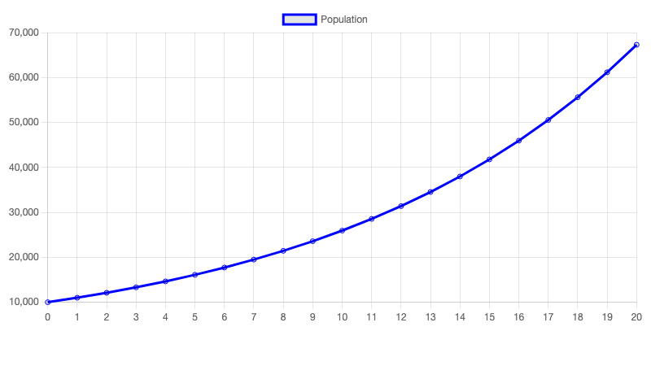

    A test of the Insight Maker simulation library: a single population stock with a 10% growth flow, simulated over 20 years and plotted with Chart.js.

-   **[Point-to-Point vs. Hub Integration Cost](./integration-cost-explorer/index.md)**

    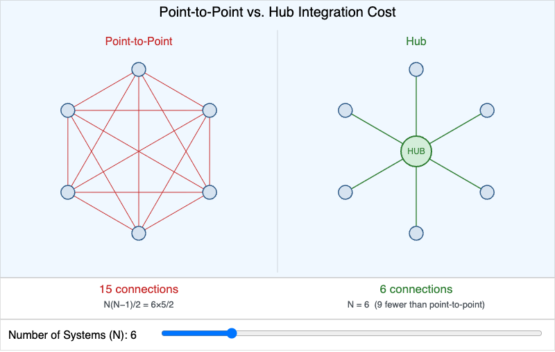

    Move one slider and watch point-to-point connections grow as N(N-1)/2 while hub connections grow as N.

-   **[Population Simulator with Causal Loop Diagram](./population-simulator/index.md)**

    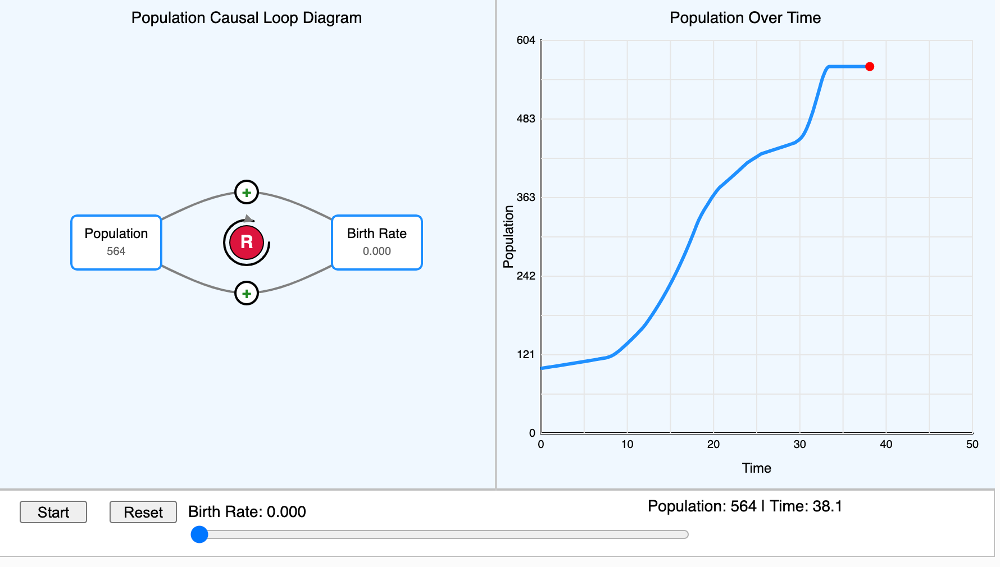

    A graphic novel about Tragedy of the Commons.

-   **[Predator-Prey Population Dynamics](./predator-prey/index.md)**

    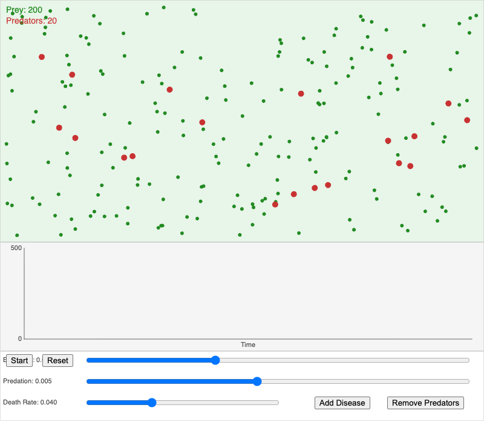

    Watch predator and prey populations oscillate out of phase in an animated Lotka-Volterra meadow.

-   **[Product Space Explorer](./product-space-explorer/index.md)**

    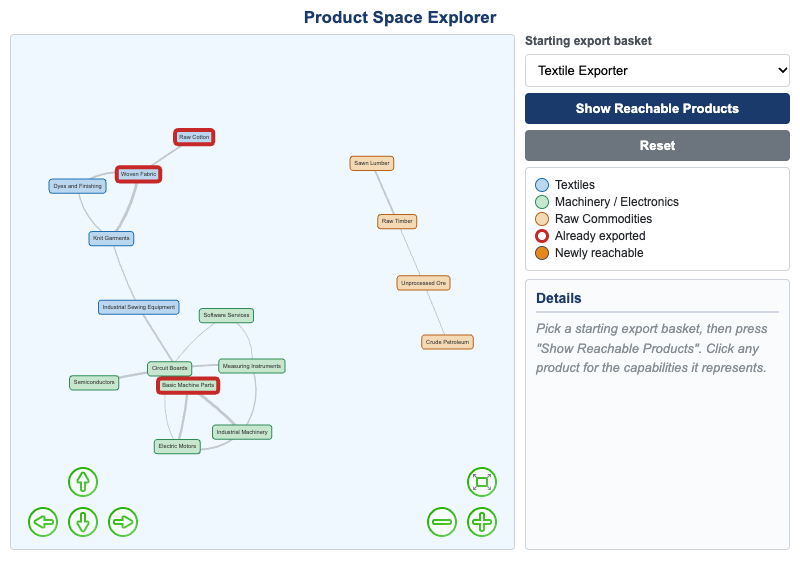

    Pick a starting export basket and see how many products relatedness puts within one step's reach.

-   **[Reinforcing vs. Balancing Loop Simulator](./reinforcing-vs-balancing/index.md)**

    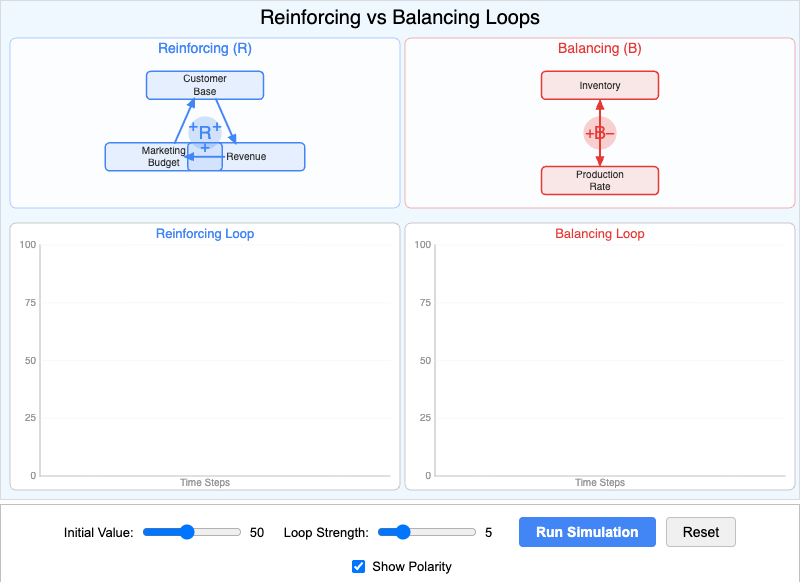

    Compare a reinforcing loop's runaway growth curve against a balancing loop's goal-seeking convergence, side by side.

-   **[Stakeholder Power-Interest Grid](./stakeholder-power-interest-grid/index.md)**

    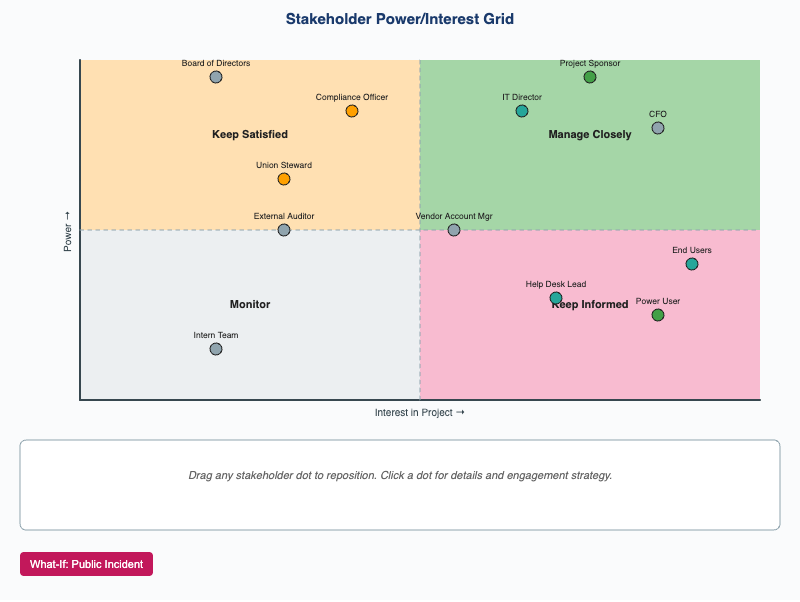

    Place stakeholders on a power-interest grid and justify a different engagement strategy for each quadrant.

-   **[Stock and Flow Notation Explorer](./stock-flow-notation-explorer/index.md)**

    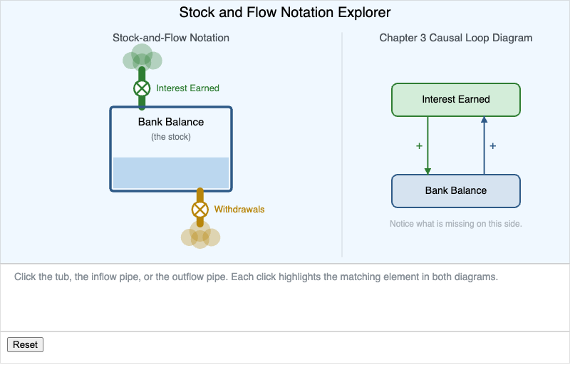

    Click parts of a bathtub-style stock-and-flow diagram to see how each maps onto the causal loop diagram from Chapter 3.

-   **[Subsystem Nesting Explorer](./subsystem-nesting-explorer/index.md)**

    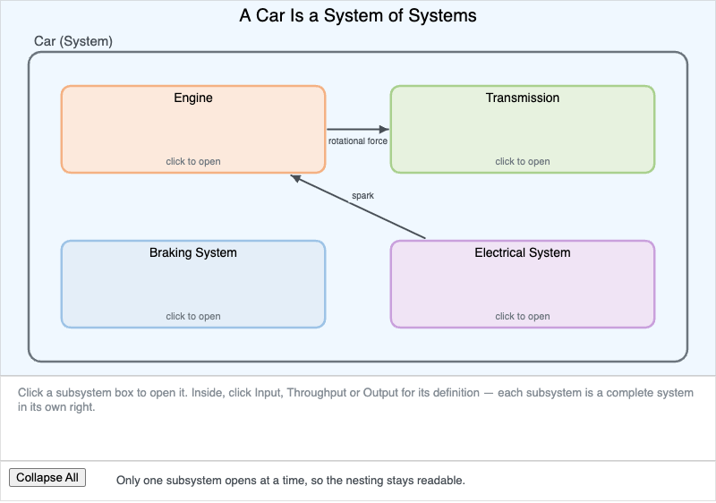

    Open each of a car's four subsystems to see that every subsystem is a complete system in its own right.

-   **[System Boundary Explorer](./system-boundary-explorer/index.md)**

    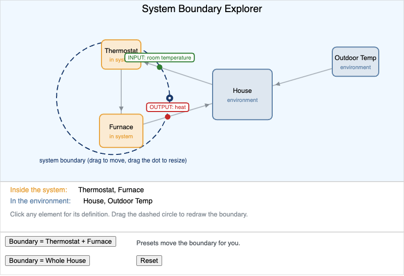

    Drag a boundary around a household heating system and watch what counts as input, output, or environment change.

-   **[Systems Map Example — Coffee Shop](./systems-map-coffee-shop/index.md)**

    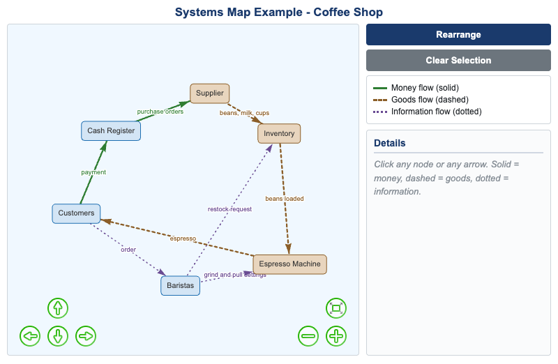

    Explore a coffee shop as a systems map, with money, goods and information flows drawn in three distinct line styles.

-   **[The Book's Concept Clusters, Connected](./book-concept-cluster-map/index.md)**

    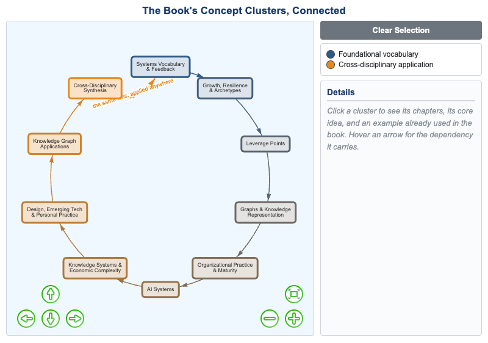

    Walk the book's ten concept clusters around a circle and see how each one builds on the last.

-   **[The Generic Software Capability Maturity Model](./cmm-template/index.md)**

    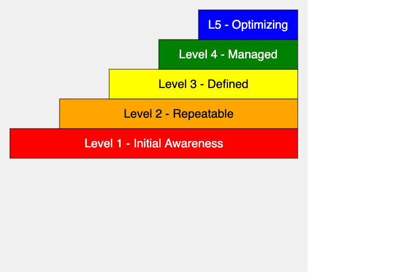

    Hover the five ascending maturity levels to place an organizational behavior at the right step.

-   **[The Organizational Silo Reinforcing Loop](./silo-reinforcing-loop/index.md)**

    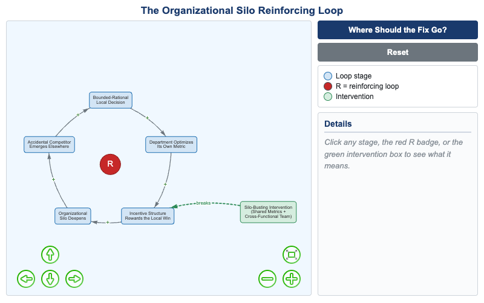

    Trace the five-stage loop that keeps an organizational silo intact, and find the one link an intervention can actually cut.

-   **[The Seven Bridges of Konigsberg](./konigsberg-bridges/index.md)**

    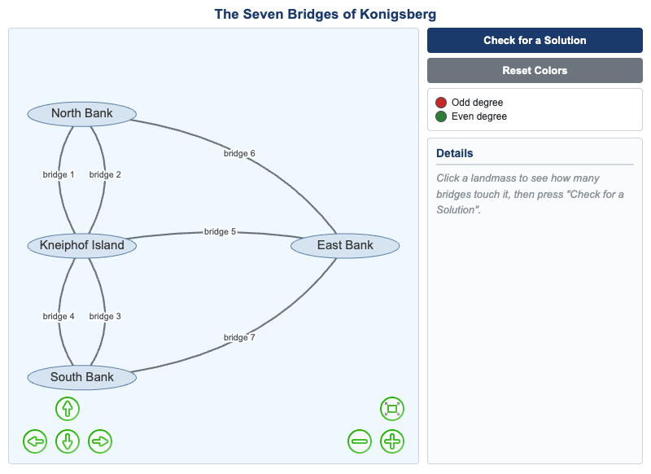

    Compute each landmass's degree and apply Euler's odd-degree rule to see why the famous walk is impossible.

-   **[The Technical Debt Feedback Loop](./tech-debt-feedback-loop/index.md)**

    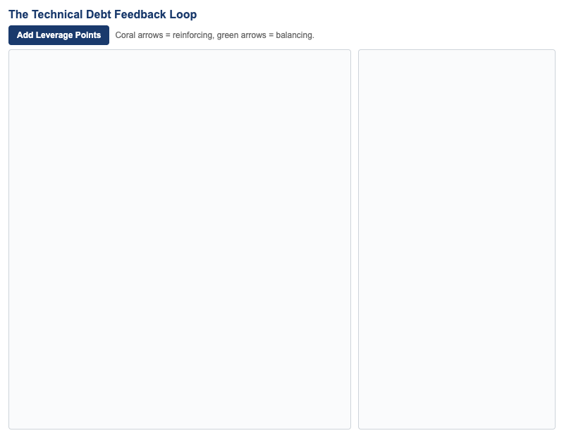

    Explore the technical debt doom loop and three leverage-point interventions that break it.

-   **[Three Feedback Loops Behind Algorithmic Disparate Impact](./algorithmic-disparity-loops/index.md)**

    

    Trace three high-stakes algorithmic systems and discover all three are the same reinforcing loop.

-   **[Three Reinforcing Loops Behind Knowledge Graph Adoption](./ekg-adoption-loops/index.md)**

    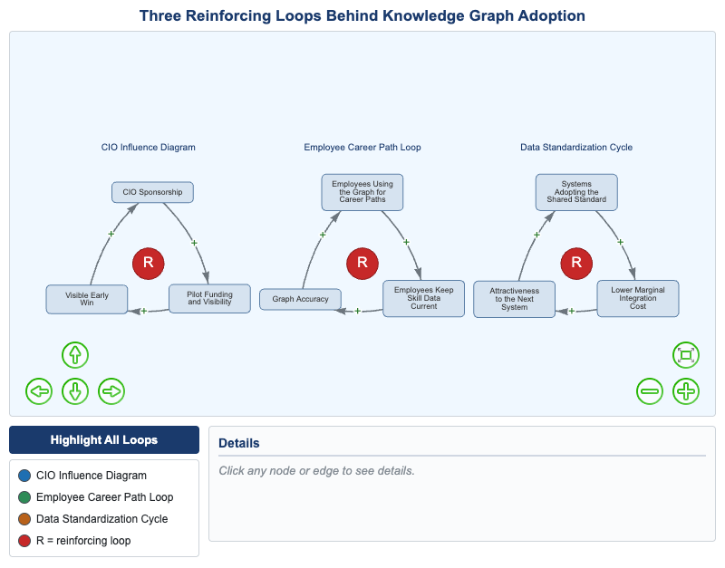

    Trace three reinforcing loops behind knowledge graph adoption and see that all three share one structure.

-   **[Tragedy of the Commons Agent-Based Simulation](./toc/index.md)**

    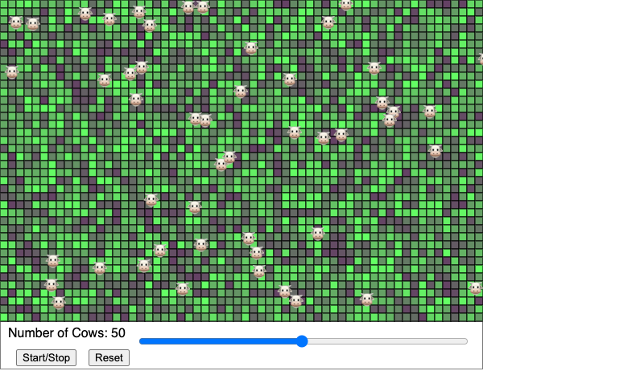

    Add cows to a shared pasture and find the herd size at which the grass stops recovering between grazing cycles.

-   **[Training vs. Validation Error -- Spotting the Overfitting Point](./overfitting-error-curves/index.md)**

    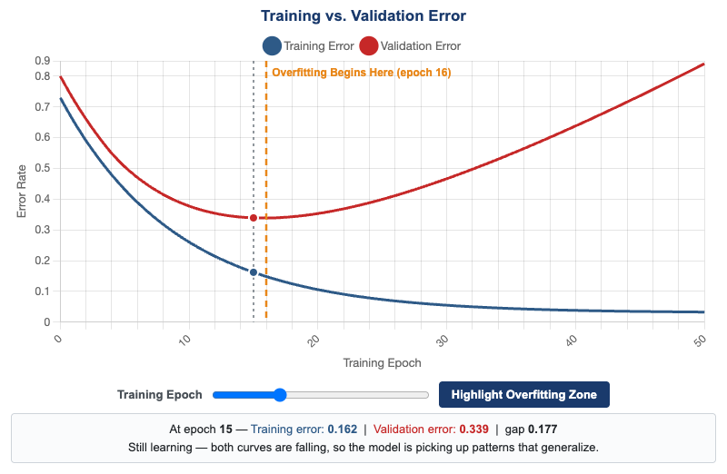

    Slide through 50 training epochs and find the exact point where validation error turns upward.

-   **[Vertical vs Scale-Out Graph Architecture](./graph-scale-out-architecture/index.md)**

    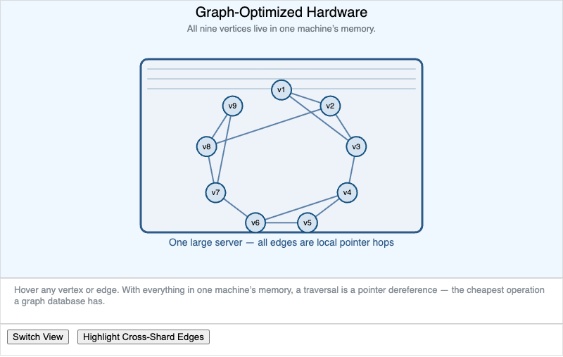

    Toggle between one large graph server and a three-shard cluster, and see why a cross-shard edge costs so much more.

