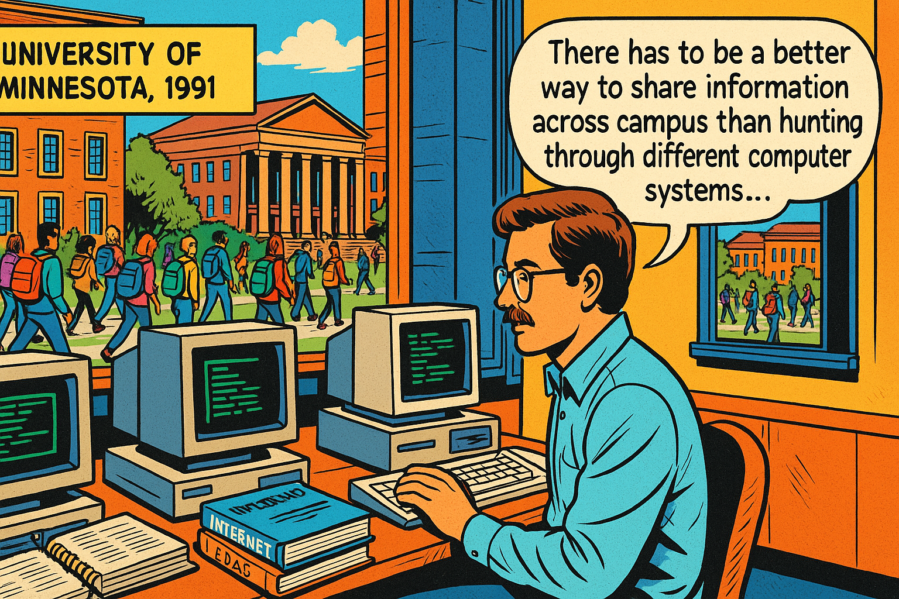
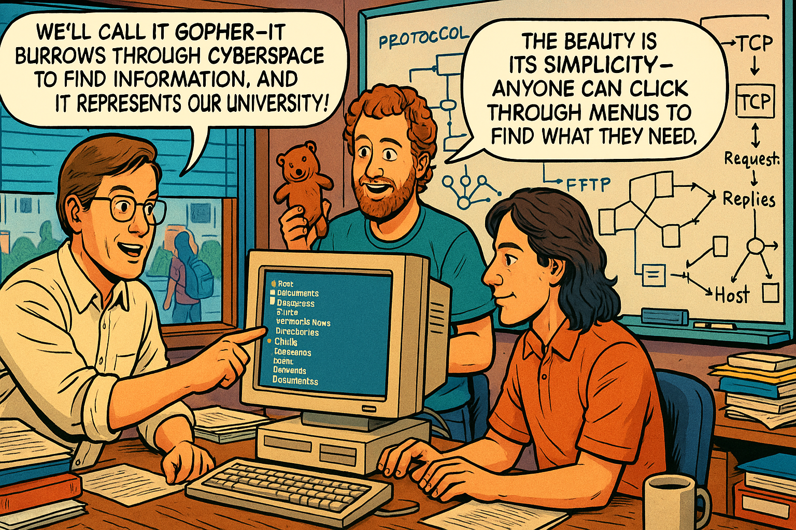
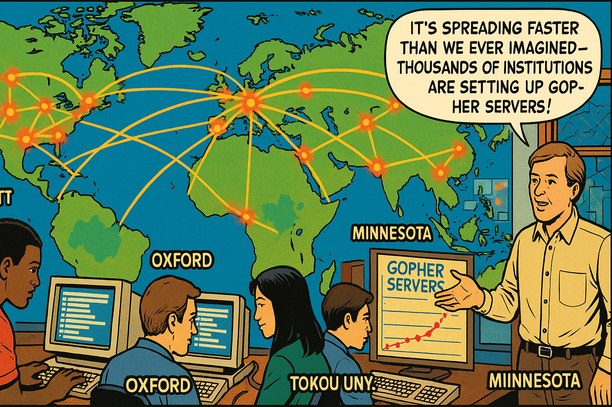
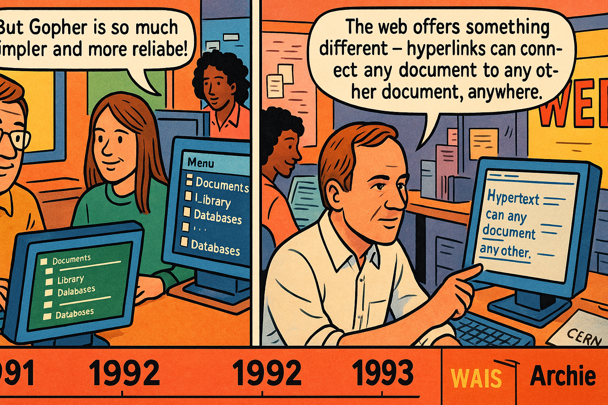
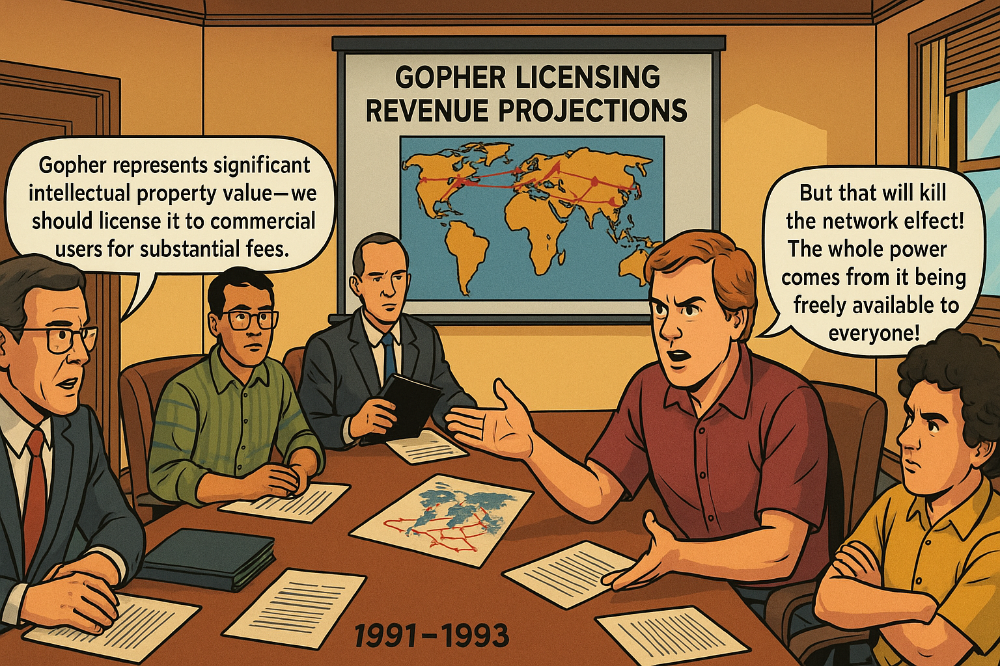
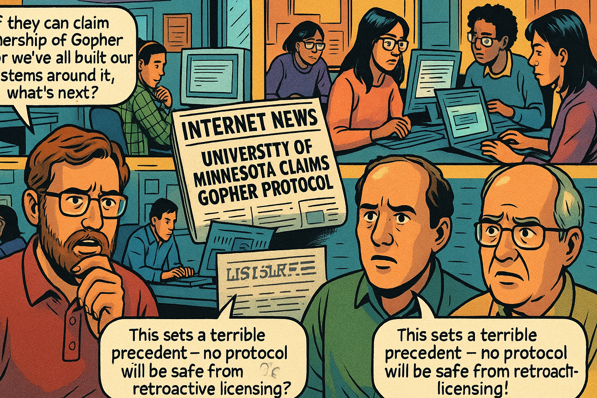
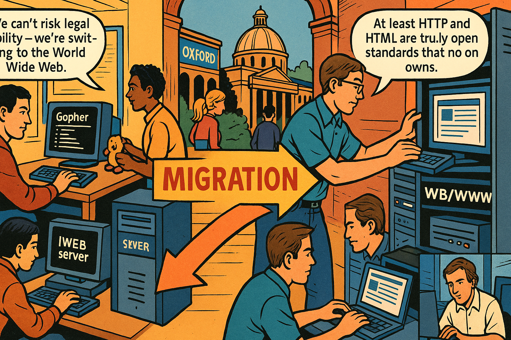
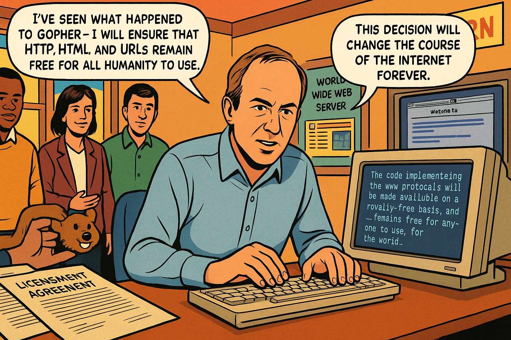
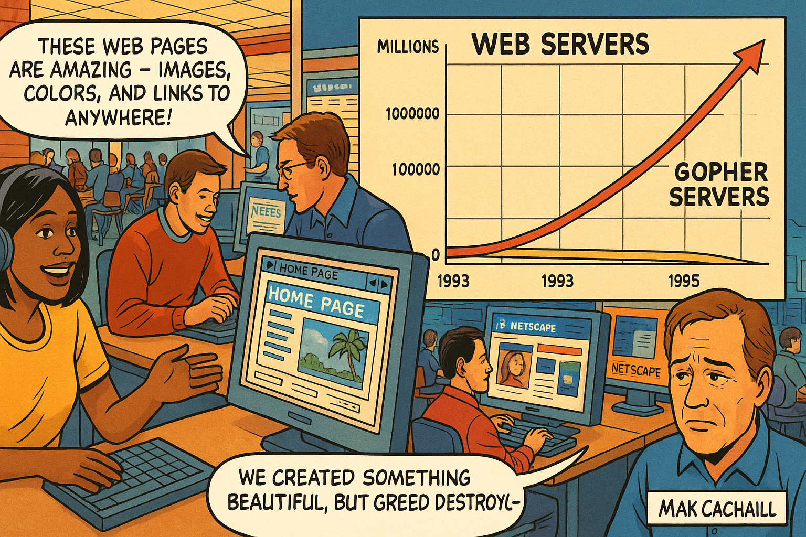
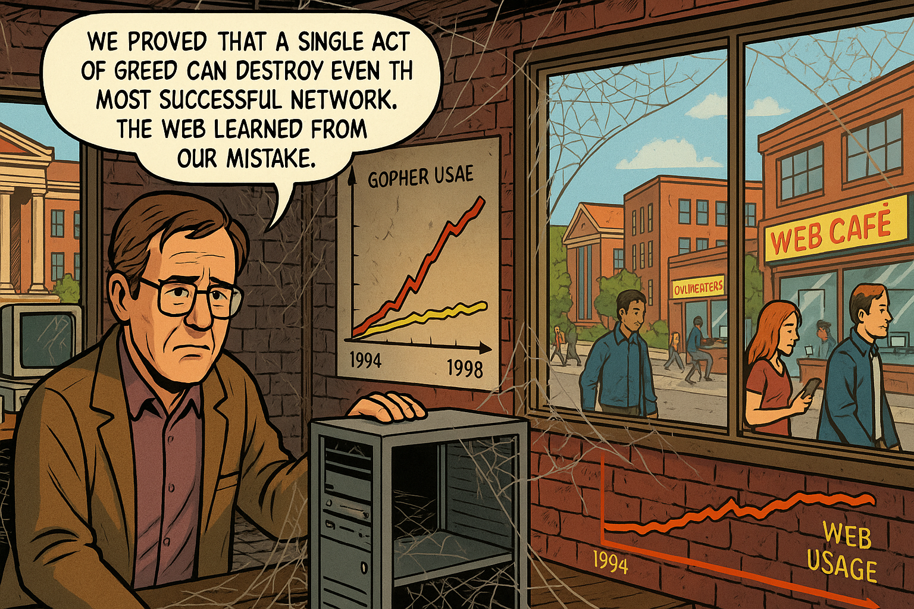

# The Fall of Gopher: A Graphic Novel Story of How Legal Greed Killed a Protocol and Sparked the Open Web

This is the story of how one university's attempt to monetize their creation accidentally destroyed it, paving the way for the World Wide Web. Through the lens of the Gopher protocol's rise and fall, we'll explore the "Tragedy of the Commons" archetype, network effects, and how openness became the defining principle of the internet age.

## The Information Revolution Begins

   
The Information Revolution Begins

Panel 1:
   Please generate a wide-landscape drawing using a bright colorful palette of colors in the style of a graphic novel comic book. Make sure you use a wide-landscape 16:9 width:height format.

In this panel, we see the University campus in 1991, with students and faculty walking between brick buildings. Inside the computer science building, we see early 1990s computers with green-screen monitors displaying text-based interfaces. A young computer scientist, Mark McCahill, sits at his workstation surrounded by technical manuals and printouts. Through the window, we can see the campus quad with students carrying heavy backpacks full of books. Speech bubble from Mark: "There has to be a better way to share information across campus than hunting through different computer systems..." The scene conveys the pre-web era when accessing digital information was fragmented and difficult.

Our story begins at the University in 1991, when the internet existed but the World Wide Web was just a distant dream. Students and faculty struggled to find information scattered across different computer systems, each with its own arcane commands and interfaces. Mark McCahill, a systems programmer at the university's computer center, was frustrated by this chaos. He envisioned a simple, menu-driven system that would let anyone navigate through information as easily as walking through a library. Little did he know that his solution would demonstrate a fundamental principle of systems thinking: how the structure of ownership and control can determine whether an innovation thrives or dies.

## Birth of the Gopher

   
Birth of the Gopher

Panel 2:
   Please generate a wide-landscape drawing using a bright colorful palette of colors in the style of a graphic novel comic book. Make sure you use a wide-landscape 16:9 width:height format. Make sure that any characters are consistent with prior panels.

In this panel, Mark McCahill and his small team of programmers work intensively in a cluttered computer lab. Whiteboards are covered with network diagrams and protocol specifications. Mark points to a simple hierarchical menu system displayed on a computer screen, showing folders and documents organized like a file system. His colleague holds up a small stuffed gopher mascot - the University's "Golden Gopher." Speech bubble from Mark: "We'll call it Gopher - it burrows through cyberspace to find information, and it represents our university!" Speech bubble from team member: "The beauty is its simplicity - anyone can click through menus to find what they need." The atmosphere suggests innovation and team collaboration in creating something revolutionary.

Mark and his team at the University Computer Center developed Gopher in 1991. Named after both the university's mascot and the idea of "going for" information, Gopher was elegantly simple: users saw hierarchical menus they could navigate by pressing numbers or arrow keys. No complex commands, no confusing syntax - just point and click (or type a number) to burrow deeper into information systems. This simplicity was Gopher's greatest strength and embodied a key systems thinking principle: successful innovations often succeed not because they're the most sophisticated, but because they're the most accessible and easy to use.

## The Global Explosion

   
The Global Explosion

Panel 3:
   Please generate a wide-landscape drawing using a bright colorful palette of colors in the style of a graphic novel comic book. Make sure you use a wide-landscape 16:9 width:height format. Make sure that any characters are consistent with prior panels.

In this panel, we see a world map showing the rapid spread of Gopher servers across continents. Universities, libraries, and research institutions are illustrated as glowing nodes connected by network lines. The scene shows students and researchers at different institutions - MIT, Oxford, Tokyo University, and others - all using Gopher interfaces on their computer screens. Mark observes this global adoption from his office in Minnesota, with a wall map showing the exponential growth of Gopher servers worldwide. Speech bubble from Mark: "It's spreading faster than we ever imagined - thousands of institutions are setting up Gopher servers!" The visual emphasizes the organic, viral nature of Gopher's adoption across the academic and research community.

By 1993, Gopher had exploded across the global academic community. Universities worldwide were setting up Gopher servers, creating a vast network of interconnected information systems. Students could navigate from their local library catalog to research databases at distant universities, to government documents, to archives of electronic texts. The network effect was in full swing - each new Gopher server made the entire system more valuable for everyone. This demonstrated another systems principle: open protocols can achieve rapid adoption because they allow anyone to participate without permission or payment. The academic community embraced Gopher because it embodied the collaborative spirit of scholarship.

## The Competitive Landscape

   
The Competitive Landscape

Panel 4:
   Please generate a wide-landscape drawing using a bright colorful palette of colors in the style of a graphic novel comic book. Make sure you use a wide-landscape 16:9 width:height format. Make sure that any characters are consistent with prior panels.

In this panel, we see a split-screen comparison showing different information systems competing in the early 1990s. On one side, we see Gopher's simple menu interface being used by happy users. On another side, we see Tim Berners-Lee at CERN working on early web browsers with hyperlinked text. In the background, we see other competing systems like WAIS and Archie. A timeline at the bottom shows 1991-1993 with various protocols emerging. Speech bubble from Tim Berners-Lee: "The web offers something different - hyperlinks can connect any document to any other document, anywhere." Speech bubble from a Gopher user: "But Gopher is so much simpler and more reliable!" The scene suggests healthy competition and innovation in the information space.

In the early 1990s, several systems competed to organize internet information. Tim Berners-Lee at CERN had created the World Wide Web, but it was still primitive and hard to use. WAIS (Wide Area Information Server) offered full-text searching but was complex. Archie helped find files on FTP servers. But Gopher was winning the popularity contest - it was simple, fast, and didn't require special software beyond a basic terminal connection. This was a classic systems dynamic: multiple competing approaches to solving the same fundamental problem. The winner wouldn't necessarily be the most technically sophisticated, but the one that best matched the needs and capabilities of the user community.

## The Fatal Decision

   
The Fatal Decision

Panel 5:
   Please generate a wide-landscape drawing using a bright colorful palette of colors in the style of a graphic novel comic book. Make sure you use a wide-landscape 16:9 width:height format. Make sure that any characters are consistent with prior panels.

In this panel, we see a tense meeting in a University conference room. University lawyers and administrators sit around a large table with Mark McCahill and his technical team. The lawyers wear suits and carry briefcases, contrasting with the casual dress of the programmers. Legal documents are spread across the table, and a presentation screen shows "Gopher Licensing Revenue Projections." Mark looks distressed and argumentative while pointing at a diagram showing the global Gopher network. Speech bubble from a lawyer: "Gopher represents significant intellectual property value - we should license it to commercial users for substantial fees." Speech bubble from Mark: "But that will kill the network effect! The whole power comes from it being freely available to everyone!" The atmosphere suggests conflict between commercial interests and technical vision.

In February 1993, the University made a fateful decision that would demonstrate the "Tragedy of the Commons" in reverse. Seeing Gopher's success, university lawyers and administrators decided they should profit from their creation. They announced that while educational and non-profit use would remain free, commercial organizations would need to pay licensing fees to use Gopher. Mark McCahill and his team were horrified - they understood that this would break the network effect that made Gopher valuable. This was a classic example of how attempting to capture value from a commons can destroy the commons itself.

## The Shock Waves Begin

   
The Shock Waves Begin

Panel 6:
   Please generate a wide-landscape drawing using a bright colorful palette of colors in the style of a graphic novel comic book. Make sure you use a wide-landscape 16:9 width:height format. Make sure that any characters are consistent with prior panels.

In this panel, we see multiple scenes of reaction across the internet community. Computer labs at various universities show worried system administrators reading the licensing announcement on their screens. Email lists and early online forums buzz with concerned discussions. A newspaper headline reads "University of Minnesota Claims Gopher Protocol." In the foreground, we see internet pioneers and system administrators looking shocked and concerned. Speech bubble from a system administrator: "If they can claim ownership of Gopher after we've all built our systems around it, what's next?" Speech bubble from another: "This sets a terrible precedent - no protocol will be safe from retroactive licensing!" The scene conveys widespread alarm and loss of trust in the internet community.

The announcement sent shock waves through the internet community. System administrators who had spent months setting up Gopher servers suddenly faced the prospect of licensing fees. Commercial internet service providers worried about retroactive charges. More fundamentally, the decision shattered trust in the principle that internet protocols should be open and free for all to use. This wasn't just about Gopher - it was about the future of internet innovation. If a university could retroactively claim ownership of a widely-adopted protocol, what would prevent others from doing the same? The systems principle of "trust" as a foundation for network effects was being violated.

## The Great Migration

   
The Great Migration

Panel 7:
   Please generate a wide-landscape drawing using a bright colorful palette of colors in the style of a graphic novel comic book. Make sure you use a wide-landscape 16:9 width:height format. Make sure that any characters are consistent with prior panels.

In this panel, we see a dramatic visualization of the exodus from Gopher to the World Wide Web. System administrators at universities worldwide are shown removing Gopher servers and installing web servers. Computer screens transition from Gopher's text menus to early web pages with hyperlinks and basic graphics. A large "migration arrow" shows users and institutions moving from Gopher to HTTP/WWW. Tim Berners-Lee appears in a small inset, working at CERN on web protocols. Speech bubble from a system administrator: "We can't risk legal liability - we're switching to the World Wide Web." Speech bubble from another: "At least HTTP and HTML are truly open standards that no one owns." The scene shows rapid, coordinated abandonment of Gopher infrastructure.

Within months of the licensing announcement, the great migration began. Universities and organizations worldwide started shutting down their Gopher servers and switching to the World Wide Web. System administrators couldn't risk legal liability, and the uncertainty around Gopher's licensing made it untenable for long-term planning. This demonstrated another systems principle: when trust is broken in a network, participants will rapidly migrate to alternatives, even if those alternatives are initially inferior. The World Wide Web in 1993 was less mature than Gopher, but it was unambiguously open and free from proprietary claims.

## Tim Berners-Lee's Response

   
Tim Berners-Lee's Response

Panel 8:
   Please generate a wide-landscape drawing using a bright colorful palette of colors in the style of a graphic novel comic book. Make sure you use a wide-landscape 16:9 width:height format. Make sure that any characters are consistent with prior panels.

In this panel, we see Tim Berners-Lee at CERN making a historic decision. He sits at his computer with legal documents spread before him, but instead of signing licensing agreements, he's typing a public statement. On his screen, we can see the text of his famous declaration that the World Wide Web protocols will remain free and open forever. Colleagues gather around him as he makes this momentous announcement. In the background, we see the early CERN web server and the first web browser. Speech bubble from Tim: "I've seen what happened to Gopher - I will ensure that HTTP, HTML, and URLs remain free for all humanity to use." Speech bubble from a colleague: "This decision will change the course of the internet forever." The scene conveys the weight and importance of this pivotal moment.

Witnessing Gopher's downfall, Tim Berners-Lee made one of the most important decisions in internet history. At CERN in April 1993, he formally announced that the World Wide Web protocols - HTTP, HTML, and URLs - would remain free and open forever, with no licensing fees or proprietary claims. CERN agreed to put the web technologies in the public domain. This wasn't just a technical decision; it was a philosophical statement about how internet protocols should be governed. Tim understood that the network effect depended on trust, and trust depended on guaranteed openness. His response to Gopher's fate ensured that the Web would avoid the same tragic end.

## The Web's Explosive Growth

   
The Web's Explosive Growth

Panel 9:
   Please generate a wide-landscape drawing using a bright colorful palette of colors in the style of a graphic novel comic book. Make sure you use a wide-landscape 16:9 width:height format. Make sure that any characters are consistent with prior panels.

In this panel, we see the explosive growth of the World Wide Web from 1993-1995. A dramatic graph shows web servers growing from hundreds to millions, while Gopher servers decline precipitously. The scene shows people around the world using web browsers like Mosaic and Netscape, viewing colorful web pages with images and hyperlinks. University computer labs are filled with students exploring websites instead of Gopher holes. Mark McCahill appears in a small inset, looking sadly at statistics showing Gopher's decline. Speech bubble from a web user: "These web pages are amazing - images, colors, and links to anywhere!" Speech bubble from Mark: "We created something beautiful, but greed destroyed it." The contrast between web growth and Gopher decline is visually striking.

With the guarantee of permanent openness, the World Wide Web exploded in growth. From 1993 to 1995, web servers grew from hundreds to hundreds of thousands, while Gopher servers steadily disappeared. The Web offered something Gopher couldn't - not just guaranteed freedom from licensing, but also richer content with images, formatting, and flexible hyperlinks. More importantly, businesses, universities, and individuals could invest in web infrastructure without fear that someone would later demand licensing fees. The network effect that had once favored Gopher now worked powerfully in favor of the Web, accelerated by the trust that came from guaranteed openness.

## The Final Collapse

   
The Final Collapse

Panel 10:
   Please generate a wide-landscape drawing using a bright colorful palette of colors in the style of a graphic novel comic book. Make sure you use a wide-landscape 16:9 width:height format. Make sure that any characters are consistent with prior panels.

In this final panel, we see the aftermath of Gopher's collapse in the late 1990s. The University of Minnesota campus appears in the background, but the computer lab where Gopher was born now shows cobwebs and abandoned equipment. Mark McCahill stands in an empty server room where Gopher servers once hummed, now silent and disconnected. In contrast, through the windows we can see the vibrant, connected world of the early commercial internet - web cafes, online businesses, and people using the World Wide Web. A graph on the wall shows Gopher usage approaching zero while web usage soars exponentially. Speech bubble from Mark: "We proved that a single act of greed can destroy even the most successful network. The web learned from our mistake." The scene is melancholic but educational, showing the consequences of breaking trust in a networked world.

By the late 1990s, Gopher was effectively dead. The University eventually backed down from their licensing demands, but it was too late - the network effect had shifted entirely to the World Wide Web. The last major Gopher servers were shut down, and the protocol became a historical curiosity studied in computer science courses as an example of how not to manage an internet standard. The irony was profound: by trying to capture the economic value of their creation, the University of Minnesota had destroyed that value entirely. Meanwhile, Tim Berners-Lee's decision to keep the Web free had created trillions of dollars in economic value worldwide.

**The Systems Thinking Lessons:**

The death of Gopher illustrates several crucial systems thinking principles:

1. **Tragedy of the Commons (Reverse)**: When those who control a common resource try to extract excessive value from it, they can destroy the resource entirely.

2. **Network Effects and Trust**: The value of a network protocol depends not just on its technical merits, but on trust that it will remain accessible to all participants.

3. **Tipping Points**: Once network effects shift from one standard to another, the transition can be swift and irreversible.

4. **Unintended Consequences**: The University of Minnesota's attempt to profit from Gopher achieved the opposite of their intended goal, destroying rather than capturing value.

5. **Success to the Successful**: Once the Web gained momentum from Gopher's misstep, its guaranteed openness created a reinforcing loop that made it increasingly dominant.

6. **Leverage Points**: Tim Berners-Lee's decision to keep web protocols free was a small action that had enormous systemic impact.

The Gopher story serves as a cautionary tale about the importance of governance models for network technologies. It shows how the structure of ownership and control can determine whether an innovation thrives or dies. Most importantly, it demonstrates that in networked systems, attempting to extract too much individual value can destroy the collective value that makes the network worthwhile.

The death of Gopher wasn't just the end of one protocol - it was a defining moment that established openness as a fundamental principle of internet governance. Tim Berners-Lee's response ensured that the World Wide Web would avoid Gopher's fate, ultimately enabling the connected world we live in today. In the systems thinking view, Gopher's death was a necessary tragedy that taught the internet community a vital lesson about the relationship between openness, trust, and network effects.