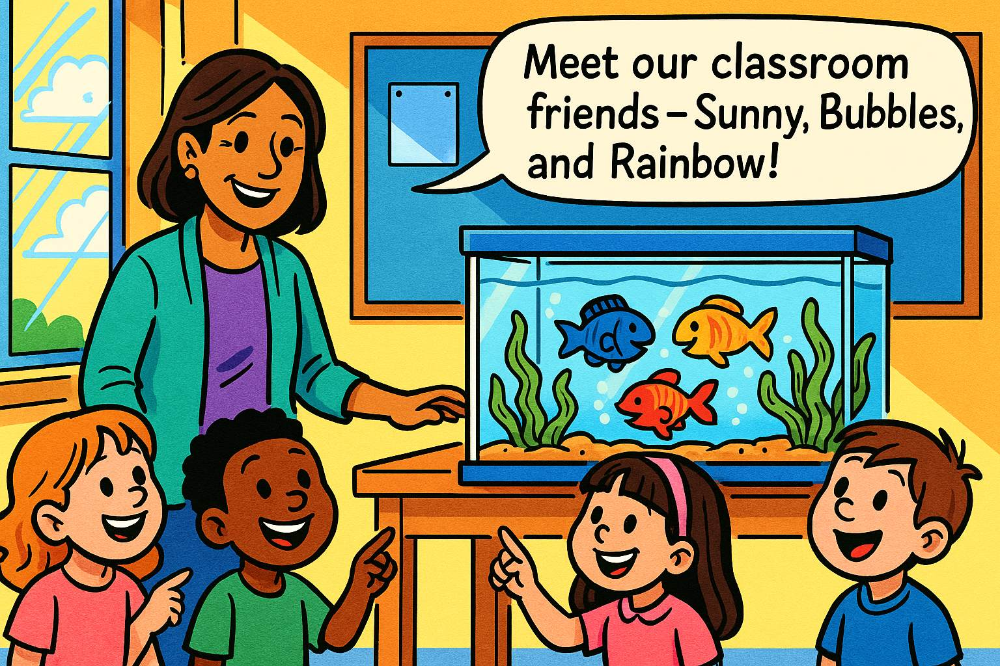
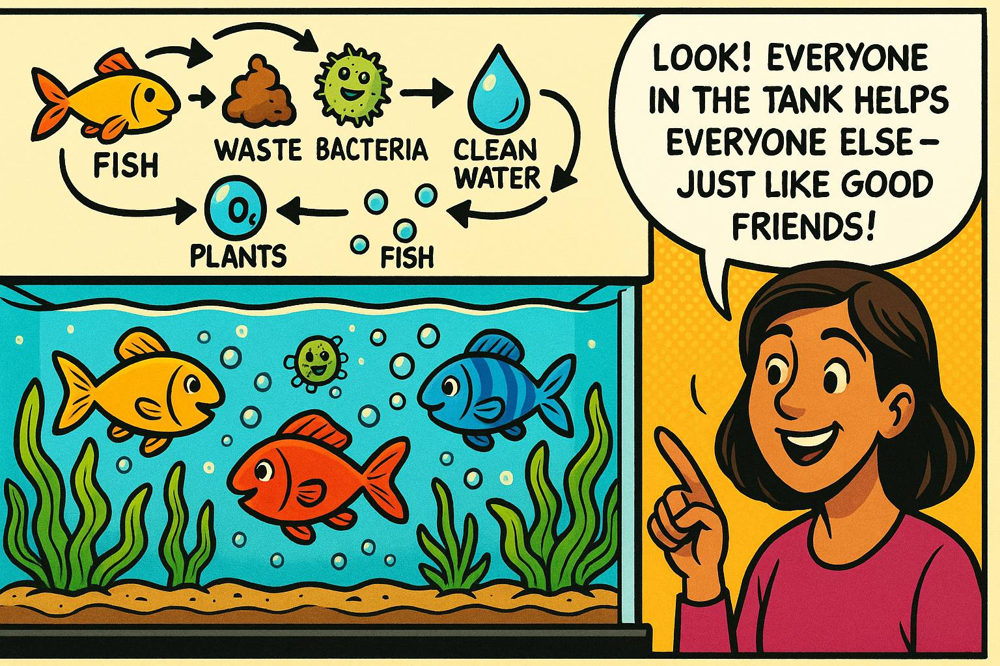
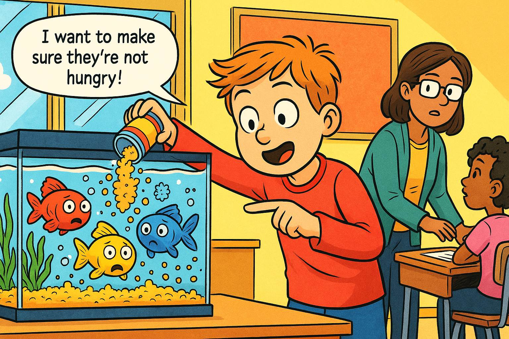
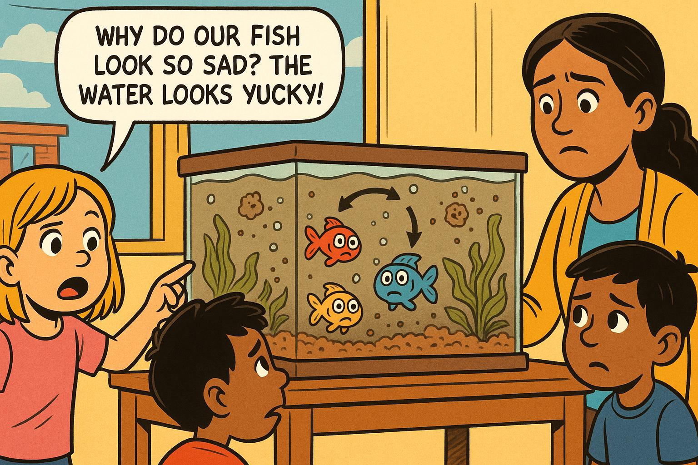
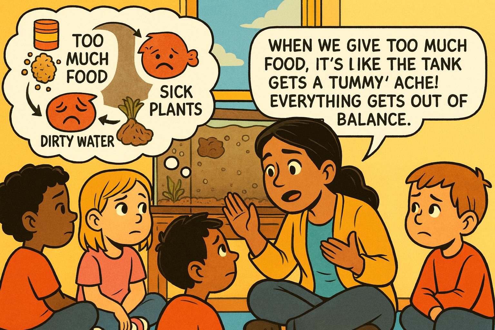
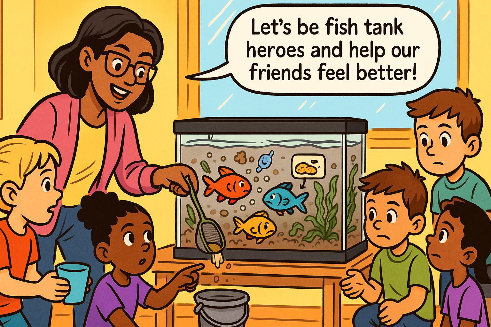
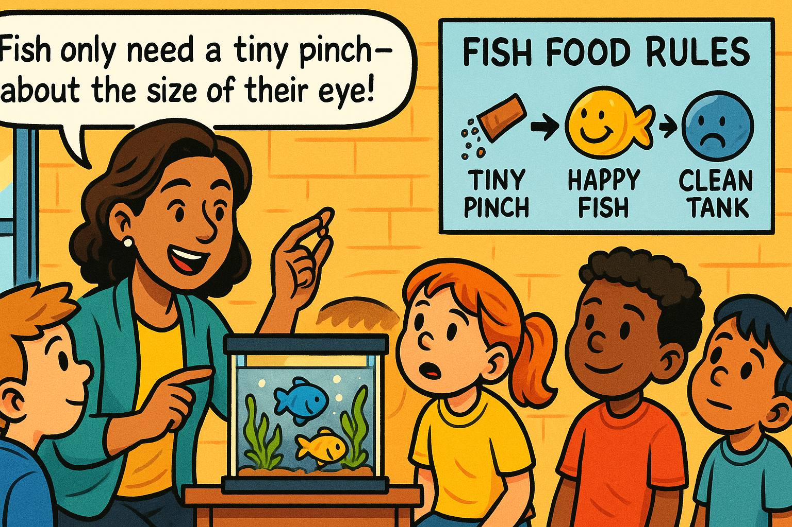
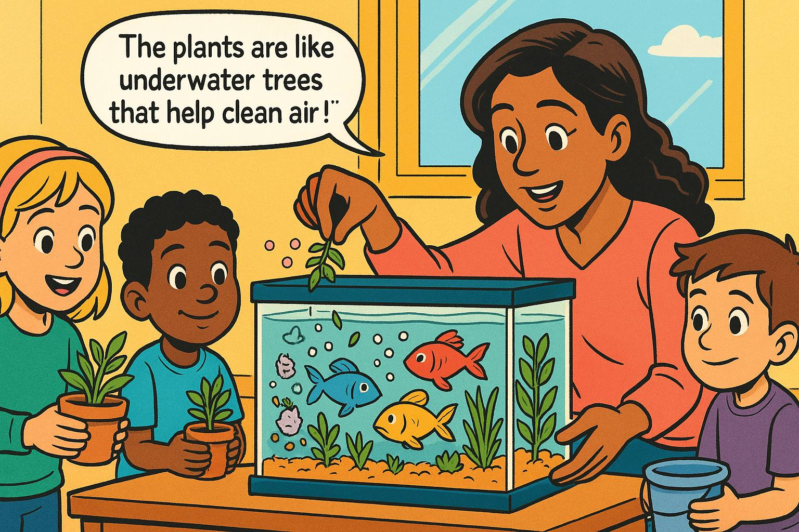
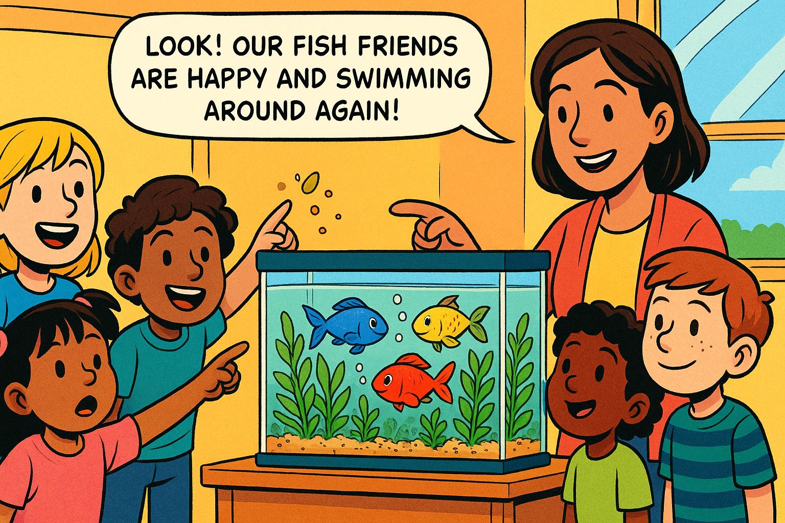
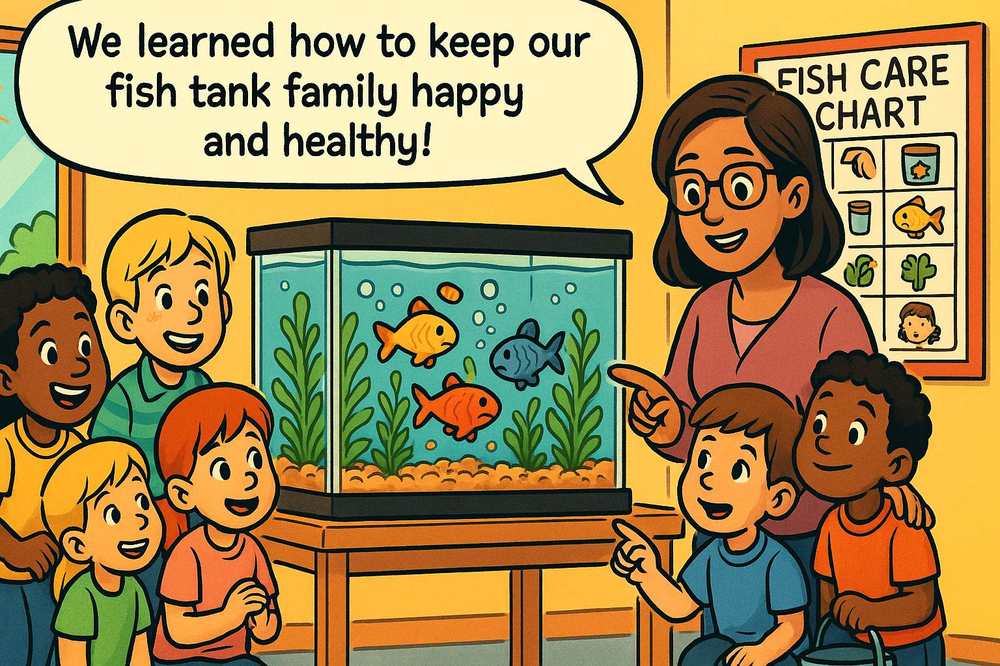

# The Fish Tank Adventure: A Story About Balance

## Panel 1: Meet Our Classroom Friend

Meet Our Classroom Friends

Panel 1:
Please generate a wide-landscape drawing using a bright colorful palette of colors in the style of a graphic novel comic book targeting 1st grade students. Make sure you use a wide-landscape 16:9 width:height format. Make sure that any characters are consistent with prior panels.

In this panel, we see a cheerful first-grade classroom with a beautiful fish tank on a table near the window. The tank has crystal clear water, green plants swaying gently, and three colorful fish swimming happily - a red fish, a blue fish, and a yellow fish. A friendly teacher, Ms. Garcia, stands next to the tank with a group of excited 6-year-old students gathered around. The children have big smiles and are pointing at the fish. Sunlight streams through the window, making the water sparkle. Speech bubble from Ms. Garcia: "Meet our classroom friends - Sunny, Bubbles, and Rainbow!"

Welcome to Mrs. Garcia's first-grade classroom! Meet our special underwater friends who live in our fish tank. There's Sunny the yellow fish, Bubbles the blue fish, and Rainbow the red fish. They live in a magical underwater world right in our classroom! Just like how you need food, water, and friends to be happy, our fish need special things too. Their tank is like a tiny neighborhood where everyone helps each other stay healthy and happy.

## Panel 2: The Circle of Tank Friends

The Circle of Tank Friends

Panel 2:
Please generate a wide-landscape drawing using a bright colorful palette of colors in the style of a graphic novel comic book targeting 1st grade students. Make sure you use a wide-landscape 16:9 width:height format. Make sure that any characters are consistent with prior panels.

In this panel, we see a close-up view inside the fish tank showing the three fish swimming among bright green aquatic plants. Small bubbles rise from the plants, and there are tiny beneficial bacteria (shown as friendly, smiling microscopic creatures) floating in the water. The fish look content and healthy. Above the tank, we see arrows in a circle showing how everything connects: fish → waste → bacteria → clean water → plants → oxygen → fish. Ms. Garcia points to the tank with a big smile. Speech bubble from Ms. Garcia: "Look! Everyone in the tank helps everyone else - just like good friends!"

Look closely at our fish tank! It's like a circle of friends where everyone has a special job. The fish breathe and swim around, making tiny bits of waste. The green plants are like underwater trees that clean the water and make fresh air for the fish. There are also tiny helpers called bacteria - so small you can't see them - that eat up the yucky stuff and keep everything clean. It's just like how you help your friends and they help you back!

## Panel 3: Feeding Time Goes Wrong

Feeding Time Goes Wrong

Panel 3:
Please generate a wide-landscape drawing using a bright colorful palette of colors in the style of a graphic novel comic book targeting 1st grade students. Make sure you use a wide-landscape 16:9 width:height format. Make sure that any characters are consistent with prior panels.

In this panel, we see a well-meaning student named Tommy enthusiastically pouring way too much fish food into the tank. The food flakes are falling like snow, covering the bottom of the tank in a thick layer. Ms. Garcia is momentarily distracted helping another student. The three fish look overwhelmed, with their eyes wide, surrounded by way more food than they could ever eat. Uneaten food particles are starting to cloud the water slightly. Speech bubble from Tommy: "I want to make sure they're not hungry!" The scene shows good intentions but poor understanding of balance.

Oh no! Tommy wants to be extra nice to our fish friends, so he gives them lots and lots of food. He thinks more food means happier fish - just like how you might want extra cookies! But fish are different from people. They only need a tiny pinch of food, about the size of their eye. When there's too much food, it's like having a huge pile of sandwiches in your bedroom that you can't finish. The extra food starts to make the water messy and cloudy.

## Panel 4: The Water Gets Cloudy

The Water Gets Cloudy

Panel 4:
Please generate a wide-landscape drawing using a bright colorful palette of colors in the style of a graphic novel comic book targeting 1st grade students. Make sure you use a wide-landscape 16:9 width:height format. Make sure that any characters are consistent with prior panels.

In this panel, the fish tank water has become noticeably cloudy and murky. The three fish are swimming slowly near the bottom, looking sad and tired. Their bright colors seem duller. The green plants are starting to look droopy and some leaves are turning brown. Leftover food particles float in the water like tiny clouds. The students are gathered around the tank looking worried and confused. One student, Emma, points at the tank with concern. Speech bubble from Emma: "Why do our fish look so sad? The water looks yucky!"

A few days later, something's not right in our fish tank! The water looks like chocolate milk instead of clear water. Our fish friends Sunny, Bubbles, and Rainbow are swimming very slowly and staying at the bottom. They look sad and tired. Even the green plants that usually stand up tall are drooping down like they're sleepy. All that extra food has made the water dirty, and now it's hard for everyone to breathe and stay healthy. It's like trying to breathe in a dusty room!

## Panel 5: Understanding What Went Wrong

Understanding What Went Wrong

Panel 5:
Please generate a wide-landscape drawing using a bright colorful palette of colors in the style of a graphic novel comic book targeting 1st grade students. Make sure you use a wide-landscape 16:9 width:height format. Make sure that any characters are consistent with prior panels.

In this panel, Ms. Garcia kneels down to the students' eye level next to the cloudy tank, using her hands to explain what happened. Above her head is a thought bubble showing a simple diagram: too much food → dirty water → sad fish → sick plants. The students sit in a circle around her, listening intently. Tommy looks a bit sad but is learning. The tank is visible in the background, still cloudy. Speech bubble from Ms. Garcia: "When we give too much food, it's like the tank gets a tummy ache! Everything gets out of balance."

Ms. Garcia gathers everyone around to solve the mystery of our sad fish tank. She explains that when we put too much food in the tank, it's like the whole tank gets a tummy ache! The extra food that the fish can't eat starts to rot, just like when an apple gets old and brown. This makes the water dirty and hard to breathe in. The plants can't do their job of cleaning the water when there's too much mess. It's like trying to clean your room when there are toys everywhere - it's just too hard!

## Panel 6: The Rescue Mission Begins

The Rescue Mission Begins

Panel 6:
Please generate a wide-landscape drawing using a bright colorful palette of colors in the style of a graphic novel comic book targeting 1st grade students. Make sure you use a wide-landscape 16:9 width:height format. Make sure that any characters are consistent with prior panels.

In this panel, Ms. Garcia and the students are working together to help the fish tank. Ms. Garcia is using a small net to gently remove excess food from the bottom of the tank. A student named Sarah is helping by holding a small cup to collect the dirty water. Another student, Marcus, is ready with a bucket of clean water. The students look determined and helpful, like superheroes on a mission. The three fish watch from a corner of the tank. Speech bubble from Ms. Garcia: "Let's be fish tank heroes and help our friends feel better!"

Time for a fish tank rescue mission! Ms. Garcia and all the students become fish tank heroes. They carefully clean out all the extra food that's making the water yucky. It's like cleaning up spilled cereal from the floor so the kitchen can be nice again. They gently take out some of the dirty water and add fresh, clean water that's just the right temperature - not too hot and not too cold, just like a perfect bath for the fish. Everyone works together as a team to help their underwater friends.

## Panel 7: Learning the Right Amount

Learning the Right Amount

Panel 7:
Please generate a wide-landscape drawing using a bright colorful palette of colors in the style of a graphic novel comic book targeting 1st grade students. Make sure you use a wide-landscape 16:9 width:height format. Make sure that any characters are consistent with prior panels.

In this panel, Ms. Garcia is teaching the students about proper feeding. She holds up a tiny pinch of fish food between her thumb and finger, showing how small it should be. Next to her is a poster showing "Fish Food Rules" with simple pictures: a tiny pinch of food, happy fish, and a clean tank. The students are paying close attention, and Tommy is nodding as he learns. The tank in the background is starting to look clearer. Speech bubble from Ms. Garcia: "Fish only need a tiny pinch - about the size of their eye!"

Now comes the most important lesson! Ms. Garcia shows everyone how much food fish really need. She holds up a tiny pinch between her fingers - it's smaller than a pea! She explains that fish stomachs are tiny, about the size of their eye. Feeding them too much is like trying to eat a whole pizza when you only want one slice. Tommy learns that loving our fish means giving them just the right amount, not too much. Sometimes taking good care of someone means knowing when to stop, not when to give more.

## Panel 8: Adding More Plant Helpers

Adding More Plant Helpers

Panel 8:
Please generate a wide-landscape drawing using a bright colorful palette of colors in the style of a graphic novel comic book targeting 1st grade students. Make sure you use a wide-landscape 16:9 width:height format. Make sure that any characters are consistent with prior panels.

In this panel, Ms. Garcia and the students are gently adding more aquatic plants to the tank. The new plants are bright green and healthy-looking. Some students are holding small potted aquatic plants, while others watch as Ms. Garcia carefully places them in the tank. The water is noticeably clearer than before, and the original plants are starting to perk up. The three fish are swimming a bit higher in the tank and look more interested. Speech bubble from a student named Lisa: "The plants are like underwater trees that help clean the air!"

To help the tank get better faster, the class adds more green plant friends! These underwater plants are like tiny trees that work all day and night to clean the water and make fresh air for the fish. Just like how trees in the park help make the air fresh for us to breathe, these plants do the same job underwater. The more plant helpers they have, the cleaner and healthier the water becomes. It's like having more friends to help clean up the classroom - many hands make light work!

## Panel 9: Balance Returns

Balance Returns

Panel 9:
Please generate a wide-landscape drawing using a bright colorful palette of colors in the style of a graphic novel comic book targeting 1st grade students. Make sure you use a wide-landscape 16:9 width:height format. Make sure that any characters are consistent with prior panels.

In this panel, the fish tank looks beautiful and healthy again. The water is crystal clear, the plants are bright green and standing tall, and all three fish are swimming actively throughout the tank. Sunny, Bubbles, and Rainbow have their bright colors back and look happy and energetic. Small bubbles rise from the plants, and everything looks balanced and peaceful. The students are smiling and pointing excitedly at the improvements. Speech bubble from Emma: "Look! Our fish friends are happy and swimming around again!"

What a wonderful change! After a few days of careful care, the fish tank looks amazing again. The water is clear like a window, the plants stand up tall and green, and best of all - Sunny, Bubbles, and Rainbow are swimming all around their home! Their colors are bright again, and they're moving like they're dancing underwater. The tiny plant helpers are working perfectly, making bubbles of fresh air for the fish. Everything is balanced again, just like a perfectly organized classroom where everyone knows their job.

## Panel 10: The Happy Ecosystem

The Happy Ecosystem

Panel 10:
Please generate a wide-landscape drawing using a bright colorful palette of colors in the style of a graphic novel comic book targeting 1st grade students. Make sure you use a wide-landscape 16:9 width:height format. Make sure that any characters are consistent with prior panels.

In this final panel, we see the complete, thriving ecosystem. The students are gathered around the beautiful tank, taking turns being the daily fish caretaker. A "Fish Care Chart" on the wall shows the rotation schedule and proper care instructions with simple pictures. The three fish are healthy and active, the plants are lush and green, and the water sparkles in the sunlight. Ms. Garcia stands proudly with her students. There's a sense of accomplishment and joy. Speech bubble from the whole class: "We learned how to keep our fish tank family happy and healthy!"

Now our fish tank is like a perfect little neighborhood where everyone helps everyone else! The students have learned that taking care of their underwater friends means understanding balance - not too much food, not too little; clean water but not too clean that the helpful bacteria go away; enough plants to help but not so many there's no swimming room. Every day, a different student gets to be the fish caretaker, giving just the right tiny pinch of food. They've learned that the best way to show love is to give just what's needed. Their fish tank family is happy, healthy, and balanced - just like a good friendship!

## What We Learned About Systems

Just like our fish tank, everything in nature works together in balance. When one thing changes, it affects everything else - just like how too much food changed the whole tank! The most important lesson is that in any system - whether it's a fish tank, a classroom, or even our whole school - everyone has a special job, and when we all do our part just right, everything works beautifully together.

## References for Teachers

I'll search for educational resources that support teaching systems thinking to elementary students, particularly those that complement the fish tank ecosystem story.Now I'll verify some of the URLs work and search for a few more elementary-specific resources:Let me search for a few more elementary-specific resources:Based on my research, I now have enough high-quality resources to provide 10 references for a first-grade teacher using the fish tank story. Here are the references formatted as requested:

# 10 References for First Grade Teachers: Systems Thinking and Ecosystem Education

1. [Systems Thinking in the Elementary Classroom](https://edtech-class.com/2021/09/15/systems-thinking-in-the-elementary-classroom/) - September 22, 2021 - EdTech Classroom - Provides practical examples of how to introduce systems thinking concepts to elementary students through neighborhood mapping and classroom systems identification. Perfect for adapting the fish tank story into broader systems discussions about classroom and school ecosystems.

2. [Teaching K-12 Students About Systems Thinking](https://www.edutopia.org/article/teaching-k-12-students-systems-thinking/) - January 12, 2024 - Edutopia - Offers concrete classroom strategies including "connected circles" activities and visualization techniques that can help first graders understand the interconnections in their fish tank ecosystem, with age-appropriate questioning techniques.

3. [Hands-On Activities for Introducing Ecosystems to Elementary Students](https://www.plt.org/educator-tips/ecosystem-activities-elementary-students) - October 30, 2019 - Project Learning Tree - Features bottle ecosystem creation and food web activities specifically designed for elementary students, providing perfect extensions to the fish tank story with hands-on ecosystem building projects.

4. [6 Resources for Teaching Systems Thinking](https://humaneeducation.org/6-resources-for-teaching-systems-thinking/) - April 14, 2025 - Institute for Humane Education - Includes videos like "What are Systems?" and the "Systems Iceberg Model" that are appropriate for upper elementary students and can help teachers understand systems concepts to simplify for first graders.

5. [Waters Center for Systems Thinking](https://waterscenterst.org/) - Ongoing Resource - Waters Center for Systems Thinking - The foundational resource for systems thinking education featuring the "14 Habits of a Systems Thinker" with tools and activities specifically designed to make systems thinking accessible to children of all ages.

6. [Three Must-Try Ecosystem Activities for Elementary Classrooms](https://simplysteameducation.com/three-ecosystem-activities-for-elementary-classrooms/) - March 24, 2024 - Simply STEAM Education - Provides the "Circle of Life Web" activity using yarn to demonstrate interconnections, and resource gathering games that perfectly complement the fish tank balance story.

7. [How to Practice Systems Thinking in the Classroom](https://teacher-blog.education.com/how-to-practice-systems-thinking-in-the-classroom-9cbfa3dcd2cf) - June 1, 2018 - Education.com Teacher Voice - Focuses on identifying systems in everyday classroom life and creating how-to books about classroom systems, offering practical ways to extend the fish tank lesson to other classroom systems.

8. [Systems Thinking Activities Used in K-12](https://www.frontiersin.org/journals/education/articles/10.3389/feduc.2023.1059733/full) - January 17, 2023 - Frontiers in Education - Academic research documenting successful systems thinking activities in elementary classrooms, including primary school students using behavior over time graphs with storybooks like "The Lorax."

9. [Hands-on Ecosystem Activities for Elementary Students](https://whatihavelearnedteaching.com/hands-on-ecosystem-activities/) - June 27, 2025 - What I Have Learned Teaching - Features worm bin creation, gardening projects, and food web games specifically designed for grades 2-5, providing concrete follow-up activities for the fish tank ecosystem story.

10. [Ecosystems for Kids - Science Activities for 1st to 5th Grades](https://www.ecosystemforkids.com/) - Ongoing Resource - Ecosystem for Kids - Comprehensive collection of games, worksheets, and interactive activities specifically designed for elementary grades, with age-appropriate content that reinforces the balance concepts taught in the fish tank story.

These resources provide first-grade teachers with both theoretical understanding of systems thinking principles and practical, hands-on activities that build upon the fish tank ecosystem story. They emphasize age-appropriate ways to help young students understand interconnections, balance, and cause-and-effect relationships in systems around them.

!!! Note
    We have verified that these links all work on September 8th, 2024.  

## Prompt Example

[First Grade Prompt Example](../../prompts/first-grade/fish-tank.md)