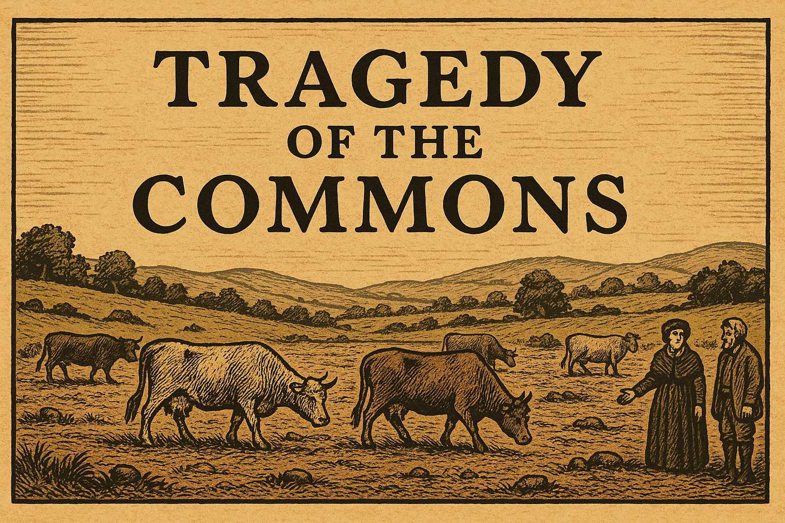
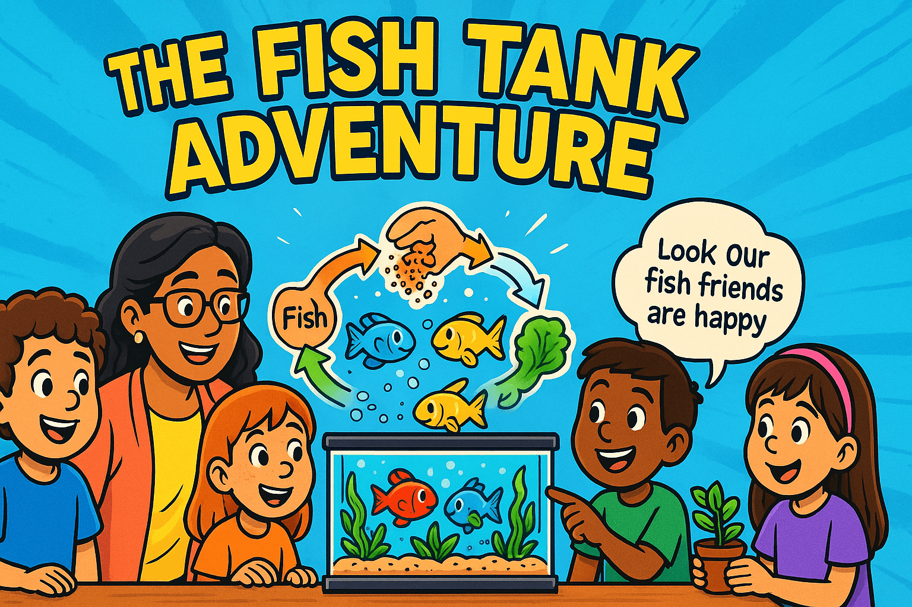
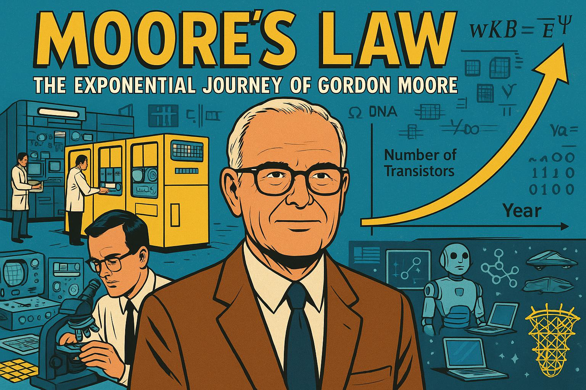
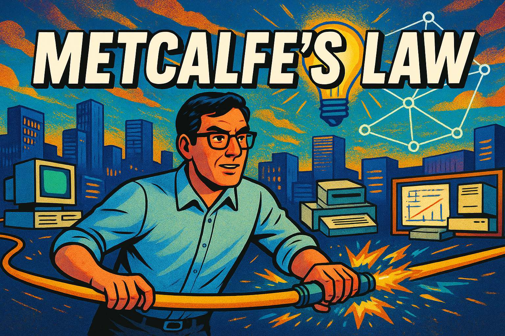
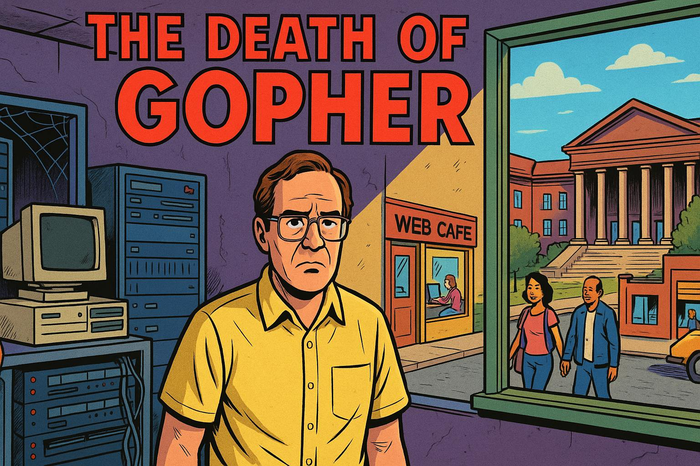
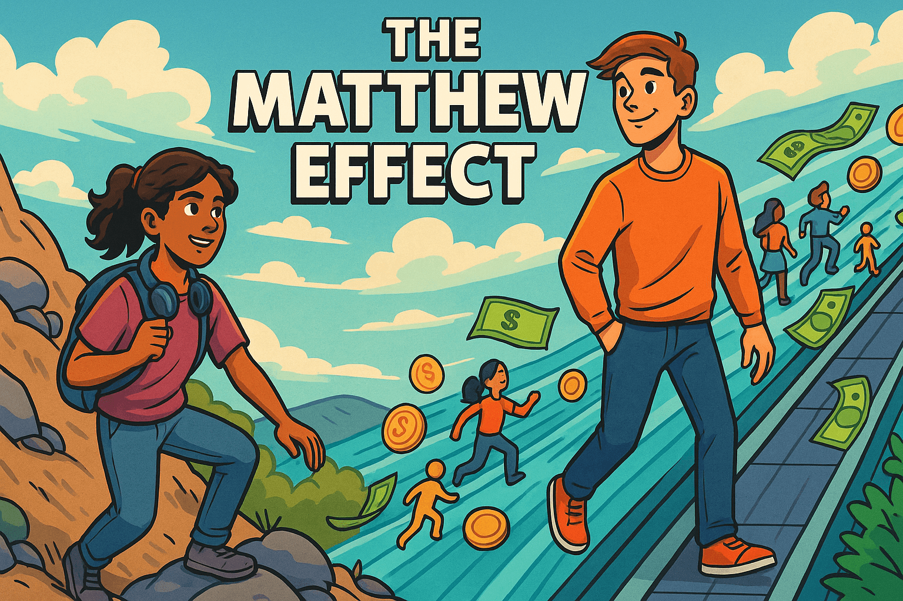
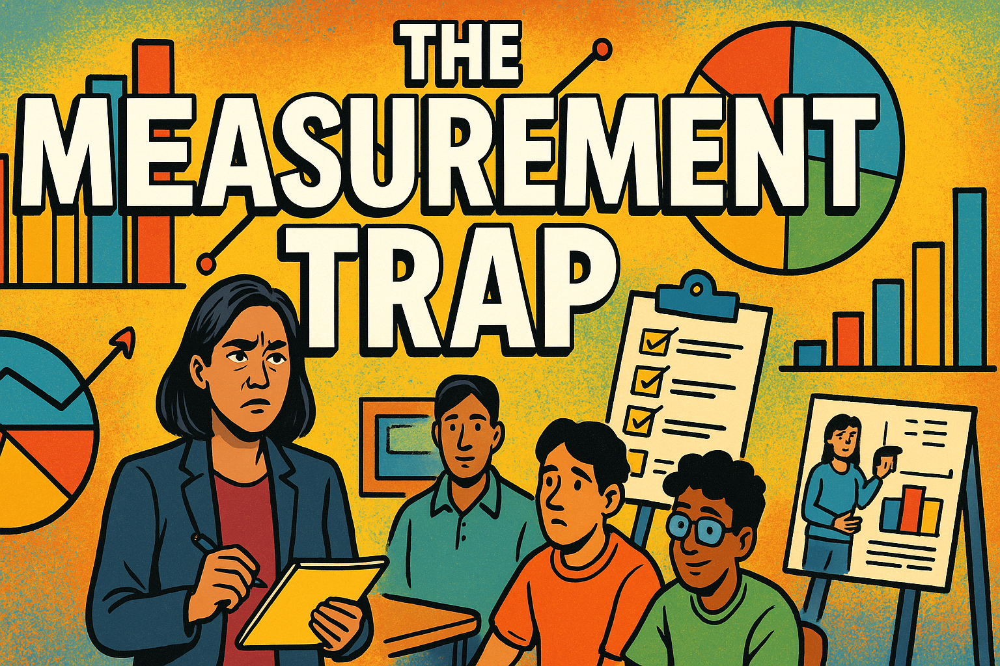

---
---
# Systems Thinking Stories

## Tragedy of the Commons

{width=400}

In 1833, the peaceful English village of Millhaven possessed 
a secret that had sustained five farming families for 
generations—a lush common pasture where all their 
cattle grazed freely and prospered together. 
But when Farmer Whitmore made a seemingly brilliant calculation that he could add just one more cow to boost his profits while sharing the cost with everyone else, 
he triggered a devastating chain reaction that 
would destroy everything. One by one, each 
neighbor followed the same "rational" logic, 
and within a single season, their shared paradise 
transformed into a barren wasteland of starving cattle 
and ruined families. This true story of how individual 
greed can destroy collective prosperity became the 
foundation for one of economics' most powerful 
theories—and its lessons echo in everything from 
climate change to internet overload, proving that 
sometimes being smart individually can make us all collectively stupid.

[Read the Tragedy of the Commons Story](./tragedy-of-the-commons/index.md)

## The Fish Tank Adventure: A Story About Balance

{width=400}

This graphic novel that teaches fundamental systems thinking concepts through the story of Sunny, Bubbles, and Rainbow - three fish living in a first-grade classroom aquarium. When well-meaning student Tommy gives the fish too much food, the balanced ecosystem becomes cloudy and unhealthy, demonstrating how small changes can disrupt entire systems. Through teamwork and understanding, Ms. Garcia's class learns to restore balance by addressing root causes rather than symptoms, discovering how every part of their underwater neighborhood - fish, plants, water, and tiny helpful bacteria - works together in a circle of mutual support. Perfect for introducing young learners to concepts like feedback loops, unintended consequences, and the interconnectedness of living systems through an engaging story they can see, touch, and relate to in their own classroom.

[Read the Fish Tank Adventure](./fish-tank/index.md)

## Moore's Law

The Geek Who Accidentally Predicted the Future

{width=400}

What if a quiet engineer's simple observation about computer chips became the most famous prediction in technology history—and then revealed a hidden pattern that explains why all exponential growth eventually hits a wall? In 1965, Gordon Moore was just trying to figure out why computer chips kept getting better, but his discovery launched the entire digital revolution, enabling everything from smartphones to social media to AI. For 50 years, Moore's Law drove the exponential progress that transformed our world, making Moore himself a tech legend who watched room-sized computers shrink to fit in our pockets. But here's the twist: this incredible success story is actually a perfect example of how even the most powerful growth eventually runs into limits—both the laws of physics (you can only make things so small before you're dealing with individual atoms!) and brutal economics (building chip factories now costs more than NASA's entire budget). This graphic novel tells the wild ride of how one man's simple chart became the roadmap for the digital age, and why understanding patterns like Moore's Law can help us navigate any situation where explosive growth meets immovable limits.

[Read the Moore's Law Story](./moores-law/index.md)

## Metcalfe's Law

{width=400}

The Network Pioneer: How One Engineer's Big Idea Connected the World

Imagine a world where computers couldn't talk to each other – no internet, no email, no social media, nothing. That was reality in 1973 when a young engineer named Bob Metcalfe had a revolutionary idea that would change everything. Working late nights at Harvard and then at the legendary Xerox research lab, Bob invented Ethernet – a simple way to connect computers with a single cable. But this wasn't just about technology; it was about understanding a powerful mathematical truth: the more people who join a network, the more valuable it becomes for everyone (that's Metcalfe's Law). What followed was an epic battle between competing technologies, where Bob's "underdog" Ethernet had to defeat IBM's technically superior Token Ring network. Through brilliant strategy, open standards, and the unstoppable force of network effects, Bob didn't just win – he laid the foundation for our entire connected world. This is the untold story of how one person's insight about systems and networks created the internet age, proving that sometimes understanding how systems work is more powerful than having the best technology.

[Go to the Story of Metcalfe's Law](./metcalfes-law/index.md)

## The Death of Gopher

{width=400}

Could a single decision by a short-term profit school administrator kill the entire internet as we knew it? In 1993, a simple menu-based system called Gopher was the hottest thing online - millions of students worldwide used it to navigate through information like a digital library, and it was poised to become the foundation of the internet. But then lawyers at the University made a catastrophic decision that would destroy their own creation and accidentally give birth to the World Wide Web. This is the incredible true story of how one university's attempt to cash in on their invention sent shockwaves through the global internet community, caused a massive exodus of users, and inspired Tim Berners-Lee to make a decision that would shape the entire future of the internet. It's a tale of innovation, betrayal, and how sometimes the biggest failures lead to the greatest successes - proving that in the networked world, greed can literally kill, but openness can create trillions of dollars in value.

[Go to the Death of Gopher Story](./death-of-gopher/index.md)

## The Matthew Effect

Follow Maya and Alex, two equally talented teenage coders with the same dream of creating a music streaming app, as their different starting points lead to dramatically different outcomes. Maya, working with limited resources and an old laptop, builds her app through determination and late-night coding sessions, while Alex leverages his family's tech connections, professional tools, and startup competition access. Through their parallel journeys, this story illustrates how the "Matthew Effect" - named after the biblical principle "to everyone who has, more will be given" - creates reinforcing feedback loops where initial advantages compound over time, turning small differences in resources and opportunities into massive inequalities. Perfect for high school students, the story demonstrates key systems thinking concepts including cumulative advantage, network effects, and winner-take-all dynamics, while exploring how understanding these patterns can help us design more equitable systems and interventions.

[Go to the The Matthew Effect Story](./matthew-effect/index.md)

## The Measurement Trap

A Tale of Numbers, Tests, and What Really Matters** - When Principal Maria Martinez discovers her school obsessively tracking test scores while ignoring critical skills like collaboration, creativity, and resilience, she embarks on a journey to understand Peter Drucker's famous warning: "what gets measured gets managed." Through innovative project-based learning and authentic assessment methods, Maria demonstrates how schools and businesses fall into the trap of measuring what's easy rather than what's important. This engaging story explores the disconnect between standardized testing and real-world skills, showing how systems thinking can help us break free from the measurement trap and focus on developing the capabilities students truly need for success in life and work.

[Go to the The Measurement Trap Story](./measurement-trap/index.md)