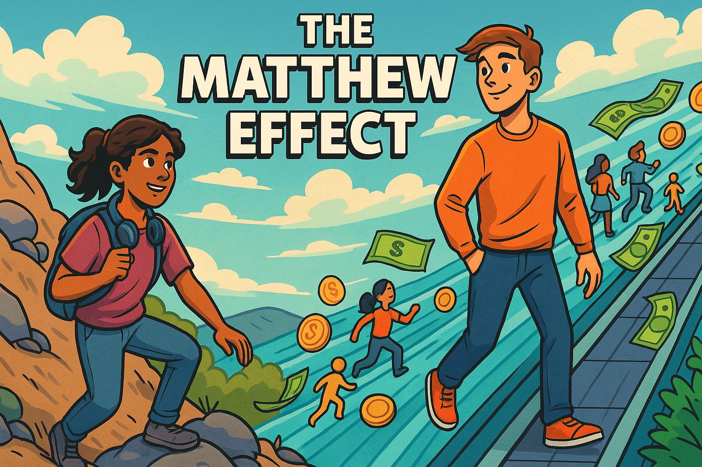
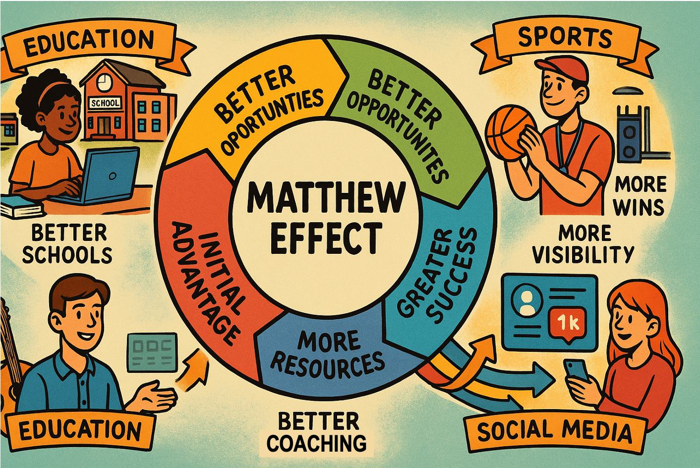
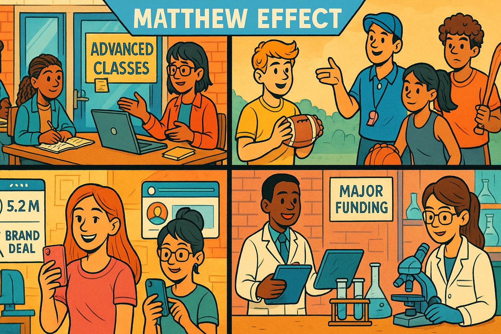
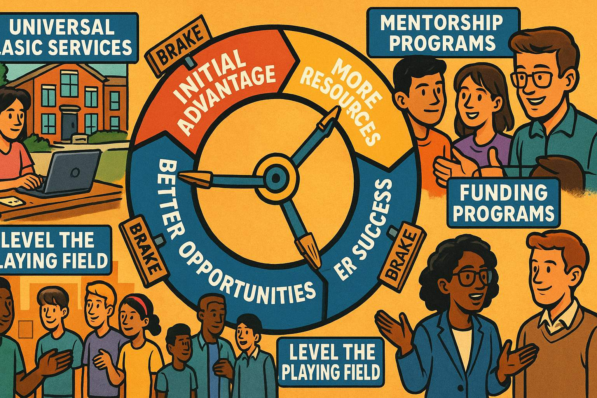

# The Matthew Effect - The Music Streaming Competition

*How Small Advantages Snowball into Massive Success*

## Chapter 1: The Dream

   
Show prompt for this panel

Panel 1:
Please generate a drawing using a wide-landscape format that has a 16:9 width to height ratio.
The drawing uses the style of a colorful graphic novel.
The audience is high-school students.

Drawing Description: Split-screen illustration showing two teenagers in their bedrooms. On the left, Maya sits at a cluttered desk with a laptop, headphones around her neck, surrounded by music posters and a small keyboard. Her room is modest but filled with passion - sticky notes with song lyrics, a guitar in the corner. On the right, Alex lounges in a much larger, high-tech room with multiple monitors, professional audio equipment, and expensive instruments. Both are looking at their screens with determination, but their resources are clearly different.

Maya Rodriguez had been coding since she was twelve, teaching herself programming languages from free online tutorials while her mom worked double shifts at the hospital. Now, at seventeen, she had an idea that kept her awake at night: a music streaming app that would help independent artists get discovered by matching listeners with new music based on their emotional state and activity.

Across town, Alex Chen had the same dream, but with a different starting point. His parents were tech executives who had given him the latest MacBook Pro for his sixteenth birthday, along with access to professional development tools, coding bootcamps, and a network of Silicon Valley connections through family friends.

Both teens were brilliant. Both were passionate about music and technology. But as we'll see, in systems with "network effects" and "cumulative advantage," being equally talented doesn't lead to equal outcomes. This is the story of the Matthew Effect - named after the biblical verse "For to everyone who has, more will be given" - and how small initial differences can create massive inequality over time.

## Chapter 2: The First Advantage

   
Show prompt for this panel

Panel 2:
Please generate a drawing using a wide-landscape format that has a 16:9 width to height ratio.
The drawing uses the style of a colorful graphic novel.
The audience is high-school students.  Make the characters consistent with the prior images
generated in this session.

Drawing Description: A classroom scene showing Maya presenting to a small group of classmates in what appears to be a regular high school computer lab with older desktop computers. Meanwhile, in a more modern setting, Alex presents his app prototype to a room full of adults in business attire - clearly a professional pitch competition or startup accelerator. The contrast shows different levels of audience, resources, and opportunity.

Maya built her app, "MoodTunes," during lunch breaks and late nights, using her family's old laptop and free development tools. She presented it at her high school's science fair, where she won third place and $100. Her computer science teacher was impressed and helped her apply for a local coding scholarship.

Alex built his app, "VibeStream," using professional development software and beta-testing it with friends who had expensive phones and fast internet. His parents entered him in a regional startup competition for young entrepreneurs, where he placed second and won $5,000 in startup funding, plus mentorship from successful tech executives.

**The Systems Principle at Work:** Both apps were good, but Alex's initial advantages - better tools, wider network, and access to larger opportunities - gave him a head start. In systems thinking, we call this a "stock" - an accumulation of resources that can generate more resources.

## Chapter 3: The Network Effect Begins

   
Show prompt for this panel

Panel 3:
Please generate a drawing using a wide-landscape format that has a 16:9 width to height ratio.
The drawing uses the style of a colorful graphic novel.
The audience is high-school students.  Make the characters consistent with the prior images
generated in this session.

Drawing Description: Two network diagrams side by side. Maya's network shows her connected to a few close friends, her teacher, and some online coding communities - a small but tight network. Alex's network shows him connected to his parents, who connect to multiple business contacts, investors, and other entrepreneurs - a much larger, more influential web of connections. Lines show information, opportunities, and resources flowing through these networks.

With his prize money, Alex hired a professional designer to improve his app's interface and a marketing consultant to help with social media strategy. His parents introduced him to a friend who ran a venture capital fund focused on teen entrepreneurs.

Maya used her scholarship money to buy a better computer and taught herself advanced programming through online courses. She reached out to independent musicians on social media, slowly building a community of artists who believed in her vision.

**The Matthew Effect Accelerates:** Alex's initial success attracted more resources, attention, and opportunities. This is the core of the Matthew Effect - success breeds more success through what systems thinkers call "reinforcing feedback loops." Each advantage Alex gained made it easier to gain the next advantage.

## Chapter 4: The Momentum Builds

   
Show prompt for this panel

Panel 4:
Please generate a drawing using a wide-landscape format that has a 16:9 width to height ratio.
The drawing uses the style of a colorful graphic novel.
The audience is high-school students.  Make the characters consistent with the prior images
generated in this session.

Drawing Description: A dynamic illustration showing two different trajectories. Maya is shown climbing a steep mountain path, making steady progress but facing obstacles - depicted as rocks in her path, storms, and challenging terrain. Alex is shown on a moving walkway or escalator that's carrying him upward quickly, with resources, people, and opportunities flowing toward him like a river. Both are moving up, but at very different speeds and with different levels of difficulty.

Six months later, Alex's app had 10,000 users. The VC fund invested $100,000 in his company, allowing him to hire two part-time developers and rent office space in a startup incubator. Tech blogs started writing about "the teen entrepreneur to watch," and he was invited to speak at conferences.

Maya's app had 500 loyal users, mostly independent artists and their fans. She was proud of her tight-knit community, but growth was slow. She applied for grants and pitched to local investors, but without the polished presentation materials and business connections that Alex had, she struggled to get meetings.

**Systems Insight:** This illustrates "cumulative advantage" - each success Alex achieved made the next success more likely. His growing user base attracted media attention, which attracted investors, which provided resources for faster growth, which attracted more media attention. Maya was caught in a different loop - limited resources meant slower growth, which made it harder to attract investment, which kept resources limited.

## Chapter 5: The Rich Get Richer

   
Show prompt for this panel

Panel 5:
Please generate a drawing using a wide-landscape format that has a 16:9 width to height ratio.
The drawing uses the style of a colorful graphic novel. Make the characters consistent with the prior images
generated in this session.  The audience is high-school students.

Drawing Description: A visualization of resource flow showing Alex at the center of multiple streams of resources flowing toward him - money, talent, media attention, user growth - like rivers converging. Maya is shown working with a small but dedicated team, with much smaller streams of resources. The illustration emphasizes the exponential difference in resource accumulation, even though both are clearly talented and hardworking.

By his senior year, Alex's VibeStream had half a million users. Major record labels started reaching out to feature their artists on the platform. Alex hired a full development team, opened offices in two cities, and was featured on the cover of "Teen Entrepreneur Magazine." College admissions officers from top universities actively recruited him, and he had his pick of full-ride scholarships.

Maya's MoodTunes had grown to 50,000 users, with a passionate community of independent artists who credited the app with helping them find their audience. But she couldn't compete with VibeStream's marketing budget and major-label partnerships. She was accepted to a good state university with some financial aid, but would need to work part-time to afford it.

**The Network Effect in Full Swing:** Alex had achieved what economists call "network effects" - his app became more valuable to users as more users joined. This created a "winner-take-all" dynamic where the leading platform attracts users simply because it's the leading platform.

## Chapter 6: Two Different Endings?

   
Show prompt for this panel

Panel 6:
Please generate a drawing using a wide-landscape format that has a 16:9 width to height ratio.
The drawing uses the style of a colorful graphic novel.  Make the characters consistent with the prior images
generated in this session.
The audience is high-school students.

Drawing Description: A split-screen showing two possible futures. On one side, Alex is in a modern corporate boardroom, surrounded by executives and charts showing massive growth, clearly now running a major company. On the other side, Maya is in a classroom, teaching coding to a diverse group of younger students, with her MoodTunes app still running on a computer in the background, suggesting she's found a different but meaningful path.

Five years later, Alex sold VibeStream to a major tech company for $50 million. He used the money to start a venture capital fund focused on investing in young entrepreneurs, perpetuating the cycle by giving others the same advantages he had received.

Maya became a computer science teacher at an inner-city high school, where she taught students from backgrounds similar to her own. MoodTunes still operated as a small but beloved platform for independent artists. She used her experience to help her students understand both the technical and systemic challenges they would face in tech careers.

## Chapter 7: Understanding the System

   
Show prompt for this panel

Panel 7:
Please generate a drawing using a wide-landscape format that has a 16:9 width to height ratio.
The drawing uses the style of a colorful graphic novel.
The audience is high-school students.

Drawing Description: A complex systems diagram showing the Matthew Effect in action. At the center is a circular flow showing how "Initial Advantage" leads to "Better Opportunities" leads to "More Resources" leads to "Greater Success" which leads back to "Bigger Initial Advantage." Around this central loop are smaller examples from other domains - education (better schools leading to better opportunities), sports (better coaching leading to more wins), and social media (more followers leading to more visibility).

**The Matthew Effect Explained:**

The Matthew Effect isn't about individual talent or effort - both Maya and Alex were brilliant and hardworking. Instead, it's about how systems can amplify small initial differences into massive inequalities through feedback loops.

Here's how it works:

1. **Initial Advantage:** Some people start with better resources, connections, or opportunities (Alex's family wealth and network)

2. **Success Attracts Resources:** Early success brings more funding, attention, and opportunities (Alex's competition wins led to investment)

3. **Resources Enable Greater Success:** More resources make it easier to achieve bigger successes (professional help improved Alex's app)

4. **The Loop Accelerates:** Each round of success brings disproportionately more resources and opportunities

5. **Winner-Take-All Dynamics:** Eventually, the gap becomes so large that the leading player dominates the entire market

## Chapter 8: The Matthew Effect Everywhere

   
Show prompt for this panel

Panel 8:
Please generate a drawing using a wide-landscape format that has a 16:9 width to height ratio.
The drawing uses the style of a colorful graphic novel.
The audience is high-school students.
Make the characters consistent with the prior images
generated in this session.

Drawing Description: A collage-style illustration showing the Matthew Effect operating in different contexts: a school with some students having access to tutors and advanced classes while others don't; a sports scene showing some young athletes with professional coaching and equipment versus those practicing with basic gear; a social media interface showing influencers with millions of followers getting brand deals while smaller creators struggle for visibility; and a research lab showing some scientists with major funding and resources versus others working with limited budgets.

The Matthew Effect isn't limited to tech startups. It operates across many domains:

**Education:** Students from wealthier families can afford tutoring, test prep, and extracurricular activities that help them get into better schools, which provide better opportunities, leading to higher-paying careers that let them give their own children similar advantages.

**Social Media:** Influencers with large followings get featured by algorithms more often, attracting more followers, which attracts brand sponsorships, which provides resources for better content, attracting even more followers.

**Scientific Research:** Scientists at prestigious universities with large research budgets can conduct bigger studies, publish in top journals, and attract more funding, while researchers at smaller institutions struggle for resources and recognition.

**Sports:** Young athletes whose families can afford professional coaching, elite clubs, and specialized training camps are more likely to be noticed by college scouts and offered scholarships.

## Chapter 9: Breaking the Cycle

   
Show prompt for this panel

Panel 9:
Please generate a drawing using a wide-landscape format that has a 16:9 width to height ratio.
The drawing uses the style of a colorful graphic novel.
The audience is high-school students.
Make the characters consistent with the prior images
generated in this session.

Drawing Description: An illustration showing various intervention points in the Matthew Effect cycle. The image shows a large wheel representing the cycle of advantage, but with several "brake" mechanisms being applied at different points - policies like universal basic services, mentorship programs connecting successful people with those starting out, and funding programs specifically designed to help those without initial advantages. People from different backgrounds are shown working together to "level the playing field."

Understanding the Matthew Effect isn't about despair - it's about designing better systems. Once we recognize how cumulative advantage works, we can create interventions:

**Early Intervention Programs:** Providing resources to talented people early, before the gaps become too large to bridge (like coding bootcamps for underrepresented students).

**Mentorship Networks:** Connecting people with fewer initial advantages to those with established networks and resources.

**Alternative Evaluation Metrics:** Looking beyond simple success measures to identify potential in people who haven't yet had opportunities to prove themselves.

**Policy Interventions:** Creating systems that redistribute opportunities and resources more equitably (like needs-based scholarships or startup funding programs for underrepresented entrepreneurs).

**Platform Regulation:** Changing the rules of winner-take-all markets to create more space for diverse participants.

## Chapter 10: Maya's Second Act

   
Show prompt for this panel

Panel 10:
Please generate a drawing using a wide-landscape format that has a 16:9 width to height ratio.
The drawing uses the style of a colorful graphic novel.
The audience is high-school students.
Make the characters consistent with the prior images
generated in this session.

Drawing Description: A vibrant scene showing Maya, now a few years older, presenting to a packed auditorium of diverse young students. Behind her is a projection showing her new app - "CodePath" - which connects student programmers with mentors and resources. In the audience, we can see students of various backgrounds engaged and taking notes. The scene suggests that Maya has found a way to use her experience with the Matthew Effect to help others navigate it better.

Three years into her teaching career, Maya launched a new app called "CodePath" - not a music streaming service this time, but a platform that connected student programmers from underrepresented backgrounds with mentors, resources, and opportunities. She had learned from her experience with MoodTunes and Alex's success with VibeStream.

This time, Maya understood the system she was operating in. She partnered with organizations focused on diversity in tech, applied for grants specifically designed to support underrepresented entrepreneurs, and built relationships with established tech leaders who wanted to give back.

CodePath grew differently than VibeStream had - not through massive venture capital investments, but through careful community building and strategic partnerships. Maya had learned to work with the Matthew Effect rather than against it, finding ways to create advantages for people who typically didn't have them.

## Epilogue: The Systems Perspective

   
Show prompt for this panel

Panel 11:
Please generate a drawing using a wide-landscape format that has a 16:9 width to height ratio.
The drawing uses the style of a colorful graphic novel.
The audience is high-school students.
Make the characters consistent with the prior images
generated in this session.

Drawing Description: A final illustration showing a balanced scale, but instead of traditional weights, one side shows "Individual Effort & Talent" and the other shows "Systemic Advantages & Resources." Above the scale, there's a diverse group of young people working together on various projects - coding, music, art, science - suggesting that understanding systems can help create more equitable opportunities for everyone.

## What This Story Teaches Us

1. **Individual merit matters, but system structure matters more.** Maya and Alex were equally talented, but systems gave Alex cumulative advantages.

2. **Success isn't just about personal choices.** The opportunities available to us are shaped by the systems we're born into.

3. **Small differences can become massive inequalities** through reinforcing feedback loops.

4. **Understanding systems helps us design better interventions.** Instead of just telling people to "work harder," we can create programs that provide early advantages to those who need them.

5. **We can choose to perpetuate or interrupt these cycles.** People who benefit from the Matthew Effect can use their advantages to create opportunities for others.

## Questions for Discussion

* Can you think of examples of the Matthew Effect in your own school or community?
* How might understanding cumulative advantage change how we think about "merit" and "fairness"?
* What interventions could your school implement to give more students access to advanced opportunities?
* How do social media algorithms create Matthew Effects in online popularity?
* What responsibility do people who benefit from cumulative advantage have to help others?

## The Bigger Picture

The Matthew Effect shows us that in complex systems, outcomes aren't just the result of individual effort and talent - they're shaped by the structure of the system itself. By understanding these dynamics, we can work to create systems that give more people the chance to develop and showcase their abilities.

Maya and Alex's story isn't really about winners and losers - it's about how the systems we create either amplify inequality or create opportunities for everyone to thrive. The choice of which kind of system to build is up to all of us.

This story illustrates one of the most important concepts in systems thinking: how positive feedback loops can create dramatic inequality over time, and how understanding these dynamics can help us design more equitable systems. The Matthew Effect operates in countless areas of life - recognizing it is the first step toward addressing it.

## Origin of the Term "The Matthew Effect"

The term "Matthew Effect" was coined by sociologist Robert K. Merton in 1968, and it comes directly from a passage in the Gospel of Matthew in the Christian Bible.

### The Biblical Source

The name references **Matthew 25:29** (King James Version):

> "For unto every one that hath shall be given, and he shall have abundance: but from him that hath not shall be taken away even that which he hath."

A more modern translation reads:

> "For to everyone who has, more will be given, and he will have abundance. But from the one who does not have, even what he has will be taken away."

This verse appears in Jesus's Parable of the Talents, where servants are given different amounts of money (talents) to invest. Those who invest wisely and multiply their talents are rewarded with more, while the servant who buries his talent has even that taken away.

### Merton's Scientific Application

**Robert K. Merton**, a prominent sociologist at Columbia University, used this biblical reference to describe a phenomenon he observed in the scientific community: **established scientists received disproportionate credit for discoveries, while lesser-known researchers were often overlooked**, even when they made equal or greater contributions.

Merton noticed that:
- Famous scientists got more citations for similar work
- Well-known researchers attracted better graduate students and more funding
- Prestigious institutions received more recognition for the same quality research
- Scientific reputation created a "rich get richer" dynamic

### Why Merton Chose This Name

Merton selected the biblical reference because:

1. **It perfectly captured the dynamic**: Those who already have advantages (reputation, resources, recognition) gain even more advantages
2. **It was memorable and accessible**: The biblical language made the concept easy to understand and discuss
3. **It highlighted the systemic nature**: Like the parable, the effect isn't about individual merit alone, but about how systems distribute rewards
4. **It carried moral implications**: The biblical context suggested that this dynamic raised questions about fairness and justice

### The Term's Evolution

Since Merton's 1968 paper "The Matthew Effect in Science," the term has been adopted across many fields:

- **Economics**: Wealth concentration and inequality
- **Education**: Achievement gaps and cumulative learning advantages  
- **Technology**: Network effects and platform dominance
- **Social Media**: Follower growth and algorithmic amplification
- **Sports**: Training resources and competitive advantages

### The Irony

Interestingly, the naming of the "Matthew Effect" itself demonstrates the Matthew Effect in action! Merton, already a well-established and respected sociologist, received enormous credit for naming and formalizing this concept, even though:

- The underlying dynamic had been observed by others before him
- The biblical passage had existed for nearly 2,000 years
- Similar concepts appeared in other religious and philosophical traditions

Because Merton had the academic status and platform to name and theorize the concept, he received the credit and recognition - a perfect example of the very phenomenon he was describing.

### Connection to Systems Thinking

The Matthew Effect represents one of the most important **systems archetypes** because it shows how:
- **Reinforcing feedback loops** can create exponential inequality
- **Initial conditions** (starting advantages) can determine long-term outcomes
- **System structure**, not just individual effort, shapes results
- **Cumulative processes** can make small differences become massive over time

Understanding the biblical origin helps us appreciate that humans have long recognized this dynamic - Merton's contribution was formalizing it as a systematic phenomenon that could be studied, predicted, and potentially addressed through intentional system design.

## References

1. [The Matthew Effect in Science](https://www.science.org/doi/10.1126/science.159.3810.56) - 1968 - Science Magazine - Robert K. Merton's original 1968 paper that coined the term "Matthew Effect," providing the foundational academic source for understanding cumulative advantage in scientific careers and recognition.

2. [Success and Luck: Good Fortune and the Myth of Meritocracy](https://press.princeton.edu/books/hardcover/9780691167404/success-and-luck) - 2016 - Princeton University Press - Robert Frank's examination of how small initial advantages compound over time, directly relevant to understanding why equally talented individuals like Maya and Alex can have vastly different outcomes.

3. [The Matthew Effect: How Advantage Begets Further Advantage](https://www.theatlantic.com/education/archive/2014/02/the-matthew-effect-how-advantage-begets-further-advantage/284046/) - 2014 - The Atlantic - Accessible explanation of how cumulative advantage operates in education and career development, relevant to understanding systemic inequality in opportunities.

4. [Network Effects: The Complete Guide](https://www.nfx.com/post/network-effects-manual/) - 2018 - NFX - Comprehensive guide to network effects in technology platforms, explaining the winner-take-all dynamics that would affect Maya and Alex's competing music streaming apps.

5. [The Technology Trap: Capital, Labor, and Power in the Age of Automation](https://press.princeton.edu/books/hardcover/9780691172798/the-technology-trap) - 2019 - Princeton University Press - Carl Benedikt Frey's analysis of how technological advantages compound, relevant to understanding how access to better tools and resources affects entrepreneurial outcomes.

6. [Outliers: The Story of Success](https://www.gladwellbooks.com/titles/malcolm-gladwell/outliers/9780316017930/) - 2008 - Little, Brown and Company - Malcolm Gladwell's exploration of how timing, cultural background, and opportunities contribute to success, complementing the Matthew Effect concept in the story.

7. [The Entrepreneurial State: Debunking Public vs. Private Sector Myths](https://marianamazzucato.com/entrepreneurial-state/) - 2013 - Anthem Press - Mariana Mazzucato's examination of how public investment and infrastructure create the conditions for private success, relevant to understanding systemic advantages in entrepreneurship.

8. [Platform Revolution: How Networked Markets Are Transforming the Economy](https://www.platformrevolution.com/) - 2016 - W. W. Norton & Company - Analysis of how digital platforms create winner-take-all markets through network effects, directly applicable to understanding the competitive dynamics in the story.

9. [The Matthew Effect in Education](https://journals.sagepub.com/doi/10.3102/0034654306298273) - 2006 - Review of Educational Research - Academic research on how educational advantages compound over time, providing empirical support for the systemic inequalities illustrated in Maya and Alex's different educational opportunities.

10. [Thinking in Systems: A Primer](https://donellameadows.org/systems-thinking-book/) - 2008 - Chelsea Green Publishing - Donella Meadows' foundational text on systems thinking, providing the theoretical framework for understanding reinforcing loops and leverage points that could address Matthew Effect dynamics.

    
Links Status

    URL Accessibility Check Results:
============================================================
 1. ❌ ERROR 403: https://www.science.org/doi/10.1126/science.159.3810.56
 2. ✅ ACCESSIBLE: https://press.princeton.edu/books/hardcover/9780691167404/success-and-luck
 3. ✅ ACCESSIBLE: https://www.theatlantic.com/education/archive/2014/02/the-matthew-effect-how-advantage-begets-further-advantage/284046/
 4. ❌ ERROR 403: https://www.nfx.com/post/network-effects-manual/
 5. ✅ ACCESSIBLE: https://press.princeton.edu/books/hardcover/9780691172798/the-technology-trap
 6. ✅ ACCESSIBLE: https://www.gladwellbooks.com/titles/malcolm-gladwell/outliers/9780316017930/
 7. ❌ ERROR 404: https://marianamazzucato.com/entrepreneurial-state/
 8. ❌ ERROR 405: https://www.platformrevolution.com/
 9. ❌ ERROR 403: https://journals.sagepub.com/doi/10.3102/0034654306298273
10. ✅ ACCESSIBLE: https://donellameadows.org/systems-thinking-book/

