# The Measurement Trap: A Tale of Numbers, Tests, and What Really Matters

*A story about Peter Drucker's famous warning and why measuring the wrong things can lead us astray*

## Chapter 1: The New Principal's Discovery
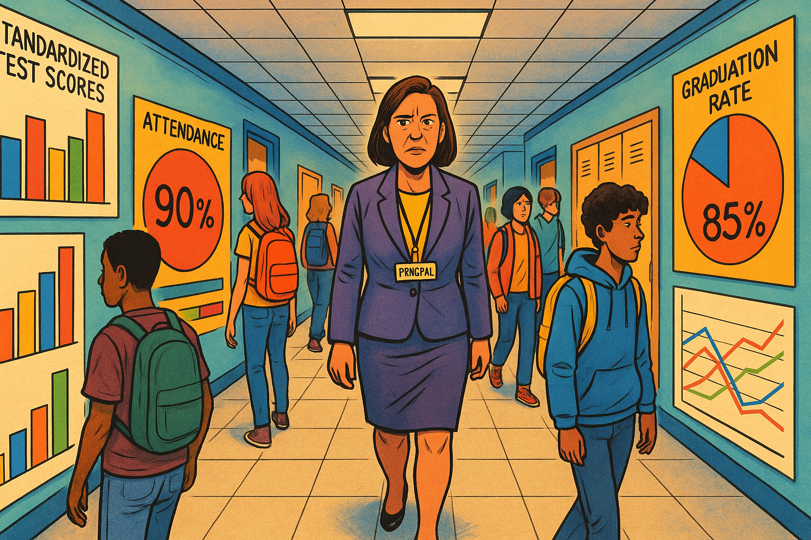

Image: Principal Martinez walks through a hallway lined with test score charts and data displays

Please generate a drawing using a colorful bright graph-novel style.
The image should be a wide-landscape format with a width:height ration of 16:9.

Description:
A wide shot of a school hallway with fluorescent lighting. The walls are covered with colorful bar charts, pie graphs, and bulletin boards displaying standardized test scores, attendance percentages, and graduation rates. Principal Maria Martinez, a woman in her 40s wearing professional attire, walks down the center of the hallway with a concerned expression. Students pass by in the background, but they seem disconnected from all the data surrounding them. The contrast between the sterile numbers on the walls and the vibrant, complex humanity of the students should be evident.

Principal Maria Martinez had been at Lincoln High School for exactly three weeks when she made a disturbing discovery. Walking through the hallways after her first faculty meeting, she noticed something odd: every wall was covered with charts, graphs, and data displays. Test scores, attendance rates, disciplinary statistics – numbers everywhere.

"Impressive, isn't it?" said Mr. Peterson, the math department head, appearing beside her. "We track everything here. Superintendent Thompson loves data. Says it keeps us accountable."

Maria nodded politely, but something felt wrong. In her twenty years of education, she'd learned to trust her instincts, and right now they were screaming. She pulled out a worn notebook and wrote down a quote she'd memorized years ago from management guru Peter Drucker: *"What gets measured gets managed."*

But as she looked around at all those charts and numbers, a more troubling question emerged: *What if we're measuring the wrong things?*

## Chapter 2: The Test Score Obsession
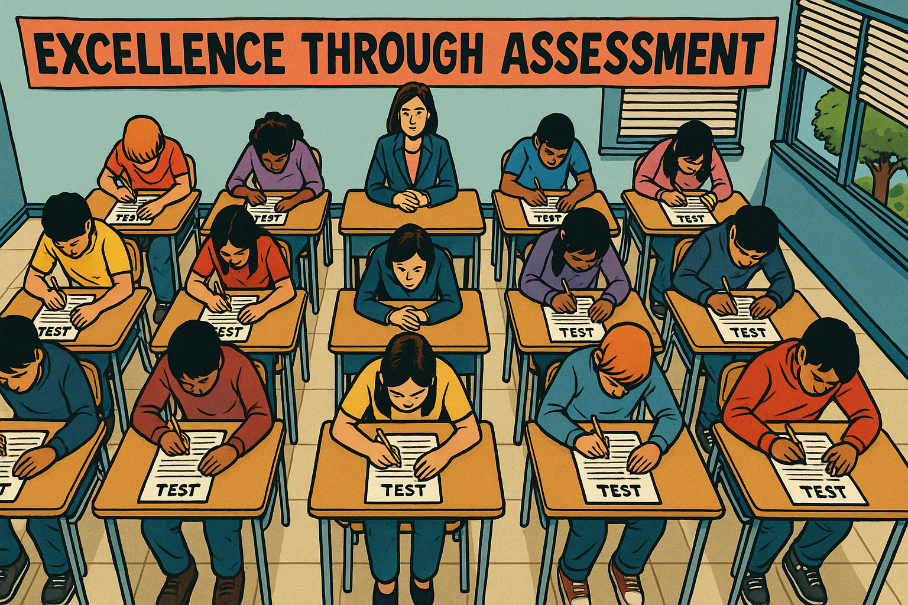

Image: A classroom where students sit in rigid rows taking a standardized test

Please generate a drawing using a colorful bright graph-novel style.
The image should be a wide-landscape format with a width:height ration of 16:9.
Make sure that the characters generated in this image are consistent with prior images generated in this session.

Description:
An overhead view of a classroom showing students seated in perfect rows, all facing forward. Each desk has a test booklet and answer sheet. The students' heads are down, focused on bubbling in answers. The teacher sits at the front, vigilant and silent. The room feels sterile and tense. A large banner on the wall reads "Excellence Through Assessment." Outside the windows, it's a beautiful spring day, but the blinds are mostly closed. The image should convey the isolation and mechanical nature of standardized testing.

The next morning, Maria decided to observe some classes. Her first stop was Ms. Rodriguez's English class, where she found thirty sophomores hunched over test prep worksheets.

"We're practicing for the state assessment," Ms. Rodriguez whispered to Maria. "It's in six weeks, and our scores dropped two points last year. The district is... concerned."

Maria watched as students mechanically filled in bubbles, practicing the same multiple-choice format they'd encounter on the test. These were the same kids she'd seen laughing and debating passionately in the hallway just minutes before, but now they sat silent and disconnected.

"What about creative writing?" Maria asked. "Critical thinking? Collaboration?"

Ms. Rodriguez looked pained. "We don't have time. The test doesn't measure those things, and what doesn't get measured..." She shrugged helplessly.

Maria finished the sentence in her head: *doesn't get managed.*

She was witnessing Peter Drucker's maxim in action, but not in a good way. The school was meticulously managing test scores because that's what they measured. But in the process, they were ignoring – and therefore failing to develop – the very skills students would need most in life.

## Chapter 3: The Business Parallel
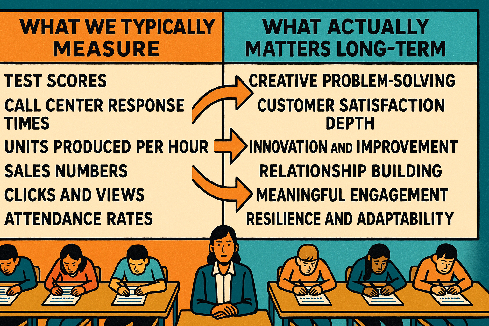

Chart: A comparison showing "What We Measure vs. What Actually Matters"

Panel 3

Please generate a drawing using a colorful bright graph-novel style.
The image should be a wide-landscape format with a width:height ration of 16:9.
Make sure that the characters generated in this image are consistent with prior images generated in this session.

Description:
A split-screen infographic with two columns. Left column titled "What We Typically Measure" shows metrics like: test scores, call center response times, units produced per hour, sales numbers, clicks and views, attendance rates. Right column titled "What Actually Matters Long-Term" shows: creative problem-solving, customer satisfaction depth, innovation and improvement, relationship building, meaningful engagement, resilience and adaptability. Arrows connect some items to show how focusing on the left can actually damage the right. The visual should be clean and professional, using contrasting colors to highlight the disconnect.

That evening, Maria met her friend David at a coffee shop. David ran a mid-sized marketing company and had been complaining lately about similar issues in the business world.

"It's everywhere," David said, stirring his latte. "My call center measures response time – how quickly agents answer calls – but not problem resolution. So agents rush customers off the phone to keep their numbers up, which creates more angry callbacks."

Maria leaned forward. "That's exactly what I'm seeing at school! We measure test scores, but not whether kids can think critically or work together."

David pulled out his phone and showed her a graph. "Look at this. We started measuring 'likes' and 'shares' on our social media campaigns. Sounds smart, right? But our team began creating shallow, clickbait content that got attention but didn't actually help our clients' businesses. We were managing what we measured, but we were measuring the wrong thing."

The parallel was striking. In both education and business, the seductive simplicity of numbers was leading people to optimize for metrics rather than outcomes.

## Chapter 4: The Easy vs. The Important

Image: A balance scale with "Easy to Measure" on one side (heavily weighted down) and "Hard to Measure but Important" on the other side (up in the air)

Panel 4

Please generate a drawing using a colorful bright graph-novel style.
The image should be a wide-landscape format with a width:height ration of 16:9.
Make sure that the characters generated in this image are consistent with prior images generated in this session.

Description:
A large, old-fashioned balance scale dominates the image. On the left side (weighted down), there are numerous items representing easy-to-measure things: stopwatches (for time), calculators (for scores), tally sheets (for counts), bar graphs, and clipboards with checkboxes. This side is heavy and touches the ground. On the right side (elevated in the air), there are more abstract representations: a lightbulb (innovation), interlocked hands (collaboration), a puzzle being solved (problem-solving), a heart (empathy), and books with pages flowing like wings (creativity and imagination). The scale clearly shows the imbalance between what's easy to measure versus what's truly important.

Back at school, Maria decided to dig deeper. She spent the next week observing classes and talking to teachers, students, and parents. What she discovered was a classic example of what she started calling "The Easy Trap."

"We measure what's easy to measure," she explained to her assistant principal, Janet. "Test scores, attendance rates, disciplinary referrals. But the most important things – creativity, empathy, resilience, the ability to collaborate – those are hard to quantify."

Janet nodded thoughtfully. "It's like that old joke about the drunk looking for his keys under the streetlight. When someone asks why he's looking there when he dropped them across the street, he says, 'Because the light's better over here.'"

"Exactly!" Maria said. "We're looking for educational success under the streetlight of standardized tests because the measurement is easier there, even though the real learning might be happening somewhere else entirely."

She pulled up the school's data dashboard on her computer. "Look at this. We can tell you the exact percentage of students who scored 'proficient' in math, but we have no idea how many can solve real-world problems or explain their reasoning to others."

## Chapter 5: The Collaboration Crisis
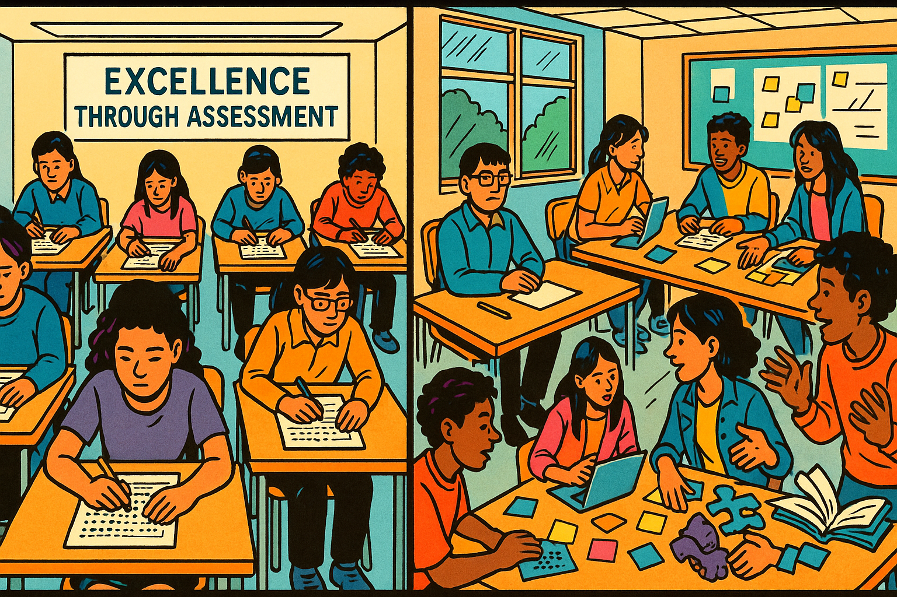

Image: Two contrasting scenes - individual test-taking vs. collaborative problem-solving

Panel 5

Please generate a drawing using a colorful bright graph-novel style.
The image should be a wide-landscape format with a width:height ration of 16:9.
Make sure that the characters generated in this image are consistent with prior images generated in this session.

Description:

A split image showing two different learning environments. On the left: the same sterile testing scene from earlier, with students isolated at individual desks, filling in bubbles on answer sheets. Everything is quiet, controlled, and uniform. On the right: a vibrant scene of students working together around tables, with laptops open, sticky notes scattered around, students pointing at diagrams, and animated discussion. One group is building something with their hands while another is sketching ideas on a whiteboard. The contrast should highlight the difference between isolated, standardized assessment and collaborative, creative learning.

Maria's investigation led her to a startling realization about one of the most critical 21st-century skills: collaboration. She observed Ms. Patterson's history class, where students were working on a group project about World War II.

"This is incredible," Maria thought, watching teams of students divide research tasks, debate interpretations, and create multimedia presentations. One student who typically struggled with tests was leading her group with exceptional organizational skills. Another was using his artistic talents to create powerful visual aids that helped everyone understand complex concepts.

But when Maria checked the gradebook, she found that these collaborative skills – leadership, communication, conflict resolution, creative problem-solving – weren't being measured or recorded anywhere. The only grades that "counted" toward state accountability were the individual test scores.

"It's like we're preparing students for a world that no longer exists," Maria realized. Every job posting she'd seen lately emphasized teamwork, communication, and adaptability. Yet schools were systematically undermining these skills by measuring and rewarding only individual performance on standardized assessments.

She remembered something her college professor had said: "In the real world, if you don't know something, you Google it or ask a colleague. On tests, that's called cheating."

## Chapter 6: The Resilience Paradox
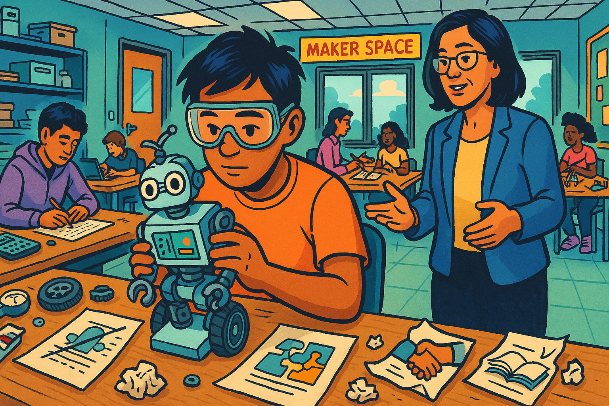

Image: A student working through failure and iteration in a maker space or science lab

Panel 6

Please generate a drawing using a colorful bright graph-novel style.
The image should be a wide-landscape format with a width:height ration of 16:9.
Make sure that the characters generated in this image are consistent with prior images generated in this session.

Description:

A warm, inviting scene in a school maker space or science lab. A student (diverse, wearing safety goggles) is working on what appears to be a robotics project. Around them are multiple iterations of failed attempts – prototype parts, crossed-out sketches, and previous versions of their project. But the student's expression shows determination and learning, not frustration. A teacher is nearby, offering guidance rather than giving answers. Other students are visible in the background, also engaged in hands-on learning. The scene should convey persistence, learning from failure, and the iterative process of real problem-solving.

During her third week of observations, Maria witnessed something that crystallized her growing concerns about measurement. In Mr. Kim's engineering class, she watched a student named Marcus struggle with a robotics challenge. His robot kept failing to navigate the obstacle course, and Maria could see his frustration mounting.

But instead of giving up, Marcus systematically analyzed each failure, adjusted his design, and tried again. Over the course of the class period, he demonstrated incredible resilience, problem-solving skills, and growth mindset – exactly the qualities that would serve him well in life.

However, when Maria checked how this would be reflected in the gradebook, she was dismayed. The rubric only measured whether the robot completed the course successfully, not the learning process, the persistence, or the improvement over time. Marcus, who had shown the most growth and resilience, would receive a lower grade than a student whose robot worked on the first try.

"We're measuring outcomes, not growth," Maria realized. "We're rewarding perfection instead of persistence."

This was particularly troubling because research showed that resilience – the ability to bounce back from failure and keep trying – was one of the strongest predictors of long-term success. Yet their measurement system was not only failing to capture this critical skill, it was actually discouraging it.

## Chapter 7: The Parent Conference Revelation
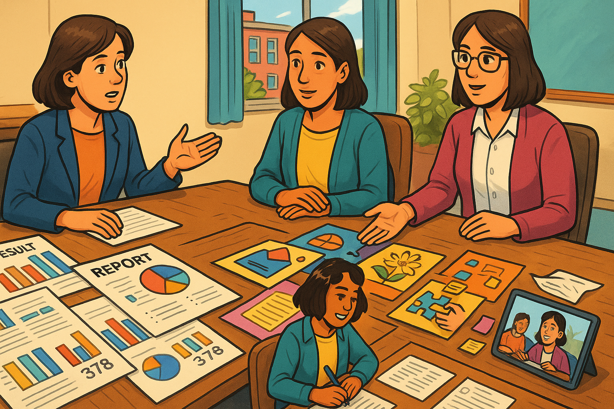

Image: A parent-teacher conference with data charts on one side and student work portfolios on the other

Panel 7

Please generate a drawing using a colorful bright graph-novel style.
The image should be a wide-landscape format with a width:height ration of 16:9.
Make sure that the characters generated in this image are consistent with prior images generated in this session.

Description:
A conference room with a large table. On one side, there are official-looking printouts with test scores, data charts, and statistical reports - all very clinical and numerical. On the other side, there's a rich collection of actual student work: creative writing pieces, art projects, photos of science experiments, collaborative project presentations, and a tablet showing a student presentation video. A parent sits between these two sides, looking more engaged and interested in the authentic work samples than the statistical reports. A teacher gestures toward both sides, representing the choice between different ways of understanding student progress.

The turning point came during parent conferences. Maria sat in on several meetings and noticed a pattern that disturbed her. Parents would dutifully nod as teachers shared test scores and data charts, but their eyes would light up when they saw actual examples of their children's work – creative writing pieces, science experiments, collaborative projects.

During one particularly memorable conference, Mrs. Chen looked at her daughter's test scores and frowned. "These numbers don't match the girl I know at home," she said. "Sarah is incredibly creative, asks thoughtful questions, and helps her younger brother with everything. Where is that in these scores?"

The teacher, Ms. Johnson, looked uncomfortable. "Well, the test doesn't really measure those things..."

"Then why are we spending so much time on it?" Mrs. Chen asked pointedly.

It was a fair question, and one that Maria found herself asking more and more. If the measurements weren't capturing what parents, teachers, and students themselves valued most, what was the point?

## Chapter 8: The Systems Thinking Solution
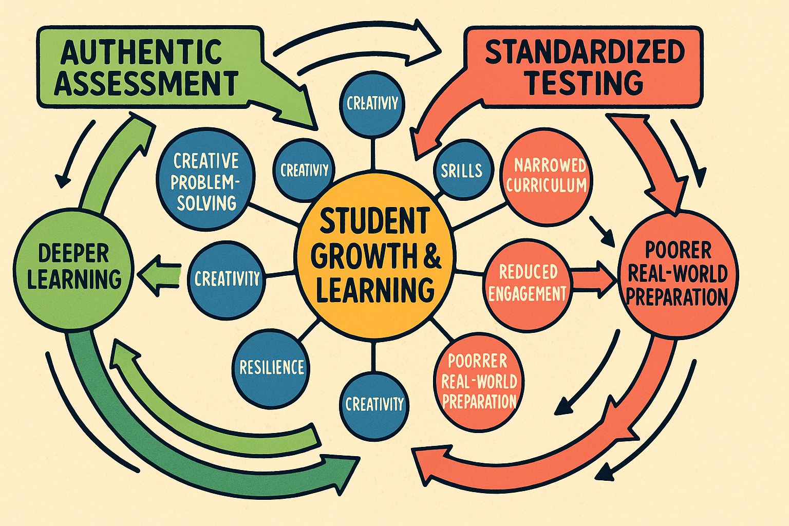

Diagram: A systems thinking view of education showing interconnected loops between different types of learning and assessment

Panel 8

Please generate a drawing using a colorful bright graph-novel style.
The image should be a wide-landscape format with a width:height ration of 16:9.
Make sure that the characters generated in this image are consistent with prior images generated in this session.

Description:
A circular systems diagram with "Student Growth & Learning" at the center. Around it are interconnected loops showing: "Authentic Assessment" → "Deeper Learning" → "Student Engagement" → "Better Outcomes" → back to "Authentic Assessment." Another loop shows "Standardized Testing" → "Teaching to Test" → "Narrowed Curriculum" → "Reduced Engagement" → "Poorer Real-World Preparation." Arrows should show these as competing loops, with the authentic assessment loop colored in green (positive) and the standardized testing loop in red (problematic). Additional elements like "Collaboration Skills," "Creativity," "Critical Thinking," and "Resilience" should be connected to the positive loop but disconnected from the negative one.

That weekend, Maria pulled out her systems thinking books and began to map out what she was seeing. The problem was clear: they had created a reinforcing loop where standardized measurements led to standardized teaching, which led to standardized learning, which reinforced the belief that standardized measurements were sufficient.

But this loop was actively undermining the skills students needed most. She drew another loop showing how authentic assessment could lead to deeper learning, which would increase student engagement, which would lead to better real-world outcomes, which would justify more authentic assessment.

The question was: how could they break free from the measurement trap?

Maria remembered reading about companies that had solved similar problems. Some had started measuring "customer success" instead of just "customer satisfaction." Others tracked employee development and innovation, not just productivity metrics. They had learned to measure what mattered, even when it was harder to quantify.

## Chapter 9: Project-Based Learning in Action
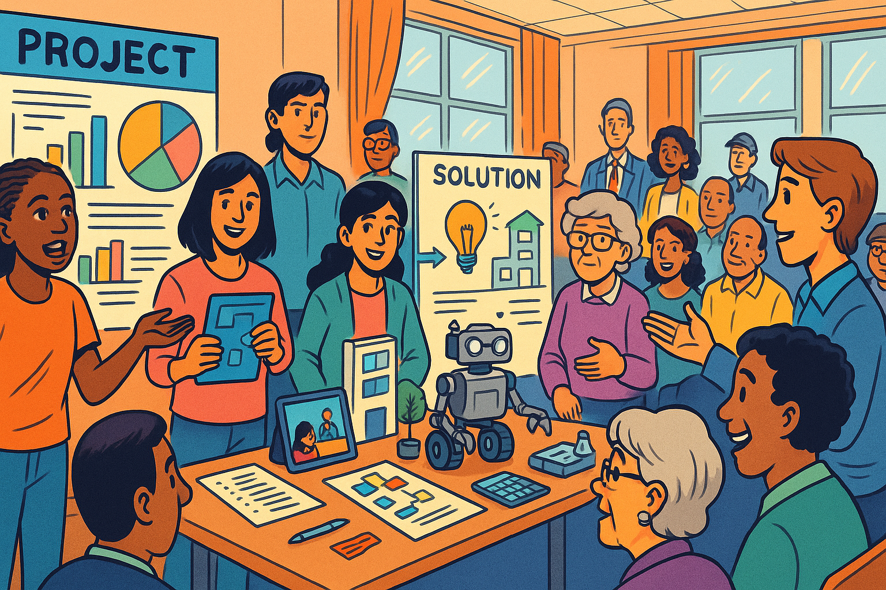

Image: Students presenting a community problem-solving project to real community members

Panel 9

Please generate a drawing using a colorful bright graph-novel style.
The image should be a wide-landscape format with a width:height ration of 16:9.
Make sure that the characters generated in this image are consistent with prior images generated in this session.

Description:
A dynamic scene in what appears to be a community center or school auditorium. Students are presenting a project to an audience that includes community members, parents, local business owners, and city officials. The presentation includes poster boards, digital displays, prototypes or models, and students actively demonstrating their solutions. The audience appears engaged and is asking questions. One student is explaining while others support with visual aids. The scene should feel authentic and connected to real-world applications, showing learning that extends beyond the classroom walls.

Determined to find a better way, Maria partnered with Mr. Rodriguez (the science teacher) and Ms. Williams (the English teacher) to pilot a project-based learning unit. Students would identify a real problem in their community and develop solutions over a six-week period.

The results were extraordinary. Teams formed organically, bringing together students with different strengths. One group tackled food insecurity at the local elementary school, combining research skills, mathematical analysis, creative presentation, and community outreach. Another group developed a peer tutoring app that required coding, user experience design, and understanding of learning psychology.

What amazed Maria most was how naturally students developed the skills that traditional tests couldn't measure:

- **Collaboration**: Students had to negotiate different opinions, divide work fairly, and support each other through challenges.
- **Resilience**: When initial ideas didn't work, teams regrouped, learned from feedback, and tried new approaches.
- **Critical Thinking**: Students evaluated sources, analyzed data, and made evidence-based decisions.
- **Communication**: They had to present complex ideas to diverse audiences, from elementary school principals to city council members.
- **Creativity**: Solutions required innovative thinking and connecting ideas from different disciplines.

## Chapter 10: Measuring What Matters
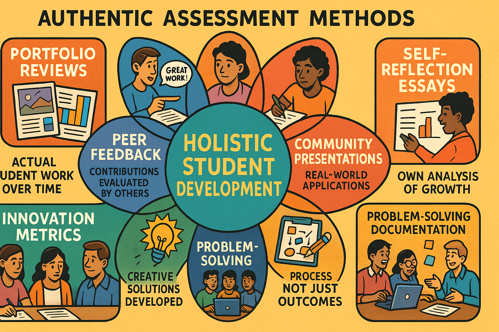

Chart: A new assessment framework showing multiple ways to capture student growth

Panel 10

Please generate a drawing using a colorful bright graph-novel style.
The image should be a wide-landscape format with a width:height ration of 16:9.
Make sure that the characters generated in this image are consistent with prior images generated in this session.

Description:
A comprehensive infographic showing various authentic assessment methods arranged in a web or flower pattern. At the center: "Holistic Student Development." Radiating outward are different assessment approaches: Portfolio Reviews (showing actual student work over time), Peer Feedback (students evaluating each other's contributions), Self-Reflection Essays (students analyzing their own growth), Community Presentations (real-world applications), Collaborative Project Success (team achievements), Problem-Solving Documentation (process not just outcomes), and Innovation Metrics (creative solutions developed). Each method should have small icons and brief descriptions of what it measures that traditional tests cannot.

The challenge was figuring out how to assess and document the learning that was happening in these projects. Traditional grades felt inadequate for capturing the complexity of what students were achieving.

Maria worked with her teachers to develop new assessment tools:

**Portfolio Reviews**: Students compiled evidence of their learning over time, including failed attempts, iterations, and breakthroughs. This showed growth and process, not just final products.

**Peer Feedback Systems**: Students evaluated each other's contributions to group work, providing insights into collaboration skills that teachers might miss.

**Community Presentations**: Students presented their solutions to real community members, receiving authentic feedback from people who understood the actual problems.

**Self-Reflection Essays**: Students wrote about their learning process, challenges they overcame, and skills they developed – developing metacognition along the way.

**Problem-Solving Documentation**: Instead of just recording right or wrong answers, they documented their thinking process, alternative approaches they considered, and how they worked through obstacles.

These approaches were harder to quantify than multiple-choice tests, but they provided a much richer and more accurate picture of student learning and development.

## Chapter 11: The Resistance

Image: A tense school board meeting with community members, data charts, and opposing viewpoints

Panel 11

Please generate a drawing using a colorful bright graph-novel style.
The image should be a wide-landscape format with a width:height ration of 16:9.
Make sure that the characters generated in this image are consistent with prior images generated in this session.

Description:
A school board meeting room with fluorescent lighting and institutional furniture. The school board sits at a curved table at the front, looking formal and somewhat intimidating. The audience includes concerned parents, teachers, and community members with mixed expressions - some supportive, others skeptical or worried. On easels around the room are competing presentations: traditional test score charts and graphs on one side, and examples of student projects and new assessment methods on the other. Maria stands presenting, with some audience members leaning forward with interest while others cross their arms skeptically. The room should feel like a democratic process with real stakes and genuine disagreement.

Not everyone was enthusiastic about Maria's innovations. At the monthly school board meeting, several community members expressed concerns.

"How do we know our kids are learning if we can't compare them to other schools?" asked Mrs. Patterson, a longtime school board member. "These project things sound nice, but what about accountability?"

Mr. Thompson, the superintendent, shifted uncomfortably. "The state still requires standardized test scores for school ratings. If our numbers drop, there could be consequences."

Maria understood their concerns. The measurement system, for all its flaws, provided a sense of certainty and control. Numbers felt objective, comparable, and fair. Changing to more authentic assessment methods meant accepting ambiguity and complexity.

"I'm not suggesting we abandon all measurement," Maria explained. "I'm suggesting we measure what actually matters. A student who can collaborate effectively, think critically, and persist through challenges will be more successful in college and careers than one who can simply fill in the right bubbles on a test."

She shared stories from the project-based learning pilot: students who had never succeeded on traditional tests but had shown remarkable leadership and problem-solving skills. Students who had struggled with anxiety during testing but thrived when working on meaningful, real-world challenges.

## Chapter 12: The Breakthrough Moment
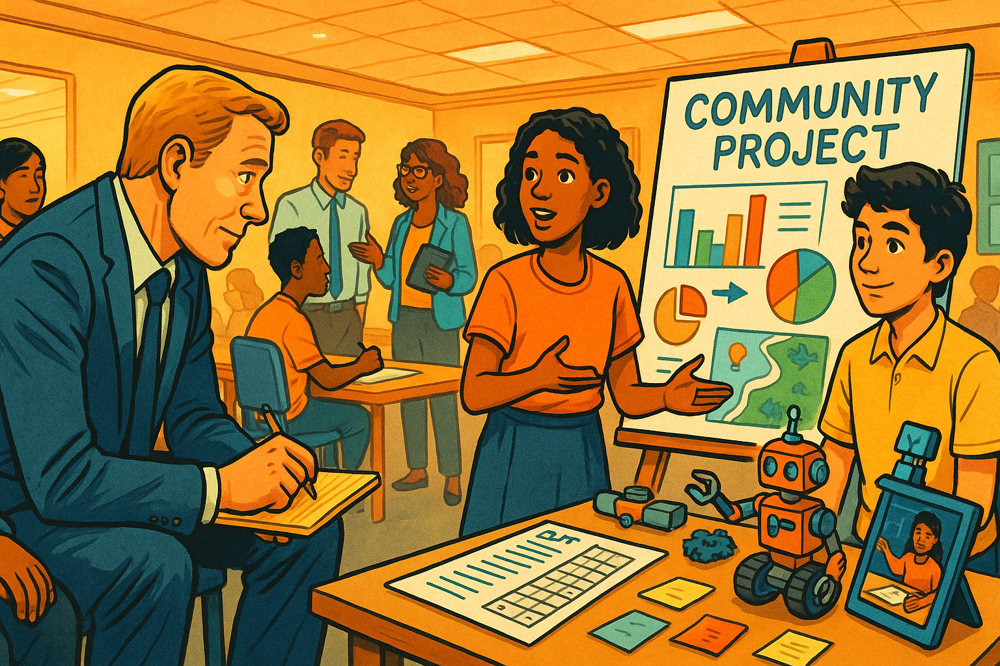

Image: A local business leader observing students presenting their solutions and being visibly impressed

Panel 12

Please generate a drawing using a colorful bright graph-novel style.
The image should be a wide-landscape format with a width:height ration of 16:9.
Make sure that the characters generated in this image are consistent with prior images generated in this session.

Description:

A professional setting where students are presenting to actual community leaders and business owners. A local CEO or business leader sits at the edge of their seat, clearly engaged and impressed as students demonstrate a creative solution to a real community problem. The business leader is leaning forward, asking questions, and taking notes. Their expression shows genuine respect for the students' work and capabilities. Other professionals in the background are having similar engaged conversations with different student groups. The scene should convey that authentic learning impresses real-world professionals more than test scores ever could.

The breakthrough came when local business leaders attended the student project presentations. Maria had invited them hoping to show the community that students were developing real-world skills, but she wasn't prepared for their enthusiastic response.

"I've been hiring college graduates for fifteen years," said Jennifer Martinez, CEO of a local tech company. "These high school students are demonstrating more practical problem-solving skills and collaborative ability than many of my new hires. What they're doing here is exactly what we need in the workplace."

Another business owner, Robert Kim, approached Maria afterward. "My company has been struggling to find employees who can think creatively and work well in teams. Whatever you're doing to develop these skills, keep doing it. I'd hire several of these students right now if they were old enough."

The community members who had been skeptical about moving away from test scores were suddenly seeing their children through different eyes. These weren't just "grades" or "data points" – they were young people developing real capabilities that would serve them throughout their lives.

## Chapter 13: The Ripple Effect

Image: A network diagram showing how authentic assessment practices spread to other schools and districts

Panel 13

Please generate a drawing using a colorful bright graph-novel style.
The image should be a wide-landscape format with a width:height ration of 16:9.
Make sure that the characters generated in this image are consistent with prior images generated in this session.

Description:
A map-like view showing Lincoln High School at the center, with connecting lines radiating outward to represent the spread of ideas to other schools. Each connection point shows small illustrations of similar authentic learning activities happening elsewhere - students presenting, collaborating, creating solutions. The lines could be different colors to represent different types of connections: teacher networks (blue), principal networks (green), community partnerships (orange), and student exchanges (purple). The overall effect should show how good ideas in education spread organically through professional and personal relationships.

Word about Lincoln High School's innovative approach began to spread. Other principals called Maria asking for advice. Teachers from neighboring districts visited to observe the project-based learning classes. Parents started asking their own schools why they weren't offering similar opportunities.

David, Maria's friend from the marketing company, had been inspired by her success and implemented similar changes in his business. Instead of just measuring response times, they began tracking customer satisfaction depth, problem resolution rates, and employee innovation contributions. Their customer retention improved dramatically, and employee satisfaction soared.

"It turns out," David told Maria over coffee, "when you measure what matters, you get what matters."

The ripple effect was exactly what systems thinkers would predict: changing the measurement system changed behavior, which changed outcomes, which validated the new measurement approach, creating a positive reinforcing loop.

## Chapter 14: The New Dashboard
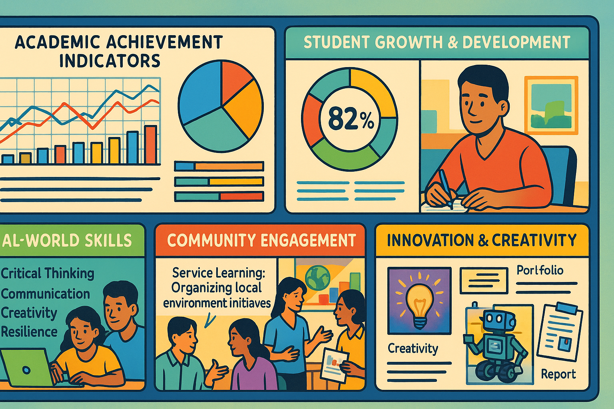

Chart: A redesigned school data dashboard showing holistic metrics alongside traditional ones

Panel 14

Please generate a drawing using a colorful bright graph-novel style.
The image should be a wide-landscape format with a width:height ration of 16:9.
Make sure that the characters generated in this image are consistent with prior images generated in this session.

Description:
A modern, well-designed dashboard display showing various metrics in a balanced way. Traditional academic metrics are still visible but occupy only one section, labeled "Academic Achievement Indicators." Much more prominent are sections for "Student Growth & Development," "Real-World Skills," "Community Engagement," and "Innovation & Creativity." Each section uses different visualization methods - some numerical, some portfolio-based, some narrative descriptions. The overall design should feel more human and comprehensive than typical data dashboards, with student photos and work samples integrated alongside charts and graphs.

A year later, Maria stood before the school board presenting a very different kind of data dashboard. Yes, it still included traditional test scores – those hadn't disappeared. But now they were just one part of a much more comprehensive picture of student success.

The new dashboard included:

**Academic Growth Indicators**: Not just current achievement levels, but progress over time and growth from individual starting points.

**Real-World Skills Development**: Evidence of collaboration, communication, critical thinking, and creativity through project work and peer assessments.

**Community Engagement**: Student involvement in addressing real community problems and feedback from community partners.

**Student Voice Measures**: Surveys about engagement, sense of purpose, and preparedness for future challenges.

**Post-Graduation Success**: Follow-up data on how alumni were performing in college and careers, with particular attention to skills that traditional tests couldn't measure.

The difference was remarkable. Instead of a narrow focus on a few standardized metrics, they now had a rich, multidimensional view of student development that actually predicted future success.

## Chapter 15: Lessons Learned
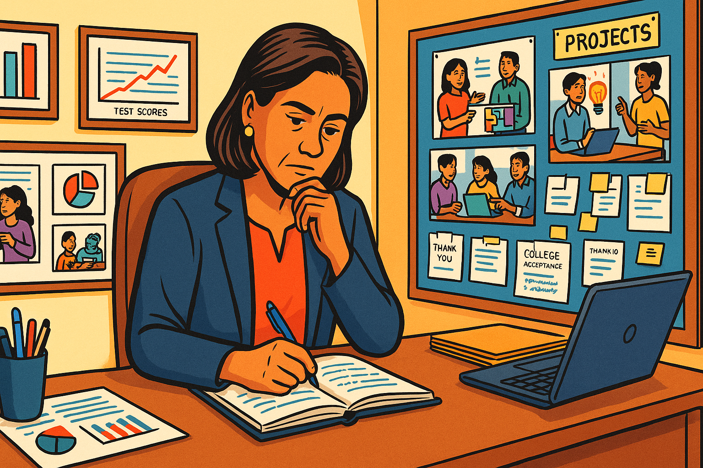

Image: Maria reflecting in her office, surrounded by both traditional data and examples of authentic student work

Panel 15

Please generate a drawing using a colorful bright graph-novel style.
The image should be a wide-landscape format with a width:height ration of 16:9.
Make sure that the characters generated in this image are consistent with prior images generated in this session.

Description:
Maria's office showing the evolution of her thinking. On one wall, traditional charts and test score data remain visible but are now balanced with displays of student project work, photos of presentations, thank-you letters from community partners, and college acceptance letters mentioning specific skills students developed. Maria sits thoughtfully at her desk, perhaps writing in the same notebook from the beginning of the story, with both types of evidence visible around her. The scene should convey wisdom gained and a more balanced approach to understanding student success.

As Maria reflected on the year's journey, she realized they had learned to navigate Peter Drucker's famous maxim more wisely. Yes, what gets measured gets managed – but the key insight was that you have to be very careful about what you choose to measure.

The lessons were clear:

**Measure what matters, not just what's easy**: The most important skills and qualities are often the hardest to quantify, but that doesn't make them less real or valuable.

**Use multiple measures**: No single metric can capture the full complexity of learning or performance. You need a portfolio of indicators.

**Include process, not just outcomes**: How students learn, grow, and overcome challenges is often more important than their final performance on any single assessment.

**Make measurement meaningful**: The best assessments should enhance learning, not just audit it. When students present to real community members, the assessment itself becomes a valuable learning experience.

**Remember the human element**: Behind every data point is a human being with unique strengths, challenges, and potential. Numbers should inform our understanding, not replace it.

**Systems thinking applies**: Changing what you measure changes behavior throughout the entire system. Choose your metrics carefully because they will shape everything else.

## Epilogue: The Measurement Revolution

Image: A montage showing students, teachers, business leaders, and communities working together in various authentic learning environments

Panel 16

Please generate a drawing using a colorful bright graph-novel style.
The image should be a wide-landscape format with a width:height ration of 16:9.
Make sure that the characters generated in this image are consistent with prior images generated in this session.

Description:
A vibrant collage-style image showing multiple scenes of authentic, engaged learning and working. Students collaborating with community members on real problems, business professionals mentoring young people, teachers facilitating rather than just instructing, parents seeing their children's work in community settings, and diverse groups of people working together on meaningful challenges. The overall feeling should be one of connection, purpose, and authentic engagement - a stark contrast to the isolated test-taking scenes from the beginning of the story.

Three years later, Lincoln High School had become a model for other districts grappling with the same measurement challenges. Test scores had actually improved, but more importantly, graduates were thriving in college and careers with the collaborative, creative, and critical thinking skills they had developed.

Maria often thought about Peter Drucker's warning and how it applied far beyond schools and businesses. In healthcare, were they measuring patient satisfaction or actual health outcomes? In cities, were they measuring traffic flow or community livability? In families, were they measuring achievements or relationships?

The principle was universal: **what gets measured gets managed**. The question each person and organization had to answer was whether they were measuring the right things.

As she walked through the halls of Lincoln High, Maria no longer saw walls covered only with test score charts. Instead, she saw displays of student work, photos of community presentations, letters from college admissions officers praising graduates' collaborative skills, and thank-you notes from local organizations whose problems students had helped solve.

The numbers were still there – they still mattered – but now they were just one part of a much richer story about human development, community engagement, and preparation for a complex world.

Maria smiled as she passed a classroom where students were intensely debating solutions to the city's public transportation challenges. Their teacher wasn't lecturing from the front; she was moving between groups, asking probing questions and helping students think more deeply.

These students would never be reduced to a single test score. They were developing into the kind of thoughtful, capable, collaborative citizens the world desperately needed.

And that, Maria knew, was something worth measuring – and managing.

**The Bottom Line**: Peter Drucker was right that what gets measured gets managed. But he didn't say we had to settle for measuring only what was easy. The greatest challenge – and opportunity – lies in figuring out how to measure what truly matters, even when it's complicated, nuanced, and human.

Because in the end, we don't just need better test scores. We need better thinkers, better collaborators, and better human beings. And that requires better measurements of what makes us human.

## Discussion Questions

1. **Peter Drucker's Maxim**: How does "what gets measured gets managed" apply to your own life? Think about grades, social media likes, sports statistics, or family expectations. What gets the most attention because it's easy to measure, and what important things might be getting ignored?

2. **The Easy vs. Important Dilemma**: Principal Martinez discovers that schools measure what's easy (test scores) rather than what's important (collaboration, creativity, resilience). Can you think of examples from your own school, sports teams, or part-time jobs where this same pattern exists? What would happen if those organizations changed what they measured?

3. **Standardized Testing Trade-offs**: The story suggests that focusing heavily on standardized tests reduces time for creative writing, critical thinking, and collaboration. Do you agree with this trade-off? How do you think schools should balance preparing for tests with developing other skills?

4. **Real-World Skills Gap**: The business leaders in the story were more impressed by students' collaborative problem-solving than by test scores. Based on your observations of adults in your life (parents, employers, coaches), what skills seem most important for success after high school? How well does your education develop these skills?

5. **Measuring Collaboration**: The story describes the challenge of assessing teamwork and group projects fairly. Have you experienced group work that felt unfair because of how it was graded? How might teachers better evaluate individual contributions to team efforts?

6. **The Resilience Problem**: Marcus shows incredible persistence and learning from failure, but receives a lower grade than students whose projects work immediately. How should schools recognize and reward the learning that happens through struggle and improvement rather than just final results?

7. **Systems Thinking Perspective**: Maria realizes that measurement systems create reinforcing loops - measuring test scores leads to teaching for tests, which leads to standardized learning. Can you identify other reinforcing loops in your school or community where the measurement system might be creating unintended consequences?

8. **Community Connections**: Students in the project-based learning unit worked on real community problems and presented to actual business leaders and community members. How might this type of authentic audience change student motivation and learning compared to traditional assignments turned in only to teachers?

9. **Multiple Measures**: The new dashboard included academic growth, real-world skills, community engagement, and student voice. If you were designing a way to measure your own development as a person, what would you include beyond grades? How might you track growth in areas like empathy, leadership, or creative thinking?

10. **Future Implications**: Imagine you're a parent 20 years from now choosing between two schools: one with the highest test scores in the district, and another with lower test scores but strong evidence of developing collaboration, creativity, and real-world problem-solving skills. Which would you choose for your child, and why? What does this reveal about what you truly value in education?
## References

1. [What Gets Measured Gets Managed - Peter Drucker's Famous Quote](https://www.drucker.institute/what-gets-measured-gets-managed/) - 2019 - The Drucker Institute - Explores the origin and implications of Peter Drucker's famous maxim, explaining how measurement systems drive behavior in organizations and why choosing the right metrics is crucial for success.

2. [The Case Against Standardized Testing](https://www.theatlantic.com/education/archive/2014/05/the-case-against-standardized-testing/370893/) - 2014 - The Atlantic - Examines research showing how excessive focus on standardized testing narrows curriculum, reduces creativity, and fails to measure important skills like collaboration and critical thinking that students need for future success.

3. [Why Schools Are Struggling to Teach Collaboration](https://www.edutopia.org/article/why-schools-struggling-teach-collaboration) - 2020 - Edutopia - Discusses the challenge of developing teamwork skills in educational environments designed around individual assessment, and provides examples of how some schools are successfully integrating collaborative learning.

4. [Project-Based Learning: Real-World Skills for Real-World Success](https://www.bie.org/about/what_pbl) - 2021 - Buck Institute for Education - Explains how project-based learning engages students in solving authentic problems while developing critical 21st-century skills that traditional testing cannot measure.

5. [The Importance of Teaching Resilience and Grit](https://www.edweek.org/leadership/opinion-the-importance-of-teaching-resilience-and-grit/2018/03) - 2018 - Education Week - Explores research on resilience and persistence as predictors of long-term success, and discusses why these qualities are often overlooked in traditional academic assessment.

6. [How Google Measures Employee Success (Hint: It's Not Just Performance)](https://www.inc.com/justin-bariso/google-spent-10-years-researching-what-makes-a-great-manager-they-came-up-with-these-10-traits.html) - 2019 - Inc. Magazine - Reveals how major companies are moving beyond simple productivity metrics to measure collaboration, innovation, and employee development, paralleling the shift needed in education.

7. [The Skills Gap: What Students Need vs. What Schools Teach](https://www.forbes.com/sites/forbescoachescouncil/2018/11/15/bridging-the-skills-gap-what-students-really-need-to-learn/) - 2018 - Forbes - Analyzes the disconnect between skills employers value most (communication, teamwork, problem-solving) and what traditional education emphasizes through testing.

8. [Systems Thinking in Education: Why It Matters](https://www.ascd.org/el/articles/systems-thinking-in-schools) - 2020 - Educational Leadership (ASCD) - Introduces systems thinking concepts and explains how understanding feedback loops and interconnections can help educators create more effective learning environments.

9. [Portfolio Assessment: A More Complete Picture of Student Learning](https://www.teachervision.com/assessment/portfolio-assessment) - 2021 - TeacherVision - Demonstrates how portfolio-based assessment captures student growth over time and provides evidence of skills that standardized tests miss, including creativity and reflection.

10. [The Future of Work Requires Different Skills Than We're Teaching](https://www.weforum.org/agenda/2020/01/future-of-work-schools-education-skills-learning/) - 2020 - World Economic Forum - Presents research on the skills most needed for future careers (creativity, critical thinking, emotional intelligence) and argues for educational reforms that develop these capabilities rather than focusing solely on test performance.