# The Network Pioneer: A Graphic Novel Story of Robert Metcalfe and the Birth of Ethernet

This is the story of how one engineer's vision created the foundation of our connected world, and how systems thinking principles shaped the battle between competing network technologies. Through the lens of Robert Metcalfe's journey, we'll explore Metcalfe's Law, network effects, and the "Success to the Successful" archetype that determined the winner in the early days of computer networking.

## The Young Engineer's Dream
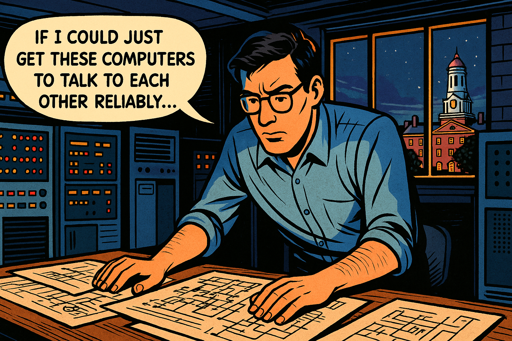

   
The Young Engineer's Dream

Panel 1:
   Please generate a wide-landscape drawing using a bright colorful palette of colors in the style of a graphic novel comic book. Make sure you use a wide-landscape 16:9 width:height format. Make sure that any characters are consistent with prior panels.

In this panel, we see young Robert Metcalfe in 1973 at Harvard University, working late in a dimly lit computer lab. Multiple early computers with blinking lights fill the room. Bob, a tall man with dark hair and glasses, is hunched over a desk covered with circuit diagrams and technical papers. Through the window, we can see the Harvard campus at night. Speech bubble from Bob: "If I could just get these computers to talk to each other reliably..." The scene conveys innovation, determination, and the birth of a revolutionary idea.

Our story begins in the early 1970s, when computers were isolated islands of computation. Robert "Bob" Metcalfe, a young electrical engineer and Harvard PhD candidate, was wrestling with a fundamental problem: how to make computers communicate with each other efficiently and reliably. Like many great innovations, Ethernet would emerge from a specific need - connecting the computers at Xerox's Palo Alto Research Center (PARC). But Bob didn't yet know that his solution would demonstrate one of the most powerful principles in systems thinking: that the value of a network grows exponentially with each new connection.

## Joining the Innovation Hub
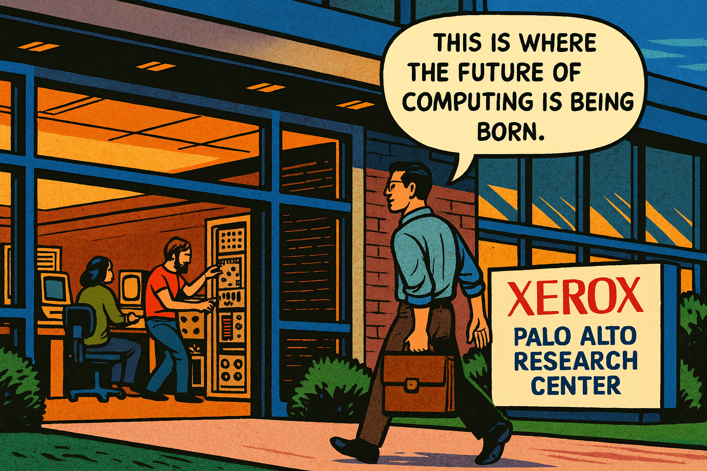

   
Joining the Innovation Hub

Panel 2:
   Please generate a wide-landscape drawing using a bright colorful palette of colors in the style of a graphic novel comic book. Make sure you use a wide-landscape 16:9 width:height format. Make sure that any characters are consistent with prior panels.

In this panel, Bob Metcalfe walks through the entrance of Xerox PARC in Palo Alto in 1973. The building has a modern, innovative design with large glass windows. Inside, we can see researchers working with early computers and experimental equipment. Bob carries a briefcase and wears a casual shirt - the informal dress code of Silicon Valley innovation. A sign reads "Xerox Palo Alto Research Center." Speech bubble from Bob: "This is where the future of computing is being born." The atmosphere suggests excitement and cutting-edge research.

In 1973, Bob joined Xerox PARC, the legendary research facility that was inventing the future of computing. PARC was developing revolutionary technologies: graphical user interfaces, laser printers, and personal computers. But there was a problem - all these amazing devices couldn't communicate with each other effectively. The existing networking solutions were expensive, unreliable, and couldn't scale. Bob saw an opportunity to create something better. This was a classic example of what systems thinkers call a "leverage point" - a place where a small change could produce big results across an entire system.

## The Eureka Moment
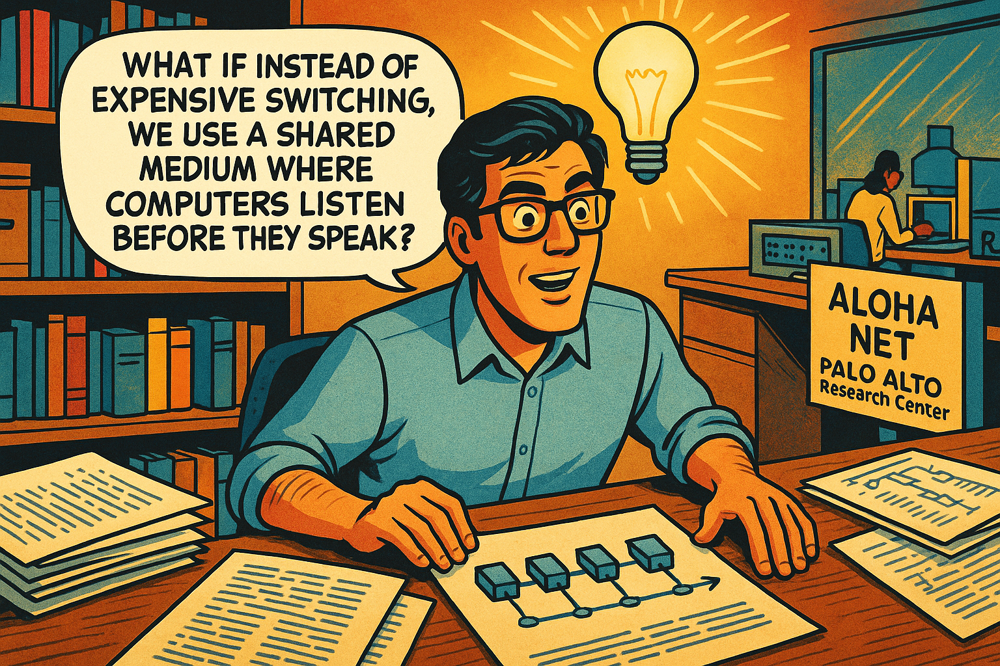

   
The Eureka Moment

Panel 3:
   Please generate a wide-landscape drawing using a bright colorful palette of colors in the style of a graphic novel comic book. Make sure you use a wide-landscape 16:9 width:height format. Make sure that any characters are consistent with prior panels.

In this panel, Bob sits at his desk surrounded by research papers, including one about the ALOHANET radio system from Hawaii. A lightbulb moment is depicted literally - with a bright lightbulb glowing above his head. On his desk are sketches showing computers connected by a single cable, like beads on a string. Bob's expression shows sudden understanding and excitement. Speech bubble from Bob: "What if instead of expensive switching, we use a shared medium where computers listen before they speak?" The papers show network diagrams and the ALOHANET research that inspired his breakthrough.

Bob's breakthrough came from studying the ALOHANET, a radio-based network in Hawaii where computers shared a single communication channel. He realized he could adapt this concept to wired networks: instead of expensive dedicated connections between every pair of computers, they could all share a single cable. Computers would "listen before speaking" to avoid collisions, and if two tried to talk at once, they would back off and try again. This elegant solution embodied systems thinking - rather than fighting the constraints of shared resources, he designed a protocol that worked with them.

## Building the First Network
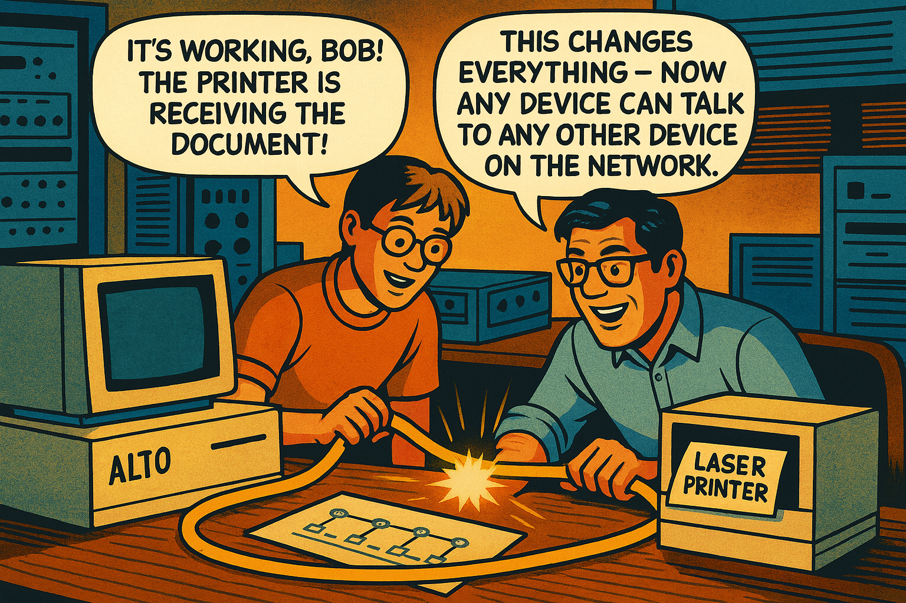

   
Building the First Network

Panel 4:
   Please generate a wide-landscape drawing using a bright colorful palette of colors in the style of a graphic novel comic book. Make sure you use a wide-landscape 16:9 width:height format. Make sure that any characters are consistent with prior panels.

In this panel, Bob and his colleague David Boggs are in a lab setting, working together to build the first Ethernet connection. They're installing thick yellow coaxial cables between computers. David is a younger engineer with lighter hair. The scene shows them connecting an Alto computer to a laser printer with their new networking hardware. Sparks of electricity and data flow are illustrated flowing through the cable. Speech bubble from David: "It's working, Bob! The printer is receiving the document!" Speech bubble from Bob: "This changes everything - now any device can talk to any other device on the network."

Working with colleague David Boggs, Bob built the first Ethernet in 1973-1974. They connected an Alto computer to a laser printer using a thick yellow coaxial cable, creating the first local area network that would scale. But the real magic wasn't just the connection - it was what systems thinkers call "emergent properties." When you connected two devices, you got one connection. But connect three devices, and suddenly you had three possible connections. Connect four, and you had six connections. The value wasn't growing linearly - it was growing exponentially.

## The Mathematical Revelation
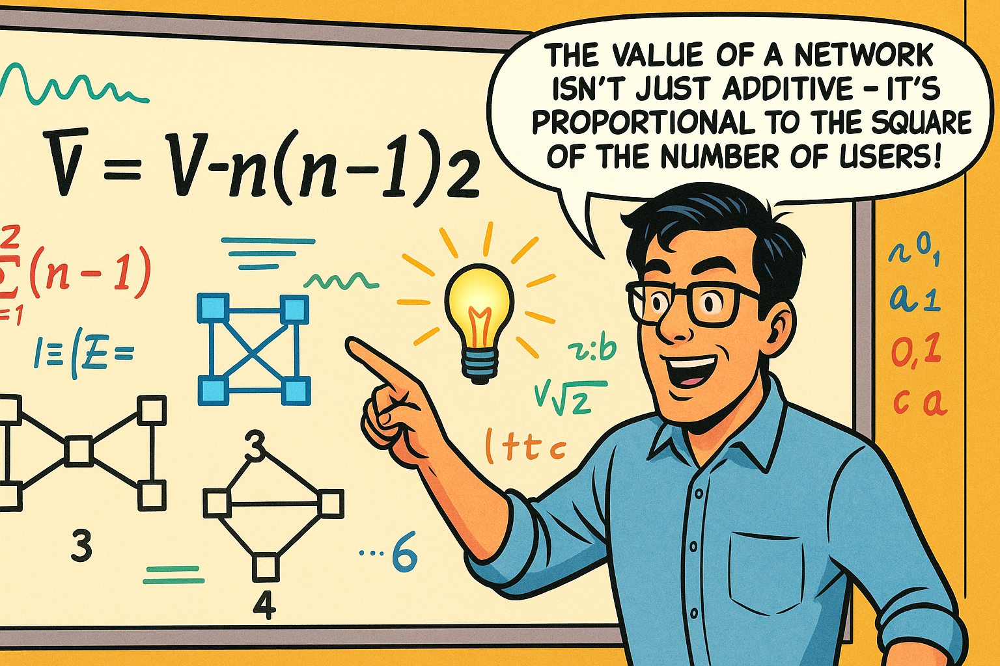

   
The Mathematical Revelation

Panel 5:
   Please generate a wide-landscape drawing using a bright colorful palette of colors in the style of a graphic novel comic book. Make sure you use a wide-landscape 16:9 width:height format. Make sure that any characters are consistent with prior panels.

In this panel, Bob stands in front of a large whiteboard covered with mathematical equations and network diagrams. The main equation "V = n(n-1)/2" is prominently displayed, along with drawings showing how network connections multiply as nodes are added. Bob points to the board with excitement. Around him are sketches showing 2 computers with 1 connection, 3 computers with 3 connections, 4 computers with 6 connections, etc. Speech bubble from Bob: "The value of a network isn't just additive - it's proportional to the square of the number of users!" The mathematical beauty of network effects is visually represented through growing interconnected diagrams.

As Bob watched Ethernet spread through PARC, he noticed something profound. Each new computer added to the network didn't just benefit itself - it made the entire network more valuable for everyone already connected. He formalized this observation into what would become known as Metcalfe's Law: the value of a network is proportional to the square of the number of connected users. This wasn't just about technology - it was a fundamental principle of systems thinking. The whole was greater than the sum of its parts, and the "network effect" created a powerful reinforcing loop where success attracted more success.

## Panel 6
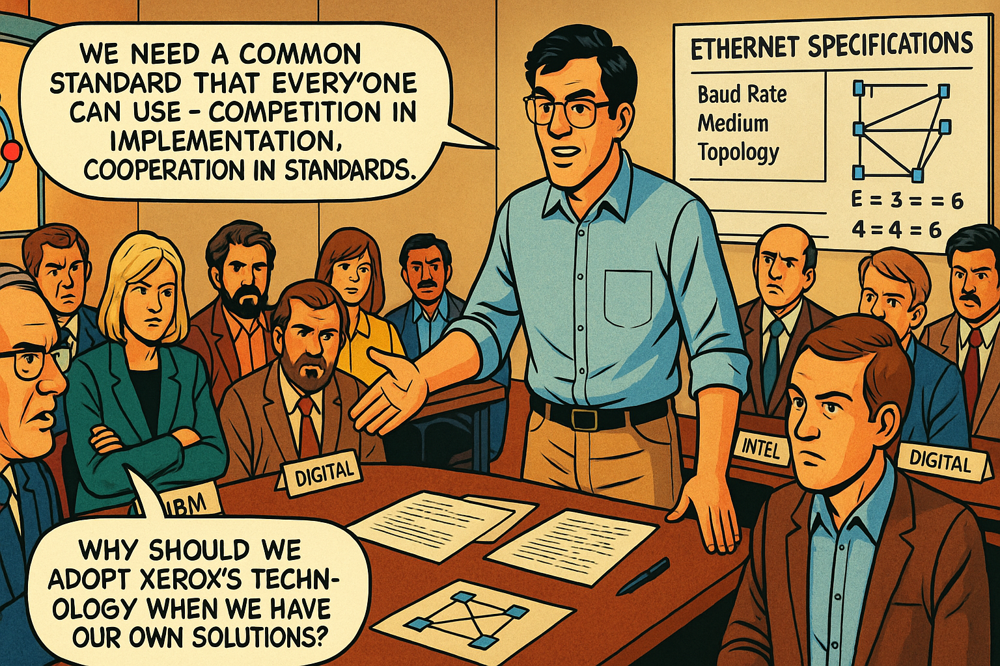

   
The Standardization Challenge

Panel 6:
   Please generate a wide-landscape drawing using a bright colorful palette of colors in the style of a graphic novel comic book. Make sure you use a wide-landscape 16:9 width:height format. Make sure that any characters are consistent with prior panels.

In this panel, we see a conference room filled with engineers from different technology companies - IBM, Digital Equipment Corporation, Intel, and Xerox. Bob stands at the head of a large conference table presenting Ethernet specifications. The room shows tension and skepticism from some participants, while others lean forward with interest. Charts on the walls show competing networking technologies like Token Ring. Speech bubble from Bob: "We need a common standard that everyone can use - competition in implementation, cooperation in standards." Speech bubble from an IBM representative: "Why should we adopt Xerox's technology when we have our own solutions?"

By the late 1970s, Bob faced a critical systems challenge. Ethernet was successful at Xerox, but to truly change the world, it needed to become an open standard that all companies could adopt. This meant convincing competitors to work together - a classic example of what systems thinkers call "shifting from competition to collaboration." Bob knew that the network effect only worked if networks could connect to each other. Incompatible networking standards would create isolated islands, limiting the value for everyone.

## Panel 7
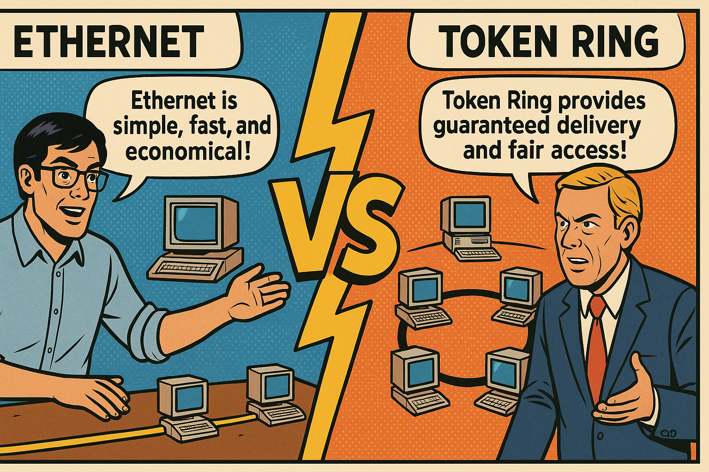

   
The Standards Battle Begins

Panel 7:
   Please generate a wide-landscape drawing using a bright colorful palette of colors in the style of a graphic novel comic book. Make sure you use a wide-landscape 16:9 width:height format. Make sure that any characters are consistent with prior panels.

In this panel, we see a split-screen comparison showing two competing technologies. On the left side, Bob demonstrates Ethernet with its simple shared-cable design, showing computers connected to a single yellow cable. On the right side, IBM engineers present Token Ring technology with its circular network topology. The middle of the panel shows a "VS" symbol like a sports competition. Speech bubble from Bob's side: "Ethernet is simple, fast, and economical!" Speech bubble from IBM's side: "Token Ring provides guaranteed delivery and fair access!" The visual suggests an epic technological battle is about to unfold.

The standardization process revealed a classic systems archetype: "Success to the Successful." Companies that were already successful in computing - like IBM - had advantages in promoting their preferred networking standards. IBM pushed Token Ring, a technology that guaranteed every computer fair access to the network by passing a special "token" around in a circle. It was technically elegant, but it was also more complex and expensive than Ethernet. This set up a fascinating systems dynamic: would the technically superior solution win, or would other factors determine the outcome?

## The Network Effect in Action
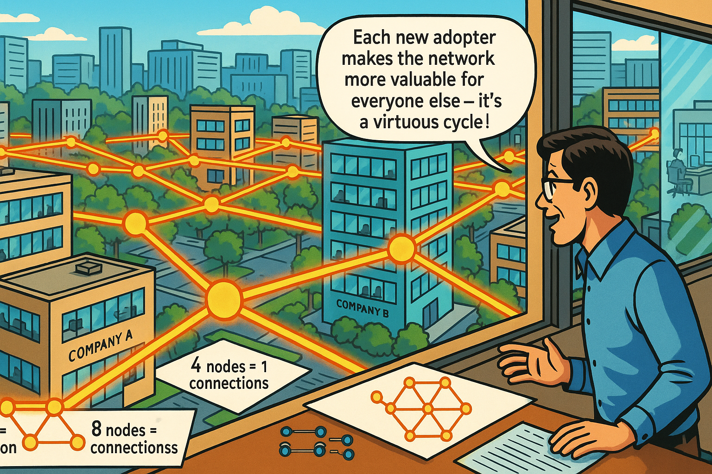

   
The Network Effect in Action

Panel 8:
   Please generate a wide-landscape drawing using a bright colorful palette of colors in the style of a graphic novel comic book. Make sure you use a wide-landscape 16:9 width:height format. Make sure that any characters are consistent with prior panels.

In this panel, we see a dynamic illustration of network growth. The scene shows an aerial view of multiple office buildings and companies, with Ethernet connections spreading like a web between them. Starting from a few early adopters, the connections multiply rapidly across the landscape. Bob observes from a window, watching the exponential spread. Visual elements show the mathematical progression: 2 nodes=1 connection, 4 nodes=6 connections, 8 nodes=28 connections, represented by glowing lines between buildings. Speech bubble from Bob: "Each new adopter makes the network more valuable for everyone else - it's a virtuous cycle!" The image conveys rapid, exponential expansion.

As the 1980s progressed, the network effect began working in Ethernet's favor. Early adopters found that Ethernet networks were easier and cheaper to install than Token Ring. More importantly, as more companies chose Ethernet, it became increasingly attractive for others to do the same - they wanted to connect to the growing network of Ethernet users. This created a powerful reinforcing loop: more users led to greater value, which attracted even more users. Systems thinkers recognize this as a "tipping point" phenomenon, where small initial advantages can snowball into decisive victories.

## Founding 3Com
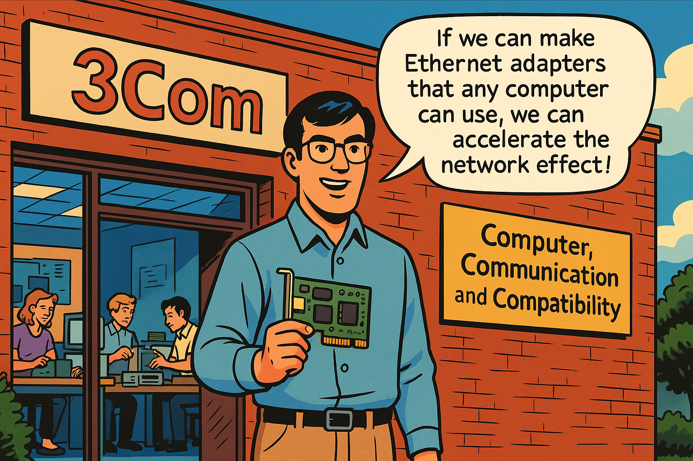

   
Founding 3Com

Panel 9:
   Please generate a wide-landscape drawing using a bright colorful palette of colors in the style of a graphic novel comic book. Make sure you use a wide-landscape 16:9 width:height format. Make sure that any characters are consistent with prior panels.

In this panel, Bob stands in front of a small startup office with a "3Com" sign. The name stands for "Computer, Communication, and Compatibility" - visible on a banner. Inside the office, we see a small team of engineers working on Ethernet hardware and adapters. Bob holds the first 3Com Ethernet adapter card, a green circuit board. The scene conveys entrepreneurial energy and innovation. Speech bubble from Bob: "If we can make Ethernet adapters that any computer can use, we can accelerate the network effect!" The setting shows the humble beginnings of what would become a networking giant.

In 1979, Bob left Xerox to found 3Com (Computer, Communication, and Compatibility), with the mission of making Ethernet universally accessible. This was a classic entrepreneurial bet on network effects and systems thinking. Bob understood that for Ethernet to achieve maximum value, it needed to be compatible with every type of computer, not just Xerox machines. 3Com would make the adapters, cables, and hubs that let any computer join the growing Ethernet ecosystem. This strategy demonstrated another systems principle: sometimes you create more value by giving up control and enabling others to participate.

## The Tipping Point
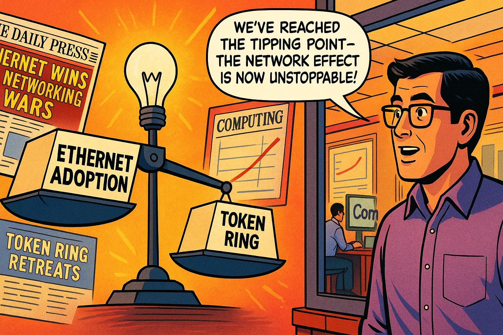

   
The Tipping Point

Panel 10:
   Please generate a wide-landscape drawing using a bright colorful palette of colors in the style of a graphic novel comic book. Make sure you use a wide-landscape 16:9 width:height format. Make sure that any characters are consistent with prior panels.

In this panel, we see a dramatic visualization of market share shift. A large scale or balance is shown, with Ethernet adoption on one side growing heavy and pulling down, while Token Ring on the other side rises up, indicating its declining market share. Bob observes this market transformation from his 3Com office. In the background, newspaper headlines and magazine covers show "Ethernet Wins the Networking Wars" and "Token Ring Retreats." Charts on the wall show exponential growth curves for Ethernet adoption. Speech bubble from Bob: "We've reached the tipping point - the network effect is now unstoppable!"

By the late 1980s, Ethernet had reached a critical tipping point. Despite Token Ring's technical sophistication and IBM's market power, the network effect overwhelmed these advantages. Companies chose Ethernet because that's what everyone else was choosing. This created what systems thinkers call a "self-reinforcing loop" - success bred more success. IBM's "Success to the Successful" advantage was being overwhelmed by the more powerful network effect dynamic. The battle was essentially over, though it would take several more years for Token Ring to completely fade away.

## Internet Integration
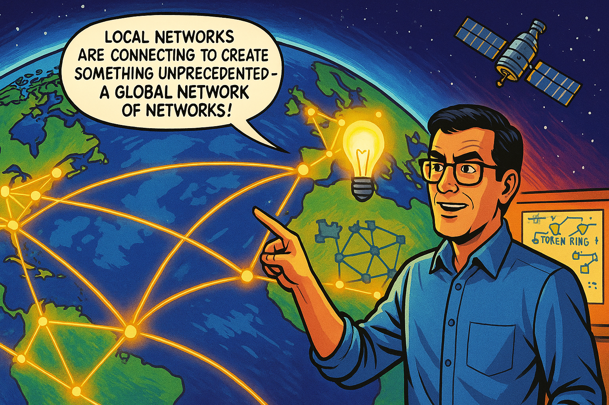

   
Internet Integration

Panel 11:
   Please generate a wide-landscape drawing using a bright colorful palette of colors in the style of a graphic novel comic book. Make sure you use a wide-landscape 16:9 width:height format. Make sure that any characters are consistent with prior panels.

In this panel, we see a global view of the Earth with network connections spanning continents. Ethernet local networks are connecting to the emerging Internet backbone, creating a worldwide web of communication. Bob stands before a world map showing these interconnections, with fiber optic cables crossing oceans and satellites in space. The scene shows the transition from local area networks to the global Internet. Speech bubble from Bob: "Local networks are connecting to create something unprecedented - a global network of networks!" The image conveys the scale and ambition of worldwide connectivity.

As the Internet began connecting local networks worldwide in the early 1990s, Ethernet found its perfect partner. Local Ethernet networks became the on-ramps to the information superhighway, connecting offices, schools, and homes to the global Internet. This represented the ultimate validation of Metcalfe's Law - the network's value exploded as it grew from connecting computers in a building, to connecting buildings in a city, to connecting cities worldwide. The systems thinking principle of "emergent properties" was on full display: the Internet became something entirely new and more powerful than the sum of its parts.

## The Exponential Revolution
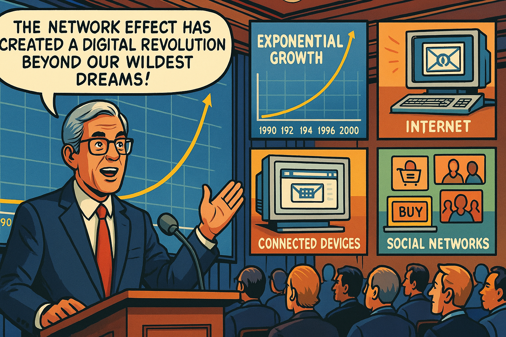

   
The Exponential Revolution

Panel 12:
   Please generate a wide-landscape drawing using a bright colorful palette of colors in the style of a graphic novel comic book. Make sure you use a wide-landscape 16:9 width:height format. Make sure that any characters are consistent with prior panels.

In this panel, we see an older Bob Metcalfe (now with gray hair) speaking at a technology conference in the late 1990s. Behind him is a large screen showing the exponential growth curve of Internet users and connected devices. The audience is filled with technology leaders and entrepreneurs. Images around the panel show the Internet revolution in full swing: email, web browsers, e-commerce, and the first social networks. Speech bubble from Bob: "The network effect has created a digital revolution beyond our wildest dreams!" The scene conveys the massive scale and impact of networked computing.

By the late 1990s, the network effect had triggered a digital revolution. Email, the World Wide Web, e-commerce, and early social networks were transforming society. Bob, now in his 50s, watched in amazement as his mathematical insight about network value had become the foundation of the digital economy. Every new website, every new Internet user, every new connected device made the entire network more valuable for everyone else. The "Success to the Successful" archetype was now working in favor of Internet-connected businesses, creating entirely new industries and economic models.

## Legacy and Recognition
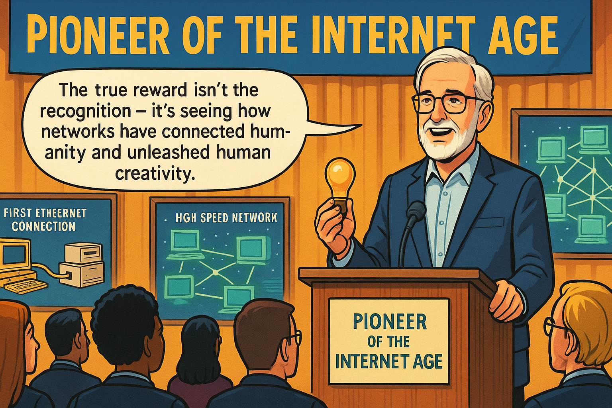

   
Legacy and Recognition

Panel 13:
   Please generate a wide-landscape drawing using a bright colorful palette of colors in the style of a graphic novel comic book. Make sure you use a wide-landscape 16:9 width:height format. Make sure that any characters are consistent with prior panels.

In this panel, we see an awards ceremony where Bob receives recognition for his contributions to networking. He stands at a podium holding an award (perhaps the National Medal of Technology), with a banner reading "Pioneer of the Internet Age." The audience includes technology leaders and students. In the background, displays show the evolution from the first Ethernet connection to modern high-speed networks. Speech bubble from Bob: "The true reward isn't the recognition - it's seeing how networks have connected humanity and unleashed human creativity." The scene honors his lifetime achievement while emphasizing the broader impact.

Bob Metcalfe received numerous honors for his contributions to networking, including the National Medal of Technology and induction into the Internet Hall of Fame. But perhaps more importantly, his work demonstrated fundamental principles of systems thinking that extend far beyond technology. The network effect applies to social networks, economic systems, and any situation where the value of participation increases with the number of participants. His victory over Token Ring showed how systems dynamics - not just technical superiority - determine which innovations succeed.

## The Connected Future
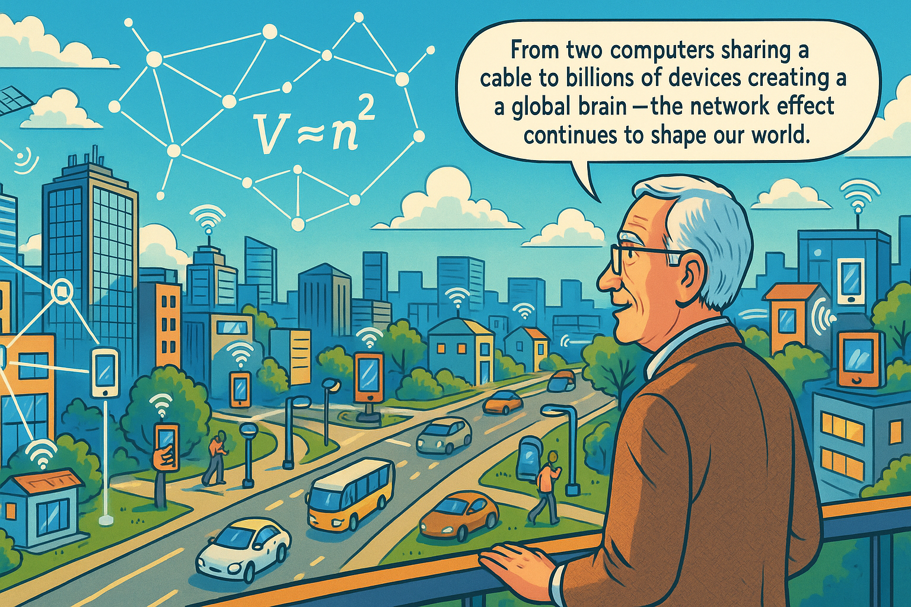

   
The Connected Future

Panel 14:
   Please generate a wide-landscape drawing using a bright colorful palette of colors in the style of a graphic novel comic book. Make sure you use a wide-landscape 16:9 width:height format. Make sure that any characters are consistent with prior panels.

In this final panel, we see a futuristic vision of our connected world. Bob, now elderly but still engaged, stands overlooking a city where everything is networked - smart buildings, autonomous vehicles, IoT devices, and people connected through various devices. The scene shows wireless networks, fiber optic connections, and satellite communications all working together. Above the city, a visual representation of Metcalfe's Law floats like a mathematical constellation, with the equation V ∝ n² prominently displayed. Speech bubble from Bob: "From two computers sharing a cable to billions of devices creating a global brain - the network effect continues to shape our world." The image conveys both achievement and ongoing potential.

Today, as we live in a world of smartphones, social media, cloud computing, and the Internet of Things, we can see Bob Metcalfe's vision fully realized. Billions of devices are connected through technologies that trace their lineage back to that first Ethernet connection in 1973. The network effect continues to drive innovation: each new connected device, each new user on a social platform, each new participant in the digital economy makes the whole system more valuable for everyone.

**The Systems Thinking Lessons:**

Bob Metcalfe's story illustrates several key systems thinking principles:

1. **Network Effects and Metcalfe's Law**: The value of a system can grow exponentially, not just additively, as more participants join.

2. **Success to the Successful**: Initial advantages can compound over time, but sometimes they can be overcome by even more powerful system dynamics.

3. **Leverage Points**: Small changes at the right place in a system can produce huge impacts - open standards transformed networking from a niche technology to a global phenomenon.

4. **Emergent Properties**: Complex systems often exhibit behaviors and capabilities that emerge from the interactions of their parts, not just their individual components.

5. **Tipping Points**: Systems can reach critical thresholds where small additional changes create dramatic shifts in behavior.

The battle between Ethernet and Token Ring wasn't just a technical competition - it was a demonstration of how systems thinking principles determine which innovations succeed in changing the world. Bob Metcalfe didn't just invent a technology; he understood and harnessed the power of networks to create a foundation for our connected future.

## References

Here are 10 references for high school students studying Robert Metcalfe, Ethernet, and network effects:

1. [Robert Metcalfe Biography](https://www.computerhistory.org/fellowawards/hall/robert-metcalfe/) - 2023 - Computer History Museum - Comprehensive biography of Metcalfe's life and achievements, perfect for understanding his journey from student to networking pioneer.

2. [What is Metcalfe's Law?](https://www.investopedia.com/terms/m/metcalfes-law.asp) - 2024 - Investopedia - Clear explanation of Metcalfe's Law with real-world examples showing how network value grows exponentially with users.

3. [The History of Ethernet](https://www.ieee.org/about/awards/recipients/metcalfe-hn.html) - 2023 - IEEE Computer Society - Technical but accessible overview of how Ethernet was developed and why it became the standard for computer networking.

4. [Network Effects Explained](https://www.nfx.com/post/network-effects-manual) - 2023 - NFX - Modern business perspective on network effects with examples from social media and tech companies that students will recognize.

5. [Token Ring vs Ethernet: The Battle That Shaped Networking](https://www.networkworld.com/article/2226122/token-ring-vs-ethernet.html) - 2022 - Network World - Detailed comparison of the competing technologies and explanation of why Ethernet won the standards war.

6. [Robert Metcalfe's 3Com Story](https://www.britannica.com/biography/Robert-Metcalfe) - 2024 - Britannica - Educational resource covering Metcalfe's entrepreneurial journey from Xerox PARC to founding 3Com.

7. [How the Internet Was Born](https://www.vox.com/2014/6/16/5813254/40-maps-that-explain-the-internet) - 2023 - Vox - Visual timeline showing how local networks like Ethernet connected to create the global Internet.

8. [Systems Thinking for Beginners](https://thesystemsthinker.com/introduction-to-systems-thinking/) - 2023 - The Systems Thinker - Introduction to systems thinking concepts that appear throughout Metcalfe's story, including network effects and feedback loops.

9. [Xerox PARC: The Legendary Innovation Lab](https://www.computerworld.com/article/2525041/xerox-parc-s-35-year-history-of-innovation.html) - 2022 - Computerworld - Background on the research environment where Ethernet was invented and other revolutionary technologies were developed.

10. [The Economics of Networks](https://www.khanacademy.org/economics-finance-domain/ap-microeconomics/imperfect-competition/monopolies-tutorial/a/natural-monopolies-review) - 2024 - Khan Academy - Educational explanation of network economics and why some technologies become dominant standards, relevant to understanding Ethernet's success.

* [Dialog for OpenAI ChatGPT Image generation](https://chatgpt.com/share/68ae7089-5ae0-8001-a2df-3f36677c51bf)

* [Dialog for Claude Sonnet story narrative generation](https://claude.ai/share/6faf2024-fcc9-4512-8d13-54bef95da3d1)