# Moore's Law: The Rise and Limits of Silicon Progress

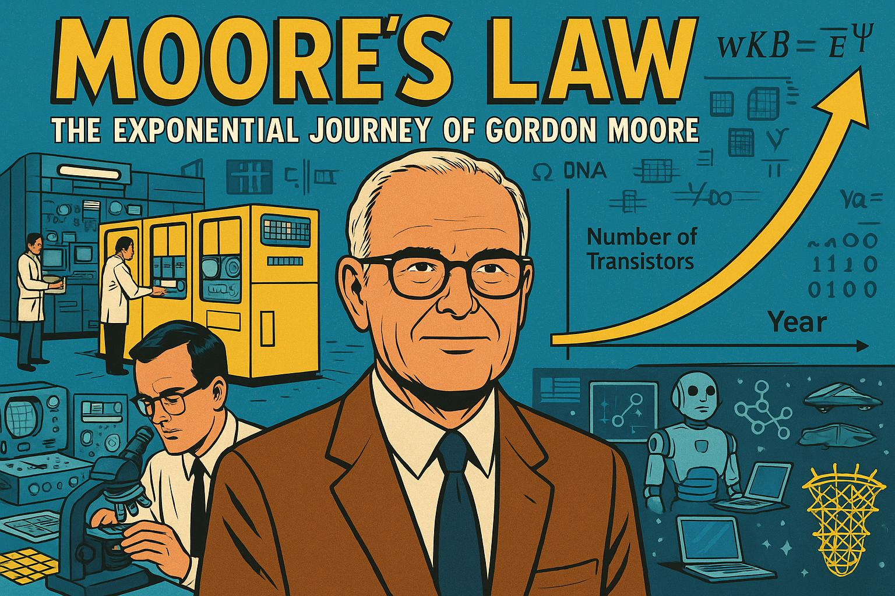

<details>
   <summary>Sample Narrative Prompt</summary>
   Please generate a narrative that would be the basis of
    a 14 panel graphic novel about Moore's Law.  Here is an outline of the story.
    
    1. Begin with how Gordon Moore began his career designing silicon chips in the 1960s.
    2. Show how he was instrumental and an engineer design chips for Fairchild.
    3. Include how he co-founded Intel.
    4. Show how he noticed that the number of transistors on each chip continued
    to increase in size.
    5. Show how he noticed that this was not a simple linear growth curve but
    an exponential growth curve.
    6. Show how he published in paper on the topic and how little people took notice.
    7. Show how by lowering the cost of electronics and increasing the power of electronics the demand for those products went up
    8. Show how that over time he became more famous because this law became a 
    guidepost of progress in electronics and computers
    9. Show the physics of fabrication created new challenges for semiconductor manufacturing
    10. How the cost of manufacturing plants also has seen exponential growth
    11. Show how his law continued to hold until present day (2025), however the cost
    of building these chips also has grown dramatically.
    12. Discuss how this is an example of the Limits to Growth Archetype in Systems Thinking.

    Your task is to tell the story and insert detailed descriptions of each of the 14 panels.  Your audience is high-school students.

    Note that Gordon Moore pass away in 2014.

    For each panel, use the following template:

    ## Panel 1 Name
    ```xml
    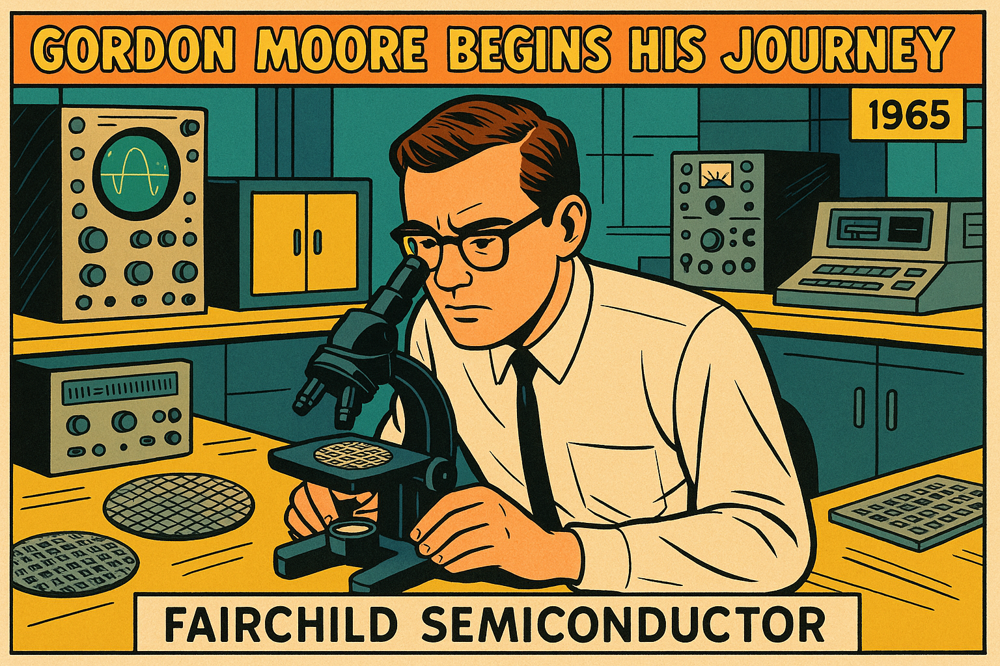
    <details>
    <summary>Name of Panel 1</summary>
        Please generate a wide-landscape drawing in the style of a graphic novel.  
        Use a color scheme and design style that reflects a book published 
        in England in 1833.
        Focus on making any characters consistent with characters in prior images.

        In this drawing....
    </detail>
    ```
</details>

## The Young Engineer

<details>
<summary>Sample Image Prompt: Gordon Moore Begins His Journey</summary>
Please generate a wide-landscape drawing in the style of a graphic novel. Use a bright color scheme and design style that reflects a comic book of the 1960s. Work hard to make any characters consistent with prior images.

In this drawing, show a young Gordon Moore in 1965, wearing a crisp white shirt and thin black tie, standing in a sterile laboratory at Fairchild Semiconductor. He's examining a silicon wafer under a microscope, with early integrated circuits visible on workbenches around him. The lab has a retro-futuristic 1960s aesthetic with analog equipment and oscilloscopes. Moore should appear thoughtful and curious, his brow slightly furrowed as he studies the tiny transistors etched into silicon. Include early computer equipment in the background and make the lighting clinical but warm, suggesting the dawn of the digital age.
</details>

The year is 1965, and Gordon Moore is a young engineer working at Fairchild Semiconductor in California's emerging Silicon Valley. As he peers through his microscope at the intricate patterns etched into silicon wafers, Moore marvels at how these tiny transistors—switches no bigger than a few atoms—can control the flow of electricity. He's part of a revolution in miniaturization, but he doesn't yet know he's about to discover one of technology's most enduring principles.

## The Intel Co-Founder

<details>
<summary>Building Intel from the Ground Up</summary>
Please generate a wide-landscape drawing in the style of a graphic novel. Use a bright color scheme and design style that reflects a comic book of the 1960s. Work hard to make any characters consistent with prior images.

In this drawing, show Gordon Moore (now three years older) standing alongside Robert Noyce in 1968, both wearing suits as they shake hands in front of a small, modest building with a simple "Intel" sign. Moore should look determined and optimistic, holding architectural blueprints for semiconductor manufacturing equipment. Show early employees in the background carrying boxes and setting up basic lab equipment. The scene should convey the entrepreneurial spirit of the era, with Moore and Noyce as visionary pioneers ready to transform an industry from this humble beginning.
</details>

By 1968, Moore has co-founded Intel Corporation with Robert Noyce, leaving the security of established companies to pursue their vision of advanced semiconductor technology. Moore brings his deep understanding of transistor physics and manufacturing processes to the new venture. As Intel's head of research and development, he's intimately involved in designing each new generation of microprocessors, constantly pushing the boundaries of what's possible in silicon.

## The Pattern Emerges

<details>
<summary>Recognizing the Exponential Trend</summary>
Please generate a wide-landscape drawing in the style of a graphic novel. Use a bright color scheme and design style that reflects a comic book of the 1960s. Work hard to make any characters consistent with prior images.

In this drawing, show Moore in his office late at night in 1970, surrounded by technical papers and chip specifications scattered across his desk. He's drawing a graph on graph paper, plotting data points that show the increasing number of transistors on chips over time. His expression should show the "eureka" moment as he realizes the points form an exponential curve rather than a linear one. Include a desk lamp creating dramatic lighting, and show various Intel chip prototypes and technical manuals in the background. The curve on his graph should be clearly rising at an accelerating rate.
</details>

Working late one evening in 1970, Moore spreads technical specifications across his desk, documenting the progress of Intel's chip designs. As he plots the number of transistors on each successive chip generation, a remarkable pattern emerges. The growth isn't linear—it's exponential. Each new chip doesn't just add a few more transistors; it roughly doubles the count every eighteen to twenty-four months. This isn't just Intel's pattern; it's happening across the entire semiconductor industry.

## The Exponential Revelation
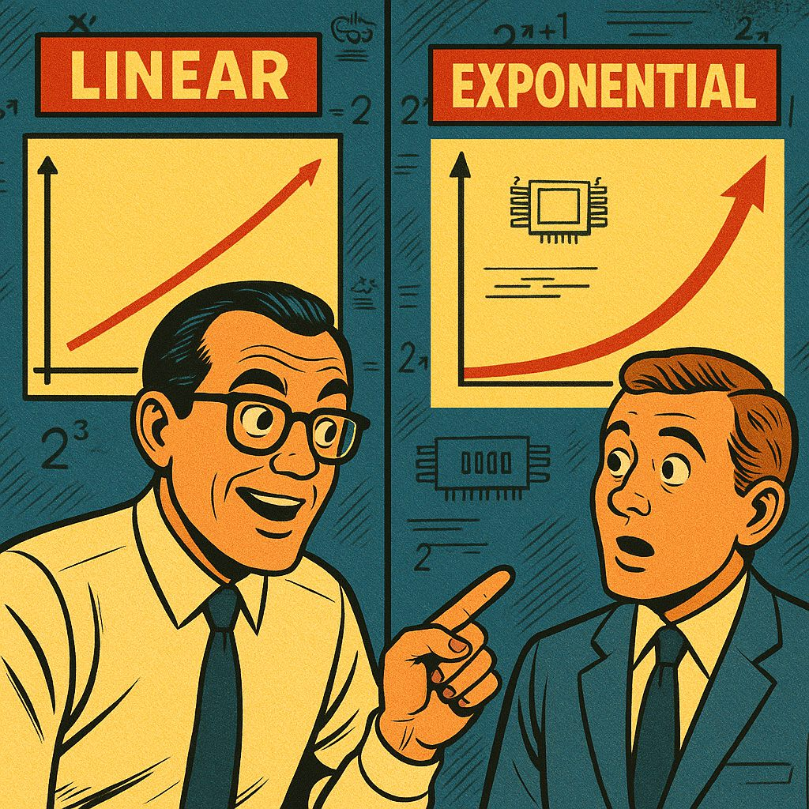
<details>
<summary>Understanding Exponential vs Linear Growth</summary>
Please generate a wide-landscape drawing in the style of a graphic novel. Use a bright color scheme and design style that reflects a comic book of the 1960s. Work hard to make any characters consistent with prior images.

In this drawing, create a split-panel effect showing Moore explaining the difference between linear and exponential growth to a colleague. On the left side, show a gentle, straight upward line representing linear growth. On the right side, show a dramatic hockey-stick curve representing exponential growth. Moore should be pointing to the exponential curve with excitement, while his colleague looks amazed. Include mathematical equations and chip diagrams in the background. The exponential curve should dominate the visual, showing how it starts slowly but then rockets upward dramatically.
</details>

Moore realizes the profound implications of exponential versus linear growth. While linear growth adds the same amount each period, exponential growth multiplies—creating a "hockey stick" effect where progress seems slow at first, then accelerates dramatically. He understands that if this trend continues, computers will become exponentially more powerful while potentially becoming smaller and cheaper. This insight will prove to be one of the most accurate technological predictions in history.

## The Overlooked Paper
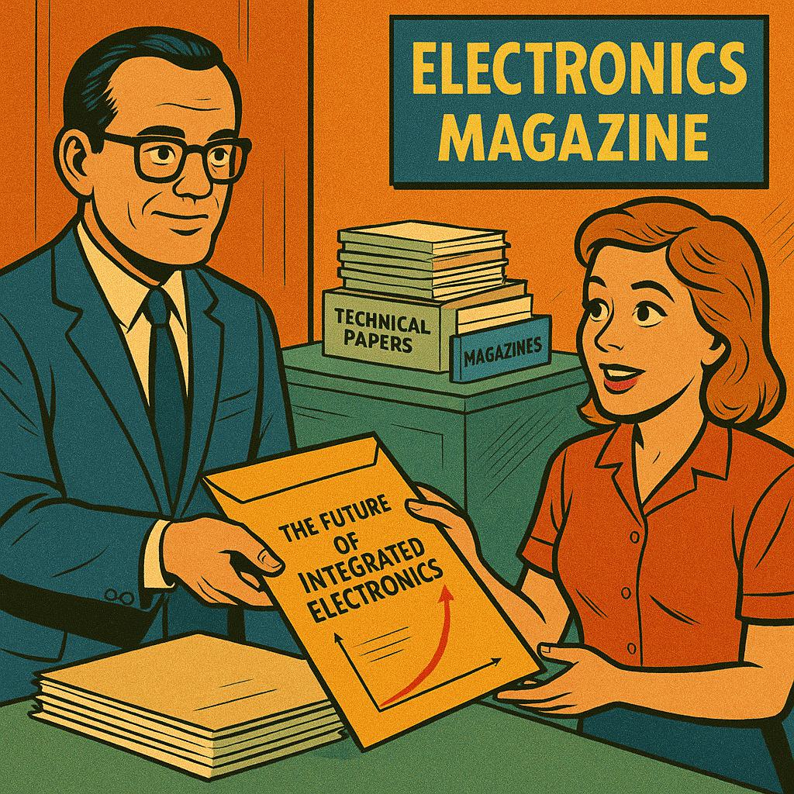
<details>
<summary>Publishing the Prediction</summary>
Please generate a wide-landscape drawing in the style of a graphic novel. Use a bright color scheme and design style that reflects a comic book of the 1960s. Work hard to make any characters consistent with prior images.

In this drawing, show Moore in 1975 submitting his paper to Electronics Magazine. He's handing a manila envelope to a receptionist at the magazine's office. The scene should convey the mundane nature of this historic moment—Moore looks confident but not overly excited, as if he's simply sharing an interesting technical observation. In the background, show stacks of other technical papers and magazines, suggesting this is just one of many submissions. Include a glimpse of his paper's title and the famous exponential curve graph visible through the envelope opening.
</details>

In 1975, Moore publishes his observation in Electronics Magazine, predicting that the number of transistors on computer chips will continue to double approximately every two years. The paper receives little initial attention—it appears to be just another technical analysis among many in the rapidly evolving semiconductor field. Few readers grasp that Moore has identified a fundamental driver of technological progress that will reshape civilization itself.

## The Industry Takes Notice
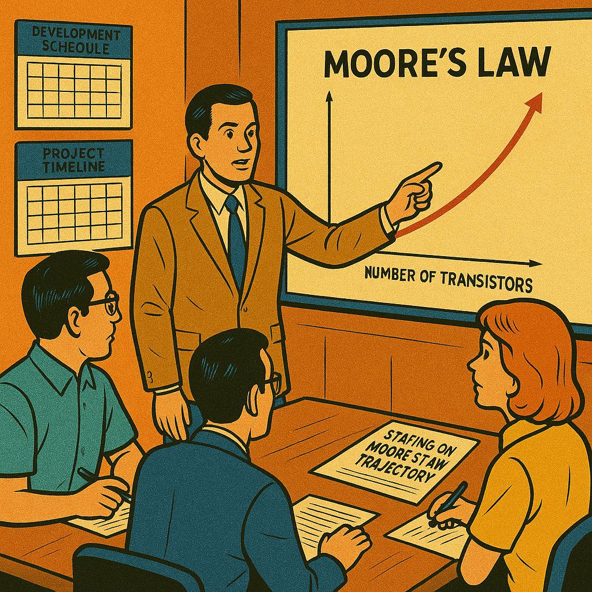
<details>
<summary>Engineering Teams Adopt the Timeline</summary>
Please generate a wide-landscape drawing in the style of a graphic novel. Use a bright color scheme and design style that reflects a comic book of the 1960s. Work hard to make any characters consistent with prior images.

In this drawing, show a 1980s engineering meeting at a semiconductor company (not Intel). Engineers are gathered around a conference table with Moore's graph prominently displayed on a whiteboard. One engineer is pointing to the curve while others take notes. The scene should convey how Moore's prediction has become a roadmap for the industry. Include calendars on the wall showing development timelines, and technical specifications that reference "staying on Moore's Law trajectory." The atmosphere should be one of focused determination as teams work to meet the exponential challenge.
</details>

By the early 1980s, semiconductor engineers across the industry begin using Moore's prediction as a roadmap for development. Engineering teams schedule their research and development cycles around Moore's timeline, treating it not just as an observation but as a goal to achieve. The prediction becomes a self-fulfilling prophecy as companies race to meet the exponential expectations, driving innovation at an unprecedented pace.

## The Digital Revolution
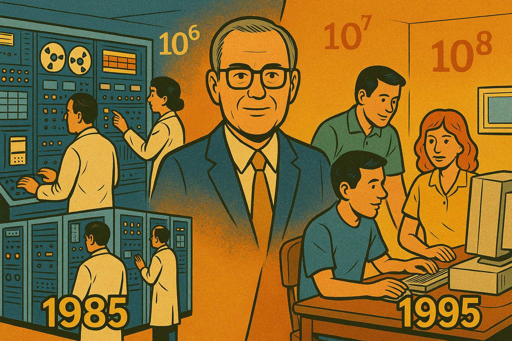
<details>
<summary>Computers Transform Society</summary>
Please generate a wide-landscape drawing in the style of a graphic novel. Use a bright color scheme and design style that reflects a comic book of the 1960s. Work hard to make any characters consistent with prior images.

In this drawing, show the transformation from 1985 to 1995 in a split scene. On the left, show a room-sized computer from 1985 with operators in white coats. On the right, show a family using a personal computer at home in 1995. Moore should appear in the center, older now with gray hair, observing this transformation with satisfaction. Include visual elements showing the exponential shrinkage of computers and growth in their capabilities—perhaps with mathematical representations of processing power floating in the background.
</details>

As Moore's Law drives exponential improvements in processing power, computers shrink from room-sized machines to desktop and eventually portable devices. The 1980s and 1990s witness the personal computer revolution, followed by laptops, and early mobile devices. Moore watches with fascination as his prediction enables technologies he never imagined—from computer graphics to the early internet. Each doubling of transistor density unlocks new possibilities.

## Moore Becomes Famous
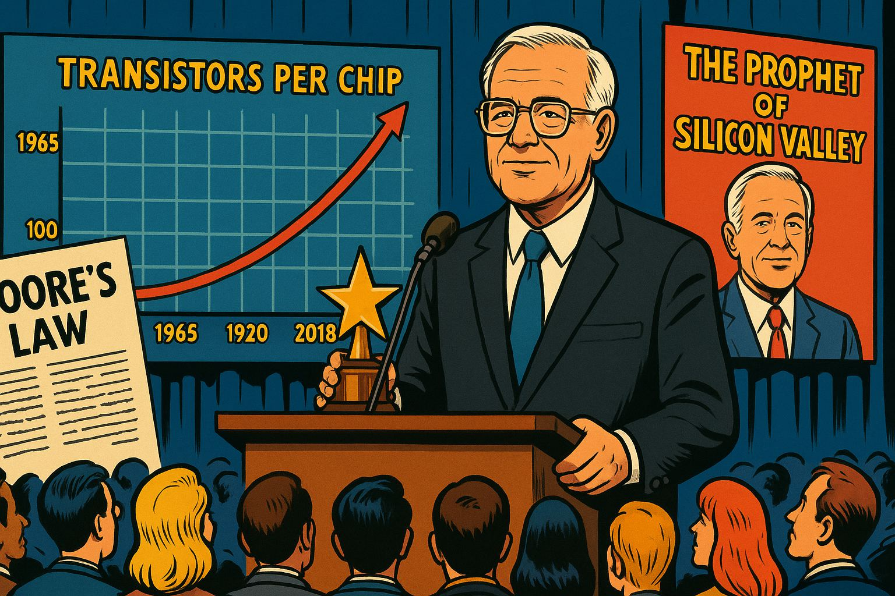
<details>
<summary>Recognition and Acclaim</summary>
Please generate a wide-landscape drawing in the style of a graphic novel.
Make SURE to use a wide-landscape orientation!
Use a bright color scheme and design style that reflects a comic book of the 1960s. 
Work hard to make any characters consistent with prior images.

In this drawing, show Moore in the late 1990s receiving an award or speaking at a major technology conference. He should appear distinguished with white hair, wearing a formal suit, standing at a podium with a large audience. Behind him, project a timeline showing how his prediction has held true for over two decades. Include newspaper headlines and magazine covers visible in the background with titles like "Moore's Law" and "The Prophet of Silicon Valley." His expression should show humility mixed with pride at how his simple observation became a guiding principle for the digital age.

Make SURE to use a wide-landscape orientation!
</details>

By the late 1990s, Moore has become a technology icon. His "law" is cited in business plans, academic papers, and technology roadmaps worldwide. What began as a simple observation has become the most famous prediction in technology history. Moore is invited to speak at conferences, receives prestigious awards, and sees his name become synonymous with technological progress. He's modest about his fame, often noting that he simply observed a trend rather than invented it.

## The Internet and Mobile Era

<details>
<summary>Exponential Growth Enables New Technologies</summary>
Please generate a wide-landscape drawing in the style of a graphic novel. 
Make SURE to use a wide-landscape orientation!
Use a bright color scheme and design style that reflects a comic book of the 1960s. 
Work hard to make any characters consistent with prior images.

In this drawing, show the explosion of internet and mobile technologies from 2000-2010. Create a montage showing people using smartphones, laptops connecting to WiFi, and servers in data centers. Moore should appear as an elder statesman observing this digital transformation, perhaps looking at a smartphone with wonder. Include visual representations of data flowing through networks, and small text showing exponentially increasing numbers of transistors in each generation of devices. The scene should convey how Moore's Law enabled the connected world.
</details>

The 2000s and 2010s bring the internet revolution and smartphone era, all enabled by continued adherence to Moore's Law. Each new generation of processors enables faster internet connections, more sophisticated software, and eventually puts supercomputer-level power in everyone's pocket. Moore watches as his prediction enables social media, cloud computing, and artificial intelligence—technologies that seemed like science fiction when he first plotted his exponential curve.

## The Cost Curve Emerges
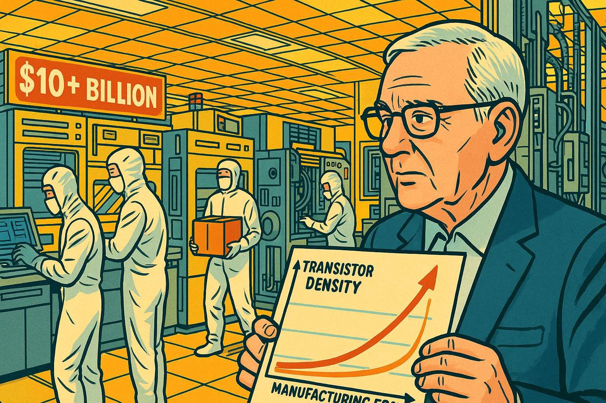
<details>
<summary>Manufacturing Becomes Exponentially Expensive</summary>
Please generate a wide-landscape drawing in the style of a graphic novel. 
Make SURE to use a wide-landscape orientation!
Use a bright color scheme and design style that reflects a comic book of the 1960s. Work hard to make any characters consistent with prior images.

In this drawing, show a modern semiconductor fabrication facility (circa 2015) with its massive, pristine cleanroom environment and billion-dollar equipment. Include engineers in full protective gear operating sophisticated machinery. In the foreground, show Moore (now quite elderly) looking at a chart showing two curves: one showing transistor density continuing to rise exponentially, and another showing manufacturing costs also rising exponentially. His expression should show concern as he realizes the economic limits approaching. Include price tags showing fabrication facilities costing $10+ billion.
</details>

Around 2015, Moore begins to notice a troubling secondary trend: while transistor density continues to grow exponentially, the cost of building the fabrication facilities to manufacture these advanced chips is also growing exponentially. State-of-the-art semiconductor fabs now cost over $10 billion to build, and each new generation requires even more expensive equipment and cleaner facilities. The economics of Moore's Law are becoming increasingly challenging.

## Physical Limits Approach
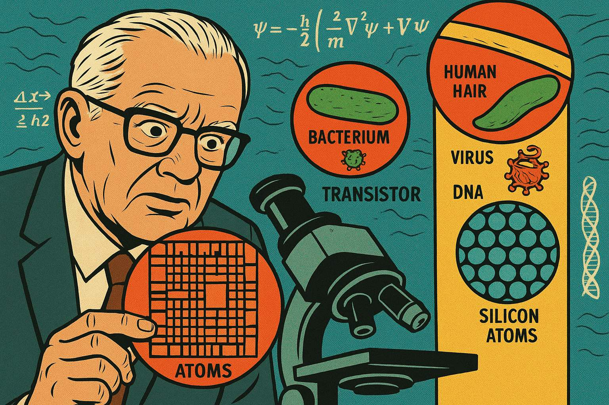
<details>
<summary>Approaching Atomic Scale</summary>
Please generate a wide-landscape drawing in the style of a graphic novel.
Make SURE to use a wide-landscape orientation! 
Use a bright color scheme and design style that reflects a comic book of the 1960s. 
Work hard to make any characters consistent with prior images.

In this drawing, create a scientific visualization showing the scale of modern transistors compared to atoms. Show Moore examining microscopic images where individual transistors are only a few atoms wide. Include a scale comparison showing a human hair, bacteria, virus, DNA strand, and finally individual silicon atoms with transistors. Moore's expression should show both amazement at how far the technology has come and concern about the fundamental physical limits being approached. Include quantum mechanical equations in the background, suggesting the physics becoming increasingly complex.
</details>

By 2020, transistors have shrunk to just a few nanometers—approaching the scale of individual atoms. Moore realizes that his law is approaching fundamental physical limits. Quantum mechanical effects begin to dominate at these scales, making traditional transistor behavior unpredictable. The very atoms that make up silicon become relevant to circuit design. Physics itself is beginning to constrain further miniaturization.

## The Economic Wall
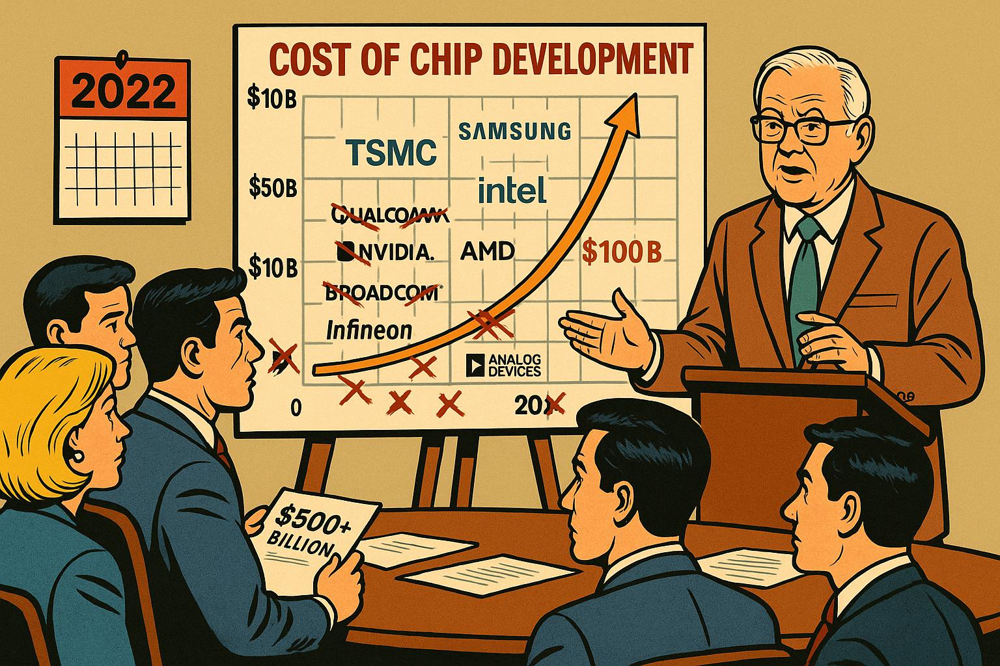
<details>
<summary>Only a Few Companies Can Afford Advanced Chips</summary>
Please generate a wide-landscape drawing in the style of a graphic novel.
Make SURE to use a wide-landscape orientation!
Use a bright color scheme and design style that reflects a comic book of the 1960s. 
Work hard to make any characters consistent with prior images.

In this drawing, show a boardroom scene in 2022 where executives are looking at a chart showing the exponentially rising costs of chip development and manufacturing. Only logos of a few major companies (TSMC, Samsung, Intel) remain viable for advanced chip production. Many smaller company logos are crossed out or faded, indicating they can no longer afford to stay on the cutting edge. Moore should appear in the scene as a consultant or advisor, pointing out how the economic limits are creating consolidation in the industry. Include dollar figures in the hundreds of billions for next-generation development.
</details>

The exponentially rising costs create an economic wall that only the largest companies can scale. By 2022, fewer than five companies worldwide can afford to manufacture the most advanced chips. What began as an industry with hundreds of semiconductor companies has consolidated into a few giants due to the enormous capital requirements. Moore observes that economic limits may end his law before physical limits do.

## The Limits to Growth Pattern
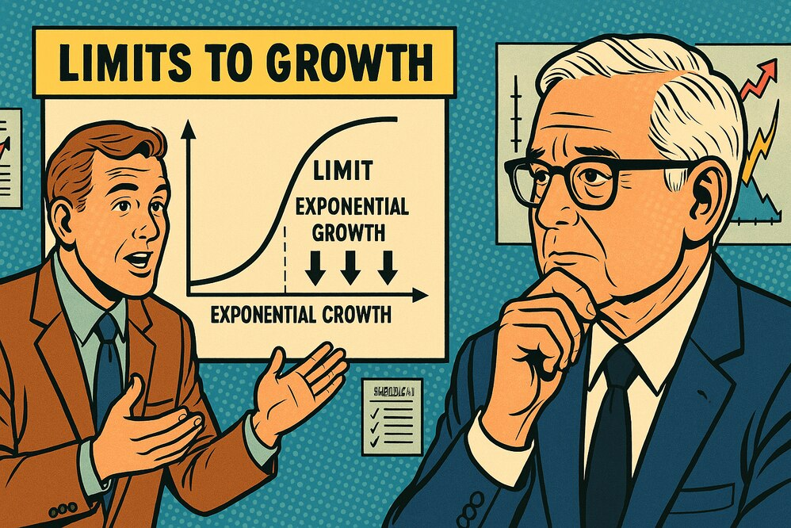
<details>
<summary>Recognizing the Systems Archetype</summary>
Please generate a wide-landscape drawing in the style of a graphic novel.
Make SURE to use a wide-landscape orientation! 
Use a bright color scheme and design style that reflects a comic book of the 1960s. Work hard to make any characters consistent with prior images.

In this drawing, show Moore in 2022 speaking with a systems thinking expert or economist. They should be looking at a classic "Limits to Growth" diagram showing an S-curve where exponential growth eventually hits resource constraints and levels off. Moore should appear thoughtful as he recognizes this pattern applies to his law. Include visual elements showing the classic systems archetype: exponential growth hitting limits (physical, economic, technical), leading to slower growth. The mood should be reflective rather than negative—showing understanding of natural system patterns.
</details>

In 2022, Moore reflects on how his law exemplifies the "Limits to Growth" archetype from systems thinking. 
Like many exponential growth patterns in nature and technology, 
Moore's Law experiences rapid expansion until it encounters 
fundamental constraints—in this case, both physical limits at the 
atomic scale and economic limits due to exponentially rising costs. 
He recognizes that this pattern is natural and predictable, not a failure but an evolution.

## Legacy and Transformation

<details>
<summary>Moore's Law's Enduring Impact and Evolution</summary>
Please generate a wide-landscape drawing in the style of a graphic novel.
Make SURE to use a wide-landscape orientation! 
Use a bright color scheme and design style that reflects a comic book of the 1960s. Work hard to make any characters consistent with prior images.

In this drawing, show an elderly Moore in 2022 looking out at a transformed world filled with AI, quantum computers, and technologies enabled by decades of exponential progress. The scene should include holographic displays, advanced robotics, and other futuristic technologies that Moore's Law made possible. He should appear satisfied and contemplative, understanding that while his law may be reaching its limits, it enabled a technological revolution that will continue evolving in new directions. Include a gentle transition showing classical computing evolving into new paradigms like quantum and biological computing.
</details>

As Moore's Law reaches its traditional limits in 2022, Moore takes satisfaction in how his simple observation enabled five decades of unprecedented technological progress. While exponential growth in transistor density may be ending, the law has already transformed civilization by enabling the internet, mobile computing, artificial intelligence, and countless innovations. Moore understands that new paradigms—quantum computing, biological computing, and novel architectures—will continue advancing computational power, just through different means. His law didn't fail; it succeeded so completely that it pushed technology to explore entirely new frontiers.


## Epilogue: The Systems Thinking Lesson

Moore's Law perfectly illustrates the "Limits to Growth" archetype in systems thinking. This pattern shows how exponential growth in any system eventually encounters constraints—whether physical, economic, or resource-based—that force the system to level off or find new growth patterns. 

The archetype teaches us that:

- Exponential growth is powerful but temporary
- Systems eventually hit fundamental limits
- Recognizing these patterns helps us prepare for transitions
- Limits don't represent failure but natural system evolution
- New paradigms often emerge when old patterns reach their boundaries

Moore's remarkable prediction held true for over 50 years, enabling the digital revolution. Its eventual limits don't diminish its importance—they demonstrate how understanding system patterns can help us navigate technological and economic transitions more effectively.

## More to Explore

You can try out our interactive infographic on Moore's Law [here](../../sims/moores-law/index.md).  Note that you can click the button at the top to show both
the linear and log views of this exponential growth data.

## References

1.  [Moore's Law's Next Step: 10 Nanometers](https://www.intel.com/content/www/us/en/newsroom/opinion/moores-law-next-step.html) - 2023 - Intel Newsroom - Intel's official explanation of how they continue pushing Moore's Law to smaller transistor sizes, written in accessible language for students interested in current semiconductor technology.
2.  [What is Moore's Law?](https://www.britannica.com/technology/Moores-law) - 2024 - Encyclopedia Britannica - A comprehensive yet student-friendly overview of Moore's Law, its history, and current challenges, perfect for research papers and understanding the basic concepts.
3.  [The Man Behind Moore's Law](https://www.computerhistory.org/biography/gordon-moore) - 2022 - Computer History Museum - Biography of Gordon Moore with timeline, photos, and videos showing his journey from young engineer to technology icon, ideal for understanding the human story behind the famous prediction.
4.  [Why Moore's Law is Running Out of Steam](https://www.scientificamerican.com/article/why-moores-law-is-running-out-of-steam/) - 2023 - Scientific American - Explains the physical and economic limits facing Moore's Law using clear diagrams and analogies that high school students can understand and use for science projects.
5.  [Systems Thinking for Students](https://www.waters-foundation.org/systems-thinking/what-is-systems-thinking/) - 2024 - Waters Foundation - Introduction to systems thinking concepts and archetypes, including "Limits to Growth," written specifically for educational use with examples students can relate to.
6.  [The Exponential Growth of Computing Power](https://ourworldindata.org/technological-progress) - 2024 - Our World in Data - Interactive charts and graphs showing Moore's Law in action over decades, perfect for visual learners and students who need data for presentations or reports.
7.  [How Computer Chips are Made](https://www.youtube.com/watch?v=Q2pawOTjb_s) - 2023 - YouTube/TED-Ed - Animated video explaining semiconductor manufacturing in simple terms, helping students understand why making smaller chips becomes exponentially more expensive and difficult.
8.  [Gordon Moore's Original 1965 Paper](https://www.cs.utexas.edu/~fussell/courses/cs352h/papers/moore.pdf) - 1965 - Electronics Magazine - The actual paper where Moore first described his observation, surprisingly readable for high school students and shows how scientific predictions are made.
9.  [What Happens When Moore's Law Ends?](https://spectrum.ieee.org/what-happens-when-moores-law-ends) - 2024 - IEEE Spectrum - Explores quantum computing, biological computing, and other technologies that might replace traditional silicon chips, great for students interested in future careers in technology.
10.  [The Limits to Growth: A Systems Thinking Classic](https://www.donellameadows.org/archives/leverage-points-places-to-intervene-in-a-system/) - 2023 - Donella Meadows Institute - Explains leverage points and systems archetypes with real-world examples, helping students understand how Moore's Law fits into broader patterns of growth and limits in complex systems.

Retry

[Claude can make mistakes.
Please double-check responses.](https://support.anthropic.com/en/articles/8525154-claude-is-providing-incorrect-or-misleading-responses-what-s-going-on)

Research

Sonnet 4