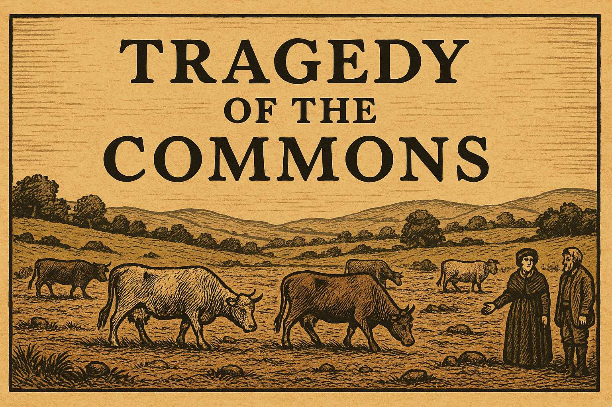

# The Tragedy of the Commons: A Graphic Novel

*Based on William Forster Lloyd's 1833 Economic Theory*

In the rolling hills of the English countryside, the village of Millhaven has thrived for generations around a precious common pasture. This is the story of how individual rational choices can lead to collective ruin—a tale that would echo through economic theory for centuries to come.

## Panel 1: The Village of Millhaven

The Peaceful Village

Please generate a wide-landscape drawing in the style of a graphic novel. Use a color scheme and design style that reflects a book published in England in 1833. Work hard to make any characters consistent with prior images.

In this drawing, show a picturesque English village circa 1833 with stone cottages, thatched roofs, and smoking chimneys nestled in rolling green hills. In the center of the village lies a large, lush common pasture where several well-fed cattle graze peacefully. Village folk in period dress—men in wool coats and breeches, women in long dresses and bonnets—go about their daily business. The scene should convey prosperity and harmony, with the common land appearing abundant and well-maintained.

For generations, the farmers of Millhaven had shared the village common—a verdant pasture that provided grazing for all their cattle. The ancient agreement was simple: each family could graze their livestock on this shared land, and all had prospered under this arrangement.

## Panel 2: The Prosperous Farmers

Five Farming Families

Please generate a wide-landscape drawing in the style of a graphic novel. Use a color scheme and design style that reflects a book published in England in 1833. Work hard to make any characters consistent with prior images.

In this drawing, show five distinct farming families standing before their respective cottages around the village. Each family should be clearly identifiable: Farmer Whitmore (a sturdy man with gray hair), Farmer Hartwell (a younger man with brown hair and a beard), Farmer Blackwood (a tall, thin man), Farmer Greene (a woman in widow's dress), and Farmer Ashton (a middle-aged man with a weathered face). Each family has 2-3 healthy cattle visible near their homes. The families should appear content and prosperous, representing the stable equilibrium that has sustained the village.

Five farming families had used the common for decades: the Whitmores, Hartwells, Blackwoods, Greenes, and Ashtons. Each family grazed two or three cattle on the shared land, and the pasture easily supported all fifteen animals. The grass was thick, the cattle were fat, and the milk and beef provided comfortable livings for all.

## Panel 3: Farmer Whitmore's Temptation

The Fateful Calculation

Please generate a wide-landscape drawing in the style of a graphic novel. Use a color scheme and design style that reflects a book published in England in 1833. Work hard to make any characters consistent with prior images.

In this drawing, show Farmer Whitmore standing in his farmyard, looking thoughtfully at a new, healthy calf beside his existing cattle. His expression should show contemplation and slight cunning. In the background, show the common pasture still looking lush and green. Whitmore should be holding or looking at coins, representing the profit he calculates from adding another animal. His wife might be visible in the doorway of their cottage, perhaps looking concerned or questioning.

One spring morning, Farmer Whitmore looked at his prize bull calf and made a calculation that would change everything. "If I add this young bull to the common," he reasoned, "I'll gain the full benefit of its milk and eventual sale. The cost of its grazing will be shared among all five families." The mathematics seemed irresistible: he would capture 100% of the benefit while bearing only 20% of the cost.

## Panel 4: The First Addition

Breaking the Balance

Please generate a wide-landscape drawing in the style of a graphic novel. Use a color scheme and design style that reflects a book published in England in 1833. Work hard to make any characters consistent with prior images.

In this drawing, show Farmer Whitmore leading his new bull calf onto the common pasture where the other cattle are grazing. The other farmers (Hartwell, Blackwood, Greene, and Ashton) should be visible in the distance, some pointing and discussing among themselves. The pasture should still look mostly healthy, but perhaps show the first subtle signs of increased grazing pressure—slightly shorter grass, a few bare patches beginning to form. Whitmore should look pleased with his decision.

Whitmore added his bull to the common. The other farmers noticed, of course, and grumbled quietly among themselves. But the pasture still seemed adequate, and no one wanted to cause a fuss. After all, one extra animal couldn't hurt much, could it?

## Panel 5: The Rational Response

Others Follow Suit

Please generate a wide-landscape drawing in the style of a graphic novel. Use a color scheme and design style that reflects a book published in England in 1833. Work hard to make any characters consistent with prior images.

In this drawing, show Farmer Hartwell and Farmer Blackwood each leading additional cattle onto the now more crowded common. The other farmers should be visible watching this scene with a mixture of concern and resignation. The pasture should show more obvious signs of overgrazing—patches of bare earth, shorter grass, and cattle competing more visibly for the best grazing spots. The scene should convey a sense of inevitability as each farmer follows the same rational logic as Whitmore.

But Farmer Hartwell soon reached the same conclusion. "If Whitmore can add a beast, so can I," he declared, leading his own additional cow to the common. Farmer Blackwood quickly followed suit, reasoning that he'd be foolish not to maximize his use of the shared resource. Each farmer's decision was perfectly rational from his individual perspective.

## Panel 6: The Escalation

The Spiral Begins

Please generate a wide-landscape drawing in the style of a graphic novel. Use a color scheme and design style that reflects a book published in England in 1833. Work hard to make any characters consistent with prior images.

In this drawing, show all five farmers now bringing additional cattle to the common, which is becoming visibly overcrowded. Widow Greene should be shown with a determined expression, leading her own extra cow, while Farmer Ashton brings up the rear with his additional beast. The common should now clearly show signs of overgrazing—large bare patches, thin grass, muddy areas where cattle have trampled the ground. The cattle should appear to be competing for limited grass, with some looking less well-fed than before.

Widow Greene, not to be outdone by her neighbors, added her extra heifer. "I cannot afford to fall behind," she muttered. Finally, even cautious Farmer Ashton brought his additional ox, saying, "If everyone else is doing it, I must protect my family's interests." The common now hosted twenty animals instead of fifteen.

## Panel 7: The First Signs of Trouble

Quality Decline

Please generate a wide-landscape drawing in the style of a graphic novel. Use a color scheme and design style that reflects a book published in England in 1833. Work hard to make any characters consistent with prior images.

In this drawing, show the farmers examining their cattle, which now appear noticeably thinner and less healthy than before. The common in the background should be clearly degraded—large areas of bare soil, sparse grass, and muddy patches. Some farmers should be looking worried, perhaps pointing at the deteriorating condition of their animals and the land. The contrast with the earlier pastoral scene should be stark and concerning.

By midsummer, the effects were undeniable. The grass grew thin and patchy. The cattle, now competing for insufficient forage, began to lose weight. What had once been a lush meadow now showed bare patches and muddy wallows where too many hooves had trampled the earth.

## Panel 8: The Desperate Logic

More Is the Only Answer

Please generate a wide-landscape drawing in the style of a graphic novel. Use a color scheme and design style that reflects a book published in England in 1833. Work hard to make any characters consistent with prior images.

In this drawing, show the farmers in heated discussion, with some appearing anxious and others defiant. Each should be shown with additional cattle nearby, ready to add even more animals to the commons. The background should show the common in severe decline—mostly bare earth with only scattered tufts of grass remaining. The scene should convey the paradoxical logic driving their decisions: as the resource becomes scarcer, each farmer feels more pressure to grab what they can before others do.

Faced with declining returns, each farmer reached a terrible conclusion. "If the pasture is deteriorating," Whitmore reasoned, "I must add even more cattle to maintain my income before the grass runs out entirely." This logic spread like a fever through the village. If the resource was becoming scarce, each farmer felt compelled to claim as much as possible before their neighbors did.

## Panel 9: The Vicious Cycle

Accelerating Destruction

Please generate a wide-landscape drawing in the style of a graphic novel. Use a color scheme and design style that reflects a book published in England in 1833. Work hard to make any characters consistent with prior images.

In this drawing, show a chaotic scene of farmers driving large herds of cattle onto what remains of the common. The pasture should now be almost completely destroyed—primarily bare, eroded soil with virtually no grass remaining. Cattle should appear gaunt and desperate, fighting over the few remaining scraps of vegetation. The farmers' expressions should show a mixture of desperation, anger, and grim determination as they pursue their self-destructive course.

The village descended into a desperate spiral. Each farmer added more and more cattle, hoping to extract what value remained before the others could claim it. The twenty animals became twenty-five, then thirty. The once-verdant common transformed into a wasteland of packed earth and scattered stones.

## Panel 10: Mutual Destruction

The Ruined Commons

Please generate a wide-landscape drawing in the style of a graphic novel. Use a color scheme and design style that reflects a book published in England in 1833. Work hard to make any characters consistent with prior images.

In this drawing, show the complete devastation of the common—a barren, eroded landscape with virtually no vegetation remaining. Emaciated cattle should be scattered across the wasteland, some lying down from weakness. The five farmers should be shown standing around the edges of the ruined commons, their faces showing shock, despair, and the dawning realization of what they have collectively done. The contrast with the opening scene should be heartbreaking.

By autumn, the common was destroyed. Where lush grass once grew, only hard-packed earth remained. The cattle, now skeletal and weak, could barely find enough sustenance to survive. What had taken generations to build had been destroyed in a single season through the rational decisions of individual actors.

## Panel 11: The Reckoning

Counting the Cost

Please generate a wide-landscape drawing in the style of a graphic novel. Use a color scheme and design style that reflects a book published in England in 1833. Work hard to make any characters consistent with prior images.

In this drawing, show the five farmers sitting around a table in one of their cottages, with ledgers and papers spread before them showing their financial losses. Through the window, the ruined common should be visible in the background. Their faces should show a mixture of anger, regret, and bitter understanding. Empty milk jugs and unpaid bills should be visible on the table, representing their collective economic ruin.

The five families gathered to assess the damage. Each had acted rationally, seeking to maximize their individual benefit. Yet collectively, they had destroyed the very resource that had sustained them all. Their cattle were worthless, their milk production had ceased, and their families faced hardship that could have been easily avoided.

## Panel 12: The Lesson Learned

Economic Theory Born

Please generate a wide-landscape drawing in the style of a graphic novel. Use a color scheme and design style that reflects a book published in England in 1833. Work hard to make any characters consistent with prior images.

In this drawing, show economist William Forster Lloyd in his study, writing by candlelight with quill and ink. On his desk should be papers with economic diagrams and calculations. Through his window, a vista of the English countryside should be visible with various commons and pastures, representing the broader economic principle he is discovering. The scene should convey the moment of intellectual breakthrough as Lloyd formulates his theory about individual rationality leading to collective irrationality.

As word of Millhaven's tragedy spread, economist William Forster Lloyd saw in it a profound truth about human nature and economics. When individuals acting rationally in their own self-interest share a common resource, the result can be the destruction of that resource and harm to all. This paradox—that individual rationality can lead to collective irrationality—would become known as the "Tragedy of the Commons," a principle that would echo through economic thought for generations to come.

The lesson was clear: some problems cannot be solved by 
individual action alone, no matter how rational. 
They require collective wisdom, shared governance, and the courage to constrain individual desires for the greater good of all.

## References

# References for "The Tragedy of the Commons" Story

1. [The Tragedy of the Commons](https://www.britannica.com/topic/tragedy-of-the-commons) - 2024 - Encyclopedia Britannica - Comprehensive overview of the economic concept with clear definitions and modern examples that help students understand how Lloyd's 1833 theory applies to current environmental and social issues.

2. [William Forster Lloyd and the Original Tragedy of the Commons](https://www.econlib.org/library/Columns/y2009/Mungertragedy.html) - 2009 - Library of Economics and Liberty - Detailed exploration of Lloyd's original pamphlet and how his sheep grazing example became the foundation for modern environmental economics and policy discussions.

3. [Tragedy of the Commons: Definition and Examples](https://www.investopedia.com/terms/t/tragedy-of-the-commons.asp) - 2024 - Investopedia - Student-friendly explanation with contemporary examples like overfishing, climate change, and internet bandwidth that show how this 19th-century concept affects today's world.

4. [The Science of the Tragedy of the Commons](https://www.sciencedirect.com/science/article/pii/S0167268118302841) - 2018 - Journal of Economic Behavior & Organization - Research article examining real-world cases and experimental evidence, useful for students interested in how economists test theories about human behavior.

5. [Managing Common Pool Resources](https://www.nobelprize.org/prizes/economic-sciences/2009/ostrom/facts/) - 2009 - The Nobel Prize Organization - Information about Elinor Ostrom's Nobel Prize-winning work on how communities can successfully manage shared resources, offering solutions to the tragedy Lloyd identified.

6. [The Commons in History: Culture, Conflict, and Ecology](https://www.jstor.org/stable/2166431) - 1991 - The Journal of American History - Historical analysis of how common lands actually functioned in medieval and early modern England, providing context for understanding Lloyd's theoretical example.

7. [Game Theory and the Tragedy of the Commons](https://plato.stanford.edu/entries/game-theory/) - 2020 - Stanford Encyclopedia of Philosophy - Accessible introduction to how game theory explains the mathematical logic behind individual versus collective decision-making in the commons dilemma.

8. [Climate Change as a Global Commons Problem](https://www.brookings.edu/articles/climate-change-as-a-global-commons-problem/) - 2021 - Brookings Institution - Analysis of how carbon emissions represent a modern tragedy of the commons, connecting Lloyd's 1833 theory to today's most pressing environmental challenge.

9. [The Digital Commons: How the Internet Faces Tragedy](https://www.wired.com/story/tragedy-of-the-digital-commons/) - 2019 - WIRED Magazine - Exploration of how online resources like bandwidth, server capacity, and attention span face commons-like problems in the digital age, relevant to students' daily technology use.

10. [Success Stories: Communities That Avoided the Tragedy](https://www.resilience.org/stories/2012-10-15/commons-success-stories/) - 2012 - Resilience.org - Real-world examples of communities that successfully managed shared resources through cooperation and governance, showing students that the tragedy isn't inevitable and offering hope for collective problem-solving.